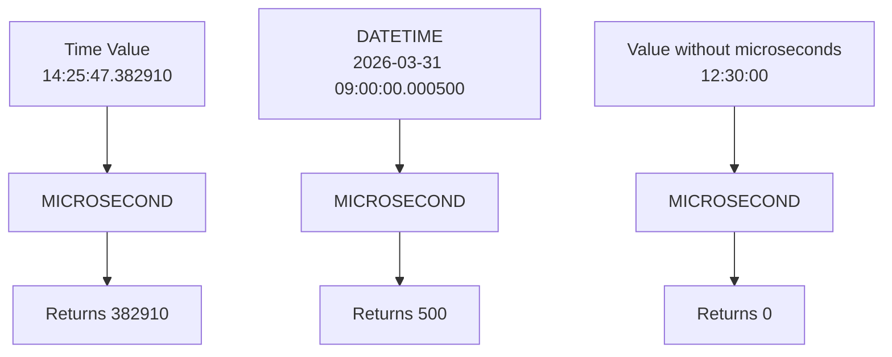

# How to Use MICROSECOND() Function in MySQL

Author: [nawazdhandala](https://www.github.com/nawazdhandala)

Tags: MySQL, SQL, Date Function, Time Function, Database

Description: Learn how to use the MySQL MICROSECOND() function to extract the microsecond component from TIME, DATETIME, and TIMESTAMP values for high-precision time analysis.

---

## What MICROSECOND() Does

`MICROSECOND()` extracts the microsecond part of a time or datetime value and returns an integer in the range 0 to 999999. It is useful when working with high-resolution timestamps, profiling queries, or measuring sub-second durations.



## Syntax

```sql
MICROSECOND(time_or_datetime)
```

The argument can be a `TIME`, `DATETIME`, `TIMESTAMP`, or a string literal that MySQL can interpret as one of those types.

## Setup: Sample Table

```sql
CREATE TABLE api_requests (
    id          INT AUTO_INCREMENT PRIMARY KEY,
    endpoint    VARCHAR(100),
    started_at  DATETIME(6),
    ended_at    DATETIME(6)
);

INSERT INTO api_requests (endpoint, started_at, ended_at) VALUES
('/api/users',   '2026-03-31 10:00:00.123456', '2026-03-31 10:00:00.456789'),
('/api/orders',  '2026-03-31 10:00:01.000100', '2026-03-31 10:00:01.850300'),
('/api/search',  '2026-03-31 10:00:02.500000', '2026-03-31 10:00:03.750000'),
('/api/health',  '2026-03-31 10:00:04.999001', '2026-03-31 10:00:05.000500');
```

Note: `DATETIME(6)` stores fractional seconds with microsecond precision. Without the `(6)` specifier, fractional seconds are truncated.

## Basic Usage

```sql
SELECT
    endpoint,
    started_at,
    MICROSECOND(started_at) AS start_us,
    MICROSECOND(ended_at)   AS end_us
FROM api_requests;
```

```text
+-------------+----------------------------+----------+--------+
| endpoint    | started_at                 | start_us | end_us |
+-------------+----------------------------+----------+--------+
| /api/users  | 2026-03-31 10:00:00.123456 |   123456 | 456789 |
| /api/orders | 2026-03-31 10:00:01.000100 |      100 | 850300 |
| /api/search | 2026-03-31 10:00:02.500000 |   500000 | 750000 |
| /api/health | 2026-03-31 10:00:04.999001 |   999001 |    500 |
+-------------+----------------------------+----------+--------+
```

## Using MICROSECOND() with TIME Literals

```sql
SELECT
    MICROSECOND('12:30:45.678901') AS from_time,
    MICROSECOND('12:30:45')        AS no_frac,
    MICROSECOND('00:00:00.000001') AS one_us;
```

```text
+-----------+---------+--------+
| from_time | no_frac | one_us |
+-----------+---------+--------+
|    678901 |       0 |      1 |
+-----------+---------+--------+
```

## Calculating Sub-Second Durations

To calculate elapsed microseconds between two `DATETIME(6)` values, use `TIMESTAMPDIFF` with `MICROSECOND` as the unit:

```sql
SELECT
    endpoint,
    TIMESTAMPDIFF(MICROSECOND, started_at, ended_at) AS duration_us,
    TIMESTAMPDIFF(MICROSECOND, started_at, ended_at) / 1000.0 AS duration_ms
FROM api_requests
ORDER BY duration_us DESC;
```

```text
+-------------+-------------+-------------+
| endpoint    | duration_us | duration_ms |
+-------------+-------------+-------------+
| /api/search |      125000 |     1250.00 |  -- crosses a second boundary
| /api/orders |      850200 |      850.20 |
| /api/health |        1499 |        1.50 |
| /api/users  |      333333 |      333.33 |
```

## Filtering by Microsecond Range

```sql
-- Find requests that started in the first half-second of any second
SELECT endpoint, started_at
FROM api_requests
WHERE MICROSECOND(started_at) < 500000;
```

```sql
-- Find requests that started in the last millisecond of a second
SELECT endpoint, started_at
FROM api_requests
WHERE MICROSECOND(started_at) >= 999000;
```

## Using MICROSECOND() in GROUP BY

```sql
-- Bucket requests into 250ms windows within a second
SELECT
    endpoint,
    FLOOR(MICROSECOND(started_at) / 250000) AS quarter_second_bucket,
    COUNT(*) AS request_count
FROM api_requests
GROUP BY endpoint, FLOOR(MICROSECOND(started_at) / 250000);
```

## Combining with Other Date Functions

```sql
-- Full breakdown of a DATETIME(6) value
SELECT
    started_at,
    HOUR(started_at)        AS hr,
    MINUTE(started_at)      AS mn,
    SECOND(started_at)      AS sec,
    MICROSECOND(started_at) AS us
FROM api_requests;
```

## MICROSECOND() with NOW(6)

`NOW()` returns a datetime without fractional seconds by default. Pass a precision argument to include microseconds:

```sql
SELECT
    NOW()    AS now_no_frac,
    NOW(6)   AS now_with_us,
    MICROSECOND(NOW(6)) AS current_us;
```

## Storing Microsecond-Precision Timestamps

```sql
-- Column definition for sub-second precision
CREATE TABLE performance_log (
    id         INT AUTO_INCREMENT PRIMARY KEY,
    operation  VARCHAR(100),
    logged_at  DATETIME(6) DEFAULT CURRENT_TIMESTAMP(6)
);

-- Insert with explicit microseconds
INSERT INTO performance_log (operation, logged_at) VALUES
('cache_miss', '2026-03-31 08:00:00.001234'),
('db_query',   '2026-03-31 08:00:00.003500'),
('cache_hit',  '2026-03-31 08:00:00.000050');

-- Verify stored microseconds
SELECT operation, MICROSECOND(logged_at) AS us FROM performance_log;
```

## Summary

`MICROSECOND()` extracts the microsecond component (0-999999) from `TIME` and `DATETIME` values. To work with sub-second precision in MySQL, declare columns as `DATETIME(6)` or `TIME(6)` and use `NOW(6)` or `CURRENT_TIMESTAMP(6)` for insertions. For duration calculations, `TIMESTAMPDIFF(MICROSECOND, start, end)` is more reliable than subtracting `MICROSECOND()` values directly, since it accounts for second and minute boundaries.
