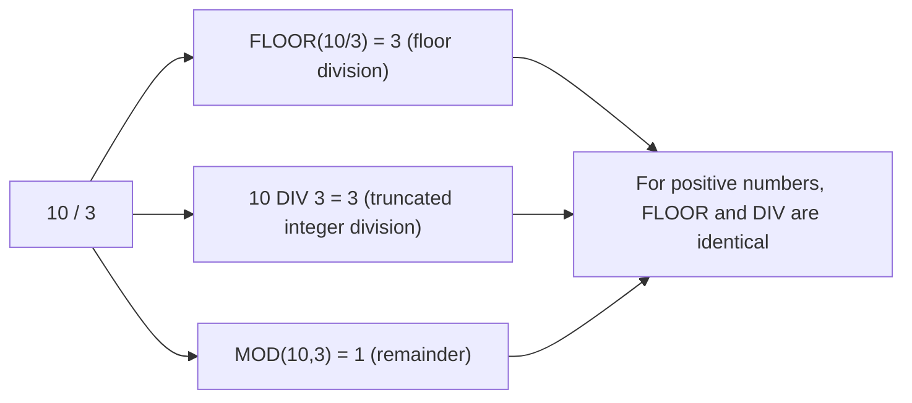

# How to Use MOD() and DIV Operator in MySQL

Author: [nawazdhandala](https://www.github.com/nawazdhandala)

Tags: MySQL, SQL, Numeric Function, Database

Description: Learn how to use MySQL MOD() and the DIV operator for integer modulo and integer division operations with practical query examples.

---

## Overview

MySQL provides two tools for integer arithmetic:

- `MOD()` (or the `%` operator) - returns the remainder after integer division.
- `DIV` - performs integer division, discarding the fractional part.

Both are commonly used for grouping, cycling, pagination logic, and numeric classification.

---

## MOD() Function

Returns the remainder when one number is divided by another.

**Syntax:**

```sql
MOD(N, M)
N % M    -- operator equivalent
N MOD M  -- keyword equivalent
```

- Returns `NULL` if either argument is `NULL`.
- Returns `NULL` if `M` is `0` (division by zero).
- The result has the same sign as `N` (the dividend).

### Basic Examples

```sql
SELECT MOD(10, 3);
-- Returns: 1  (10 / 3 = 3 remainder 1)

SELECT MOD(9, 3);
-- Returns: 0  (exactly divisible)

SELECT MOD(7, 2);
-- Returns: 1  (odd number)

SELECT MOD(8, 2);
-- Returns: 0  (even number)

SELECT 10 % 3;
-- Returns: 1  (same as MOD)

SELECT MOD(10, 0);
-- Returns: NULL  (division by zero)

SELECT MOD(-10, 3);
-- Returns: -1  (sign follows dividend)

SELECT MOD(10.5, 3);
-- Returns: 1.5  (works with decimals)
```

---

## DIV Operator

Performs integer (truncated) division.

**Syntax:**

```sql
N DIV M
```

- Divides `N` by `M` and discards the fractional part (truncates toward zero, not floor).
- Returns `NULL` if `M` is `0`.
- Returns `NULL` if either argument is `NULL`.
- Returns a `BIGINT`.

### Basic Examples

```sql
SELECT 10 DIV 3;
-- Returns: 3  (10 / 3 = 3.33, truncated to 3)

SELECT 9 DIV 3;
-- Returns: 3

SELECT 7 DIV 2;
-- Returns: 3

SELECT 1 DIV 2;
-- Returns: 0

SELECT -7 DIV 2;
-- Returns: -3  (truncated toward zero, not -4)

SELECT 10 DIV 0;
-- Returns: NULL
```

---

## MOD() vs DIV vs FLOOR(N/M)



For negative numbers they differ:

```sql
SELECT FLOOR(-7 / 2);   -- -4  (floor division: rounds down)
SELECT -7 DIV 2;         -- -3  (truncates toward zero)
```

---

## Practical: Even/Odd Detection

```sql
CREATE TABLE orders (
    id INT AUTO_INCREMENT PRIMARY KEY,
    order_date DATE,
    amount DECIMAL(10, 2)
);

-- Flag even and odd order IDs
SELECT
    id,
    amount,
    CASE MOD(id, 2)
        WHEN 0 THEN 'Even'
        ELSE 'Odd'
    END AS id_parity
FROM orders
LIMIT 10;
```

---

## Grouping Rows into Buckets with DIV

```sql
-- Assign rows to groups of 5
SELECT
    id,
    ((id - 1) DIV 5) + 1 AS bucket
FROM orders
LIMIT 20;
```

Result: rows 1-5 go to bucket 1, 6-10 to bucket 2, etc.

---

## Pagination Logic

```sql
-- How many complete pages of 10 items are there?
SELECT COUNT(*) DIV 10 AS complete_pages FROM orders;

-- What page does item 37 fall on (page size 10)?
SELECT (37 - 1) DIV 10 + 1 AS page_number;
-- Returns: 4
```

---

## Cycling Through Values with MOD

```sql
-- Rotate through 4 servers for load balancing
SELECT
    id,
    MOD(id - 1, 4) + 1 AS assigned_server
FROM requests
LIMIT 8;
```

Result:

| id | assigned_server |
|----|-----------------|
| 1  | 1               |
| 2  | 2               |
| 3  | 3               |
| 4  | 4               |
| 5  | 1               |
| 6  | 2               |
| 7  | 3               |
| 8  | 4               |

---

## Checking Divisibility

```sql
-- Find all multiples of 7 in a numeric column
SELECT value
FROM numbers_table
WHERE MOD(value, 7) = 0;

-- FizzBuzz style output
SELECT
    n,
    CASE
        WHEN MOD(n, 15) = 0 THEN 'FizzBuzz'
        WHEN MOD(n, 3)  = 0 THEN 'Fizz'
        WHEN MOD(n, 5)  = 0 THEN 'Buzz'
        ELSE CAST(n AS CHAR)
    END AS fizzbuzz
FROM (
    SELECT 1 AS n UNION SELECT 2 UNION SELECT 3 UNION SELECT 4 UNION SELECT 5
    UNION SELECT 6 UNION SELECT 7 UNION SELECT 8 UNION SELECT 9 UNION SELECT 10
    UNION SELECT 11 UNION SELECT 12 UNION SELECT 13 UNION SELECT 14 UNION SELECT 15
) t;
```

---

## MOD() with Datetime Values

```sql
-- Is a Unix timestamp an odd or even second?
SELECT
    FROM_UNIXTIME(ts) AS datetime_val,
    MOD(ts, 2) AS odd_even
FROM events_table
LIMIT 5;
```

---

## Relationship: N = (N DIV M) * M + MOD(N, M)

This identity always holds:

```sql
SELECT
    10 = (10 DIV 3) * 3 + MOD(10, 3);  -- 10 = 3*3 + 1 = 10  -> 1 (true)
```

---

## Summary

`MOD()` returns the remainder of integer division while `DIV` returns the integer quotient, discarding the fractional part. `MOD()` is useful for even/odd detection, cycling through sequences, and divisibility checks. `DIV` is useful for page number calculation, bucket assignment, and converting large counts to whole units. Both return `NULL` on division by zero. Note that for negative numbers, `DIV` truncates toward zero whereas `FLOOR(N/M)` floors toward negative infinity.
