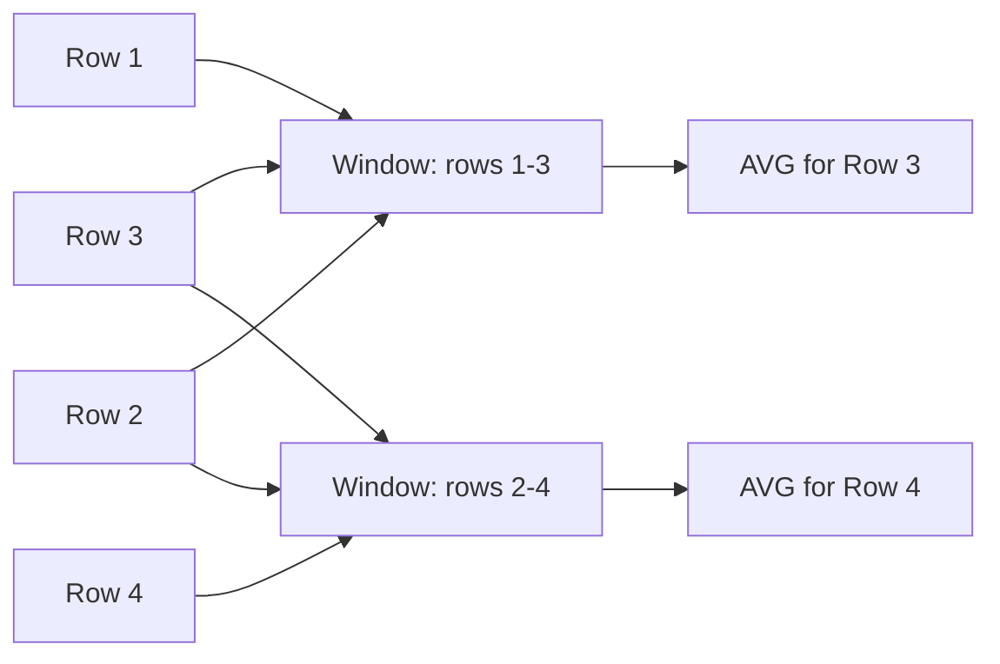

# How to Use Moving Averages with AVG() OVER() in MySQL

Author: [nawazdhandala](https://www.github.com/nawazdhandala)

Tags: MySQL, SQL, Window Function, Moving Average, AVG, MySQL 8.0, Database

Description: Learn how to compute moving averages in MySQL 8.0 using the AVG() window function with custom frame specifications for smoothing time-series data.

---

## How Moving Averages Work

A moving average (also called a rolling average) computes the average of a value over a sliding window of N rows. Unlike a running total that grows from the start, a moving average slides forward row by row, always covering the same number of rows.

In MySQL 8.0, this is done with `AVG(column) OVER (ORDER BY ... ROWS BETWEEN N PRECEDING AND CURRENT ROW)`.



## Syntax

```sql
AVG(column) OVER (
    [PARTITION BY group_column]
    ORDER BY order_column
    ROWS BETWEEN N PRECEDING AND CURRENT ROW
)
```

Common frame options:
- `ROWS BETWEEN 2 PRECEDING AND CURRENT ROW` - 3-row moving average (current + 2 prior).
- `ROWS BETWEEN 6 PRECEDING AND CURRENT ROW` - 7-row moving average.
- `ROWS BETWEEN 1 PRECEDING AND 1 FOLLOWING` - centered 3-row moving average.

## Examples

### Setup: Create Sample Data

```sql
CREATE TABLE stock_prices (
    id INT PRIMARY KEY AUTO_INCREMENT,
    ticker VARCHAR(10) NOT NULL,
    price_date DATE NOT NULL,
    closing_price DECIMAL(10, 2) NOT NULL
);

INSERT INTO stock_prices (ticker, price_date, closing_price) VALUES
    ('AAPL', '2026-01-05', 182.50),
    ('AAPL', '2026-01-06', 185.20),
    ('AAPL', '2026-01-07', 183.10),
    ('AAPL', '2026-01-08', 188.40),
    ('AAPL', '2026-01-09', 191.00),
    ('AAPL', '2026-01-12', 189.75),
    ('AAPL', '2026-01-13', 193.20),
    ('MSFT', '2026-01-05', 405.30),
    ('MSFT', '2026-01-06', 408.10),
    ('MSFT', '2026-01-07', 403.80),
    ('MSFT', '2026-01-08', 410.50),
    ('MSFT', '2026-01-09', 412.00),
    ('MSFT', '2026-01-12', 415.25),
    ('MSFT', '2026-01-13', 418.90);
```

### 3-Day Moving Average

Calculate the 3-day moving average closing price for each stock.

```sql
SELECT
    ticker,
    price_date,
    closing_price,
    ROUND(
        AVG(closing_price) OVER (
            PARTITION BY ticker
            ORDER BY price_date
            ROWS BETWEEN 2 PRECEDING AND CURRENT ROW
        ), 2
    ) AS ma_3day
FROM stock_prices
ORDER BY ticker, price_date;
```

```text
+--------+------------+---------------+---------+
| ticker | price_date | closing_price | ma_3day |
+--------+------------+---------------+---------+
| AAPL   | 2026-01-05 | 182.50        | 182.50  |
| AAPL   | 2026-01-06 | 185.20        | 183.85  |
| AAPL   | 2026-01-07 | 183.10        | 183.60  |
| AAPL   | 2026-01-08 | 188.40        | 185.57  |
| AAPL   | 2026-01-09 | 191.00        | 187.50  |
| AAPL   | 2026-01-12 | 189.75        | 189.72  |
| AAPL   | 2026-01-13 | 193.20        | 191.32  |
| MSFT   | 2026-01-05 | 405.30        | 405.30  |
| MSFT   | 2026-01-06 | 408.10        | 406.70  |
| ...    | ...        | ...           | ...     |
+--------+------------+---------------+---------+
```

The first row only uses 1 value, the second uses 2, then all subsequent rows use 3. This is a "trailing" moving average.

### 7-Day Moving Average

Extend the window to 7 days for smoother trends.

```sql
SELECT
    ticker,
    price_date,
    closing_price,
    ROUND(
        AVG(closing_price) OVER (
            PARTITION BY ticker
            ORDER BY price_date
            ROWS BETWEEN 6 PRECEDING AND CURRENT ROW
        ), 2
    ) AS ma_7day
FROM stock_prices
ORDER BY ticker, price_date;
```

### Centered Moving Average

A centered average includes rows before and after the current row, giving a smoothed value at the center of the window.

```sql
SELECT
    ticker,
    price_date,
    closing_price,
    ROUND(
        AVG(closing_price) OVER (
            PARTITION BY ticker
            ORDER BY price_date
            ROWS BETWEEN 1 PRECEDING AND 1 FOLLOWING
        ), 2
    ) AS ma_centered_3day
FROM stock_prices
ORDER BY ticker, price_date;
```

### Combining Multiple Moving Averages

Show 3-day and 5-day moving averages side by side to identify trend crossovers.

```sql
SELECT
    ticker,
    price_date,
    closing_price,
    ROUND(AVG(closing_price) OVER (
        PARTITION BY ticker ORDER BY price_date
        ROWS BETWEEN 2 PRECEDING AND CURRENT ROW), 2) AS ma_3,
    ROUND(AVG(closing_price) OVER (
        PARTITION BY ticker ORDER BY price_date
        ROWS BETWEEN 4 PRECEDING AND CURRENT ROW), 2) AS ma_5
FROM stock_prices
ORDER BY ticker, price_date;
```

### Moving Average for Daily Sales Smoothing

```sql
CREATE TABLE daily_orders (
    order_date DATE PRIMARY KEY,
    order_count INT
);

INSERT INTO daily_orders VALUES
    ('2026-01-01', 45), ('2026-01-02', 62), ('2026-01-03', 38),
    ('2026-01-04', 71), ('2026-01-05', 55), ('2026-01-06', 80),
    ('2026-01-07', 49);

SELECT
    order_date,
    order_count,
    ROUND(AVG(order_count) OVER (
        ORDER BY order_date
        ROWS BETWEEN 2 PRECEDING AND CURRENT ROW
    ), 1) AS ma_3day_orders
FROM daily_orders
ORDER BY order_date;
```

## Best Practices

- Choose the window size based on the data frequency: daily data often uses 7-day or 30-day windows; hourly data might use a 6-hour window.
- Be aware that early rows in the partition use fewer observations than the full window size; use `MIN_COUNT` or handle NULLs if you need full-window-only averages.
- Use PARTITION BY when tracking multiple entities (stocks, products, regions) so windows do not bleed across groups.
- Add a `ROWS BETWEEN` clause explicitly rather than relying on the default `RANGE BETWEEN UNBOUNDED PRECEDING AND CURRENT ROW` - the default RANGE mode can produce unexpected results when multiple rows share the same ORDER BY value.
- Combine moving average with the original value in the same query to overlay the trend on raw data.

## Summary

Moving averages in MySQL 8.0 use `AVG(column) OVER (ORDER BY ... ROWS BETWEEN N PRECEDING AND CURRENT ROW)`. The `ROWS` frame specifier controls the window size precisely. PARTITION BY enables independent moving averages per group (e.g., per stock ticker or per product). Moving averages are essential for smoothing noisy time-series data, identifying trends, and detecting anomalies by comparing raw values to their smoothed baseline.
