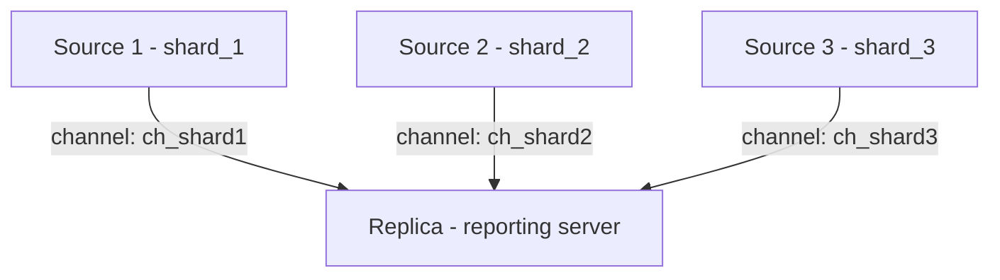

# How to Set Up MySQL Multi-Source Replication

Author: [OneUptime](https://oneuptime.com)

Tags: MySQL, Replication, Multi-Source, High Availability, Database

Description: Learn how to configure MySQL multi-source replication to consolidate data from multiple source servers into a single replica for reporting or failover purposes.

---

## Introduction

MySQL multi-source replication (available since MySQL 5.7.6) allows a single replica to receive and apply binary log events from multiple, independent source servers simultaneously. Each source-to-replica relationship is called a **replication channel** and is identified by a unique channel name.

Common use cases:

- Consolidating data from multiple shards into a single reporting replica
- Aggregating data from geographically distributed primaries
- Collecting database-level metrics in a centralized analytics server

## Architecture overview



## Prerequisites

- MySQL 5.7.6+ on all servers
- `gtid_mode = ON` or position-based replication on each source
- Replication user on each source that the replica can authenticate with
- `replica_parallel_type = LOGICAL_CLOCK` and `replica_parallel_workers > 1` recommended for performance

## Step 1 - Configure the replica my.cnf

```ini
# /etc/mysql/mysql.conf.d/mysqld.cnf (on the replica)

[mysqld]
server-id                  = 100
gtid_mode                  = ON
enforce_gtid_consistency   = ON
replica_parallel_type      = LOGICAL_CLOCK
replica_parallel_workers   = 4
relay_log                  = /var/log/mysql/replica-relay-bin
log_replica_updates        = ON
read_only                  = ON
```

## Step 2 - Create the replication user on each source

Run the following on **each source** server:

```sql
-- On Source 1 (and repeat on Source 2, Source 3, etc.)
CREATE USER 'repl'@'<replica_ip>' IDENTIFIED WITH caching_sha2_password BY 'strong_password';
GRANT REPLICATION SLAVE ON *.* TO 'repl'@'<replica_ip>';
FLUSH PRIVILEGES;
```

## Step 3 - Add the first channel (GTID mode)

Execute on the **replica** server:

```sql
CHANGE REPLICATION SOURCE TO
  SOURCE_HOST     = '192.168.1.10',
  SOURCE_USER     = 'repl',
  SOURCE_PASSWORD = 'strong_password',
  SOURCE_AUTO_POSITION = 1
FOR CHANNEL 'ch_shard1';

START REPLICA FOR CHANNEL 'ch_shard1';
```

## Step 4 - Add additional channels

```sql
CHANGE REPLICATION SOURCE TO
  SOURCE_HOST     = '192.168.1.11',
  SOURCE_USER     = 'repl',
  SOURCE_PASSWORD = 'strong_password',
  SOURCE_AUTO_POSITION = 1
FOR CHANNEL 'ch_shard2';

START REPLICA FOR CHANNEL 'ch_shard2';

CHANGE REPLICATION SOURCE TO
  SOURCE_HOST     = '192.168.1.12',
  SOURCE_USER     = 'repl',
  SOURCE_PASSWORD = 'strong_password',
  SOURCE_AUTO_POSITION = 1
FOR CHANNEL 'ch_shard3';

START REPLICA FOR CHANNEL 'ch_shard3';
```

## Step 5 - Verify all channels are running

```sql
-- Check all channels at once
SHOW REPLICA STATUS\G

-- Check a specific channel
SHOW REPLICA STATUS FOR CHANNEL 'ch_shard1'\G

-- Summary from Performance Schema (recommended)
SELECT
  CHANNEL_NAME,
  SERVICE_STATE         AS io_thread_state,
  LAST_ERROR_MESSAGE    AS io_error
FROM performance_schema.replication_connection_status;

SELECT
  CHANNEL_NAME,
  SERVICE_STATE       AS sql_thread_state,
  LAST_ERROR_MESSAGE  AS sql_error,
  LAST_APPLIED_TRANSACTION
FROM performance_schema.replication_applier_status_by_coordinator;
```

## Managing channels

```sql
-- Stop a single channel
STOP REPLICA FOR CHANNEL 'ch_shard2';

-- Start a single channel
START REPLICA FOR CHANNEL 'ch_shard2';

-- Stop all channels
STOP REPLICA;

-- Remove a channel entirely
STOP REPLICA FOR CHANNEL 'ch_shard3';
RESET REPLICA FOR CHANNEL 'ch_shard3';
```

## Position-based multi-source replication (non-GTID)

If GTIDs are not enabled, use file and position coordinates instead:

```sql
-- Get coordinates from the source
-- (Run on Source 1)
FLUSH TABLES WITH READ LOCK;
SHOW BINARY LOG STATUS;
/*
+------------------+----------+
| File             | Position |
+------------------+----------+
| mysql-bin.000003 |      876 |
+------------------+----------+
*/
UNLOCK TABLES;

-- Configure channel on the replica
CHANGE REPLICATION SOURCE TO
  SOURCE_HOST     = '192.168.1.10',
  SOURCE_USER     = 'repl',
  SOURCE_PASSWORD = 'strong_password',
  SOURCE_LOG_FILE = 'mysql-bin.000003',
  SOURCE_LOG_POS  = 876
FOR CHANNEL 'ch_shard1';

START REPLICA FOR CHANNEL 'ch_shard1';
```

## Replication filter per channel

You can assign database-level filters to individual channels to avoid applying events from the wrong schema:

```sql
CHANGE REPLICATION FILTER
  REPLICATE_DO_DB = (shard1_db)
FOR CHANNEL 'ch_shard1';

CHANGE REPLICATION FILTER
  REPLICATE_DO_DB = (shard2_db)
FOR CHANNEL 'ch_shard2';
```

## Multi-source with parallel applier threads

```ini
# Replica my.cnf - enable parallel appliers
[mysqld]
replica_parallel_type    = LOGICAL_CLOCK
replica_parallel_workers = 8
replica_preserve_commit_order = ON
```

## Handling conflicts in a multi-source setup

When two sources write to the same table (e.g., an aggregation table), conflicts can occur. Strategies include:

- Partition tables by `server_id` so each source owns distinct rows
- Use `REPLACE INTO` or `INSERT ... ON DUPLICATE KEY UPDATE` patterns in the application
- Apply per-channel filters (`REPLICATE_DO_DB`, `REPLICATE_IGNORE_TABLE`) so sources write to separate schemas

## Summary

MySQL multi-source replication is configured by adding one `CHANGE REPLICATION SOURCE TO ... FOR CHANNEL 'name'` statement for each source server, then starting each channel independently. With GTIDs enabled, `SOURCE_AUTO_POSITION = 1` handles gap detection automatically. Each channel maintains its own relay log, IO thread, and SQL applier thread, so one lagging source does not block others. Use per-channel replication filters to scope each channel to its dedicated schema and avoid data conflicts.
