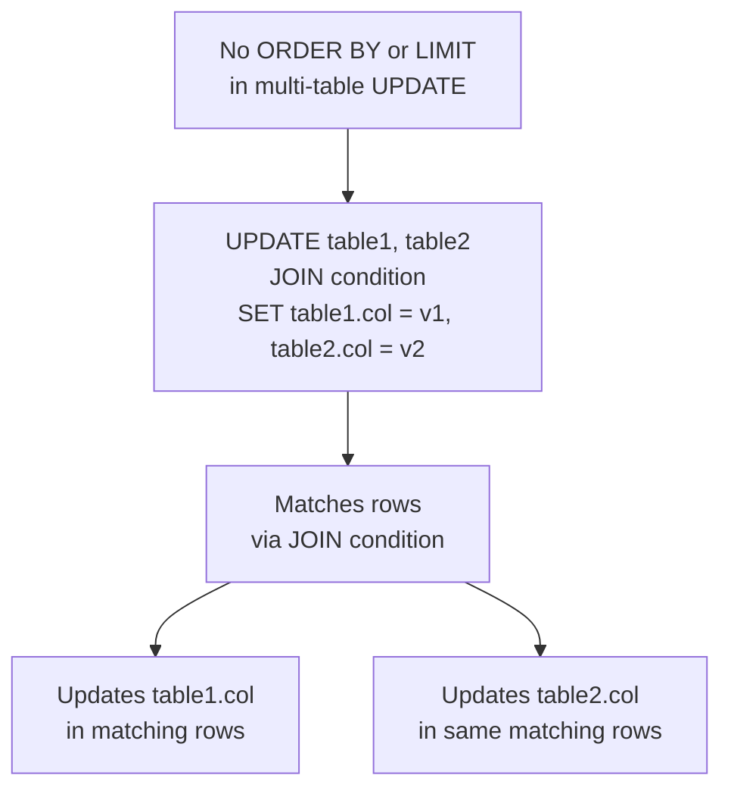

# How to Use Multi-Table UPDATE in MySQL

Author: [nawazdhandala](https://www.github.com/nawazdhandala)

Tags: MySQL, SQL, DML, Update, Multi-Table, Database

Description: Learn how to update multiple tables simultaneously in a single MySQL statement using multi-table UPDATE syntax, with practical examples and transaction guidance.

---

## What Is Multi-Table UPDATE

MySQL allows updating columns in more than one table within a single `UPDATE` statement. The multi-table `UPDATE` syntax includes multiple table references in the `UPDATE` clause and a `JOIN` to relate them. This lets you atomically update related rows in two or more tables with a single statement, reducing round-trips.

Note that multi-table `UPDATE` statements do not support `ORDER BY` or `LIMIT`.



## Syntax

```sql
-- Comma-separated tables (implicit JOIN)
UPDATE table1, table2
SET table1.col1 = value1,
    table2.col2 = value2
WHERE table1.fk_id = table2.id;

-- Explicit JOIN syntax (equivalent, clearer)
UPDATE table1
JOIN table2 ON table1.fk_id = table2.id
SET table1.col1 = value1,
    table2.col2 = value2
[WHERE conditions];

-- Three-table multi-table UPDATE
UPDATE t1
JOIN t2 ON t1.id = t2.fk1
JOIN t3 ON t2.id = t3.fk2
SET t1.col = t3.value,
    t2.col = 'updated'
WHERE t3.status = 'pending';
```

## Examples

### Setup: Orders and Order Status Log

```sql
CREATE TABLE orders (
    id         INT          PRIMARY KEY AUTO_INCREMENT,
    customer   VARCHAR(100) NOT NULL,
    status     VARCHAR(20)  DEFAULT 'pending',
    total      DECIMAL(10,2),
    updated_at DATETIME
);

CREATE TABLE order_status_log (
    id         INT      PRIMARY KEY AUTO_INCREMENT,
    order_id   INT,
    old_status VARCHAR(20),
    new_status VARCHAR(20),
    changed_at DATETIME,
    FOREIGN KEY (order_id) REFERENCES orders(id)
);

INSERT INTO orders (customer, status, total) VALUES
    ('Alice',   'pending',    250.00),
    ('Bob',     'pending',    430.00),
    ('Carol',   'processing', 125.50),
    ('Dave',    'pending',    875.00),
    ('Eve',     'processing',  60.00);

INSERT INTO order_status_log (order_id, old_status, new_status, changed_at) VALUES
    (1, 'new',    'pending',    NOW()),
    (2, 'new',    'pending',    NOW()),
    (3, 'pending','processing', NOW()),
    (4, 'new',    'pending',    NOW()),
    (5, 'pending','processing', NOW());
```

### Update Two Tables Simultaneously

```sql
-- Mark all 'pending' orders as 'shipped' and record the status change in the log
UPDATE orders o
JOIN order_status_log l ON l.order_id = o.id
SET
    o.status     = 'shipped',
    o.updated_at = NOW(),
    l.old_status = o.status,
    l.new_status = 'shipped',
    l.changed_at = NOW()
WHERE o.status = 'pending';

-- Verify
SELECT o.id, o.customer, o.status, l.old_status, l.new_status
FROM orders o
JOIN order_status_log l ON l.order_id = o.id
ORDER BY o.id;
```

```text
+----+----------+---------+------------+------------+
| id | customer | status  | old_status | new_status |
+----+----------+---------+------------+------------+
|  1 | Alice    | shipped | pending    | shipped    |
|  2 | Bob      | shipped | pending    | shipped    |
|  3 | Carol    | processing | pending | processing |
|  4 | Dave     | shipped | pending    | shipped    |
|  5 | Eve      | processing | pending | processing |
+----+----------+---------+------------+------------+
```

### Sync Data Between Two Tables

```sql
CREATE TABLE employees (
    id       INT          PRIMARY KEY AUTO_INCREMENT,
    name     VARCHAR(100) NOT NULL,
    email    VARCHAR(100),
    dept_id  INT
);

CREATE TABLE user_accounts (
    id       INT          PRIMARY KEY AUTO_INCREMENT,
    emp_id   INT UNIQUE,
    email    VARCHAR(100),
    username VARCHAR(100),
    active   TINYINT DEFAULT 1
);

INSERT INTO employees (name, email, dept_id) VALUES
    ('Alice', 'alice@example.com', 1),
    ('Bob',   'bob_new@example.com', 1),  -- email changed
    ('Carol', 'carol@example.com', 2);

INSERT INTO user_accounts (emp_id, email, username) VALUES
    (1, 'alice@example.com',   'alice'),
    (2, 'bob@example.com',     'bob'),    -- old email
    (3, 'carol@example.com',   'carol');

-- Sync user_accounts email to match current employees.email
UPDATE employees e
JOIN user_accounts u ON u.emp_id = e.id
SET u.email = e.email
WHERE u.email != e.email;

SELECT e.name, e.email AS emp_email, u.email AS account_email
FROM employees e
JOIN user_accounts u ON u.emp_id = e.id;
```

```text
+-------+---------------------+---------------------+
| name  | emp_email           | account_email       |
+-------+---------------------+---------------------+
| Alice | alice@example.com   | alice@example.com   |
| Bob   | bob_new@example.com | bob_new@example.com |
| Carol | carol@example.com   | carol@example.com   |
+-------+---------------------+---------------------+
```

### Three-Table Multi-Table UPDATE

```sql
CREATE TABLE inventory (
    product_id INT PRIMARY KEY,
    quantity   INT,
    warehouse  VARCHAR(50)
);

CREATE TABLE products (
    id       INT PRIMARY KEY AUTO_INCREMENT,
    name     VARCHAR(100),
    in_stock TINYINT DEFAULT 1
);

CREATE TABLE restock_queue (
    id         INT PRIMARY KEY AUTO_INCREMENT,
    product_id INT,
    status     VARCHAR(20) DEFAULT 'pending'
);

INSERT INTO products (name, in_stock) VALUES
    ('Widget', 0), ('Gadget', 0), ('Thingamajig', 1);

INSERT INTO inventory (product_id, quantity, warehouse) VALUES
    (1, 50, 'East'), (2, 0, 'West'), (3, 100, 'East');

INSERT INTO restock_queue (product_id, status) VALUES
    (1, 'pending'), (2, 'pending');

-- Update products in_stock and restock queue status based on inventory
UPDATE products p
JOIN inventory i       ON i.product_id = p.id
JOIN restock_queue rq  ON rq.product_id = p.id
SET
    p.in_stock  = IF(i.quantity > 0, 1, 0),
    rq.status   = IF(i.quantity > 0, 'fulfilled', 'pending')
WHERE rq.status = 'pending';

SELECT p.name, p.in_stock, rq.status, i.quantity
FROM products p
JOIN inventory i ON i.product_id = p.id
LEFT JOIN restock_queue rq ON rq.product_id = p.id;
```

```text
+-------------+----------+-----------+----------+
| name        | in_stock | status    | quantity |
+-------------+----------+-----------+----------+
| Widget      | 1        | fulfilled | 50       |
| Gadget      | 0        | pending   | 0        |
| Thingamajig | 1        | NULL      | 100      |
+-------------+----------+-----------+----------+
```

### Use a Transaction for Multi-Table UPDATE

```sql
START TRANSACTION;

UPDATE orders o
JOIN order_status_log l ON l.order_id = o.id
SET
    o.status     = 'cancelled',
    o.updated_at = NOW(),
    l.old_status = o.status,
    l.new_status = 'cancelled',
    l.changed_at = NOW()
WHERE o.id = 4;

-- Preview result before committing
SELECT o.status, l.new_status FROM orders o JOIN order_status_log l ON l.order_id = o.id WHERE o.id = 4;

COMMIT;
-- Or ROLLBACK if the result is not as expected
```

## Multi-Table UPDATE vs Separate Statements

| Approach                 | Atomicity      | Performance     | Complexity       |
|--------------------------|----------------|-----------------|------------------|
| Multi-table UPDATE       | Single statement, same transaction | One round-trip | Higher SQL complexity |
| Separate UPDATE statements | Requires explicit transaction | Multiple round-trips | Simpler per statement |

Use multi-table UPDATE when you need to keep two tables consistent in a single atomic operation. Use separate statements when each update has independent conditions.

## Limitations

- Multi-table `UPDATE` does not support `ORDER BY` or `LIMIT`.
- You cannot reference a table in a subquery that you are also updating in the same statement.
- Row-level locking applies to all tables involved; be mindful of deadlock risk with large updates.

## Best Practices

- Always run the equivalent `SELECT` with the same JOIN and WHERE to preview which rows will be modified before running the update.
- Wrap multi-table `UPDATE` in a transaction so you can roll back if the result is unexpected.
- Avoid updating the same column that appears in the `ON` JOIN condition, as MySQL evaluates the condition before the update.
- Keep multi-table updates narrowly scoped with precise `WHERE` clauses to minimize lock contention.

## Summary

Multi-table `UPDATE` in MySQL updates columns in more than one table using `UPDATE t1 JOIN t2 ON ... SET t1.col = v, t2.col = v`. It reduces round-trips and keeps related tables consistent. Use explicit `JOIN` syntax for readability. Wrap in a transaction for safety, and always preview with a `SELECT` first. Multi-table `UPDATE` does not support `ORDER BY` or `LIMIT`.
