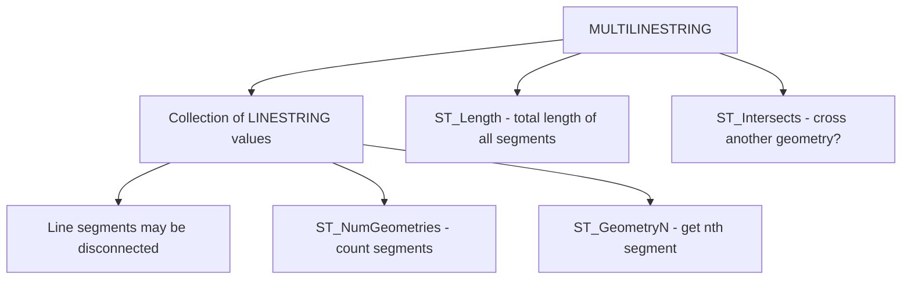

# How to Use MULTILINESTRING in MySQL

Author: [nawazdhandala](https://www.github.com/nawazdhandala)

Tags: MySQL, SQL, Spatial, GIS, Geometry, Database

Description: Learn how to store and query collections of line paths using the MULTILINESTRING data type in MySQL, with route modeling, length calculations, and spatial queries.

---

## What Is MULTILINESTRING

`MULTILINESTRING` is a spatial data type in MySQL that stores a collection of one or more `LINESTRING` values as a single geometry. The component linestrings do not need to be connected or contiguous. MULTILINESTRING is useful for modeling features that consist of multiple disconnected line segments, such as a bus route with gaps, a set of utility lines, or a river system with tributaries.



## Syntax

```sql
-- Column definition
column_name MULTILINESTRING [NOT NULL] [SRID srid_value]

-- Create from WKT
ST_GeomFromText('MULTILINESTRING((x1 y1, x2 y2), (x3 y3, x4 y4, x5 y5))', srid)

-- Useful functions
ST_NumGeometries(mls)        -- number of LINESTRING members
ST_GeometryN(mls, n)         -- nth LINESTRING (1-based)
ST_Length(mls)               -- sum of lengths of all members
ST_AsText(mls)               -- WKT string
ST_IsClosed(mls)             -- TRUE if all members are closed
ST_Envelope(mls)             -- bounding box POLYGON
```

## Examples

### Create a Table for Transit Routes

```sql
CREATE TABLE transit_routes (
    id          INT             PRIMARY KEY AUTO_INCREMENT,
    route_name  VARCHAR(100)    NOT NULL,
    route_type  VARCHAR(50),
    segments    MULTILINESTRING NOT NULL SRID 4326,
    SPATIAL INDEX idx_segments (segments)
);
```

### Insert MULTILINESTRING Values

```sql
-- Bus route with two disconnected service segments
INSERT INTO transit_routes (route_name, route_type, segments) VALUES
(
    'M15 Bus - North and South Runs',
    'Bus',
    ST_GeomFromText(
        'MULTILINESTRING(
            (-73.9730 40.7128, -73.9730 40.7480, -73.9730 40.7800),
            (-73.9600 40.7900, -73.9600 40.7600, -73.9600 40.7300)
        )',
        4326
    )
),
(
    'A Train - Express Stops',
    'Subway',
    ST_GeomFromText(
        'MULTILINESTRING(
            (-73.9857 40.7580, -73.9792 40.7614, -73.9723 40.7650),
            (-73.9620 40.7700, -73.9540 40.7760)
        )',
        4326
    )
),
(
    'Hudson River Greenway',
    'Bike Path',
    ST_GeomFromText(
        'MULTILINESTRING(
            (-74.0090 40.7074, -74.0090 40.7300, -74.0090 40.7600),
            (-74.0090 40.7800, -74.0090 40.8000)
        )',
        4326
    )
);
```

### Query Route Properties

```sql
SELECT
    route_name,
    route_type,
    ST_NumGeometries(segments)     AS num_segments,
    ROUND(ST_Length(segments), 6)  AS total_length_degrees
FROM transit_routes
ORDER BY total_length_degrees DESC;
```

```text
+---------------------------------+-----------+--------------+----------------------+
| route_name                      | route_type| num_segments | total_length_degrees |
+---------------------------------+-----------+--------------+----------------------+
| M15 Bus - North and South Runs  | Bus       | 2            |             0.132000 |
| A Train - Express Stops         | Subway    | 2            |             0.024500 |
| Hudson River Greenway           | Bike Path | 2            |             0.093000 |
+---------------------------------+-----------+--------------+----------------------+
```

### Extract Individual Segments

```sql
SELECT
    route_name,
    ST_AsText(ST_GeometryN(segments, 1)) AS segment_1,
    ST_AsText(ST_GeometryN(segments, 2)) AS segment_2
FROM transit_routes
WHERE route_name = 'A Train - Express Stops';
```

```text
+-------------------------+--------------------------------------------+--------------------------------------------+
| route_name              | segment_1                                  | segment_2                                  |
+-------------------------+--------------------------------------------+--------------------------------------------+
| A Train - Express Stops | LINESTRING(-73.9857 40.758,-73.979 40.765) | LINESTRING(-73.962 40.77,-73.954 40.776)   |
+-------------------------+--------------------------------------------+--------------------------------------------+
```

### Find Routes That Cross a Geographic Area

```sql
SET @midtown_box = ST_GeomFromText(
    'POLYGON((-74.010 40.745, -73.960 40.745, -73.960 40.770, -74.010 40.770, -74.010 40.745))',
    4326
);

SELECT route_name, route_type
FROM transit_routes
WHERE ST_Intersects(segments, @midtown_box);
```

```text
+--------------------------+-----------+
| route_name               | route_type|
+--------------------------+-----------+
| A Train - Express Stops  | Subway    |
+--------------------------+-----------+
```

### Calculate Total Length in Meters for SRID 4326

In MySQL 8.0+, `ST_Length` on a geometry with SRID 4326 returns the length in meters along the geodetic ellipsoid:

```sql
SELECT
    route_name,
    ROUND(ST_Length(segments)) AS total_length_meters
FROM transit_routes
ORDER BY total_length_meters DESC;
```

### Merge Multiple LINESTRINGs into a MULTILINESTRING

Use `ST_Collect` (MySQL 8.0.24+) to aggregate:

```sql
-- Combine all bike path segments into one MULTILINESTRING
SELECT ST_AsText(
    ST_Collect(path)
) AS combined_paths
FROM routes
WHERE type = 'bike_path';
```

## MULTILINESTRING vs Separate LINESTRING Rows

| Approach              | Best For                                        |
|-----------------------|-------------------------------------------------|
| MULTILINESTRING       | Single entity with multiple disconnected paths  |
| Separate LINESTRING   | Individual routes queried independently         |

Use MULTILINESTRING when the collection of line segments represents one logical entity (like a full transit route including both directions). Use separate rows when each segment is independently managed.

## Best Practices

- Use SRID 4326 for geographic route data so length and intersection functions work correctly.
- Add a `SPATIAL INDEX` on the column for efficient spatial queries.
- Use `ST_GeometryN` to iterate over segments on the application side.
- Prefer separate `LINESTRING` rows for simpler querying when segments are managed independently.

## Summary

`MULTILINESTRING` stores a collection of `LINESTRING` segments as one geometry value. Insert with `ST_GeomFromText('MULTILINESTRING((x1 y1, x2 y2), (x3 y3, x4 y4))', srid)`. Use `ST_NumGeometries` to count segments, `ST_GeometryN` to extract individual segments, `ST_Length` for total combined length, and `ST_Intersects` to find routes crossing a given area.
