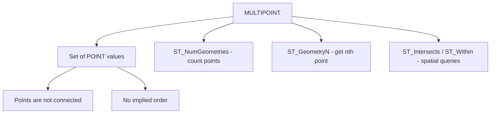

# How to Use MULTIPOINT in MySQL

Author: [nawazdhandala](https://www.github.com/nawazdhandala)

Tags: MySQL, SQL, Spatial, GIS, Geometry, Database

Description: Learn how to store and query sets of discrete geographic points using the MULTIPOINT data type in MySQL, with WKT insertion and spatial query examples.

---

## What Is MULTIPOINT

`MULTIPOINT` is a spatial data type in MySQL that stores a collection of zero or more `POINT` values. Unlike `LINESTRING`, the points in a MULTIPOINT are not connected and have no implied order. MULTIPOINT is useful for representing a set of locations that belong to the same entity but are not linked, such as a chain of branches, a set of sensor stations, or a group of ATM locations.



## Syntax

```sql
-- Column definition
column_name MULTIPOINT [NOT NULL] [SRID srid_value]

-- Create from WKT
ST_GeomFromText('MULTIPOINT((x1 y1), (x2 y2), (x3 y3))', srid)
-- Alternative (no inner parentheses, also valid in MySQL)
ST_GeomFromText('MULTIPOINT(x1 y1, x2 y2, x3 y3)', srid)

-- Useful functions
ST_NumGeometries(mp)       -- count of points in the collection
ST_GeometryN(mp, n)        -- nth point (1-based)
ST_AsText(mp)              -- WKT string
ST_Envelope(mp)            -- bounding box as POLYGON
```

## Examples

### Create a Table with a MULTIPOINT Column

```sql
CREATE TABLE branch_networks (
    id          INT        PRIMARY KEY AUTO_INCREMENT,
    company     VARCHAR(100) NOT NULL,
    region      VARCHAR(50),
    locations   MULTIPOINT NOT NULL SRID 4326,
    SPATIAL INDEX idx_locations (locations)
);
```

### Insert MULTIPOINT Values

```sql
INSERT INTO branch_networks (company, region, locations) VALUES
(
    'City Bank',
    'New York',
    ST_GeomFromText(
        'MULTIPOINT(
            (-74.0060 40.7128),
            (-73.9857 40.7484),
            (-73.9442 40.6782),
            (-73.8648 40.7282)
        )',
        4326
    )
),
(
    'Quick Mart',
    'Chicago',
    ST_GeomFromText(
        'MULTIPOINT(
            (-87.6298 41.8781),
            (-87.6553 41.9200),
            (-87.6700 41.8500)
        )',
        4326
    )
);
```

### Query MULTIPOINT Properties

```sql
SELECT
    company,
    region,
    ST_NumGeometries(locations)   AS num_branches,
    ST_AsText(ST_Envelope(locations)) AS bounding_box_wkt
FROM branch_networks;
```

```text
+------------+----------+--------------+-------------------------------------------------+
| company    | region   | num_branches | bounding_box_wkt                                |
+------------+----------+--------------+-------------------------------------------------+
| City Bank  | New York | 4            | POLYGON((-74.006 40.6782,...,-74.006 40.6782))  |
| Quick Mart | Chicago  | 3            | POLYGON((-87.67 41.85,...,-87.67 41.85))        |
+------------+----------+--------------+-------------------------------------------------+
```

### Extract Individual Points

```sql
SELECT
    company,
    ST_AsText(ST_GeometryN(locations, 1)) AS branch_1,
    ST_AsText(ST_GeometryN(locations, 2)) AS branch_2,
    ST_AsText(ST_GeometryN(locations, 3)) AS branch_3
FROM branch_networks;
```

```text
+------------+---------------------------+---------------------------+---------------------------+
| company    | branch_1                  | branch_2                  | branch_3                  |
+------------+---------------------------+---------------------------+---------------------------+
| City Bank  | POINT(-74.006 40.7128)    | POINT(-73.9857 40.7484)   | POINT(-73.9442 40.6782)   |
| Quick Mart | POINT(-87.6298 41.8781)   | POINT(-87.6553 41.92)     | POINT(-87.67 41.85)       |
+------------+---------------------------+---------------------------+---------------------------+
```

### Find Networks That Have Branches Inside a Polygon

```sql
SET @manhattan = ST_GeomFromText(
    'POLYGON((-74.020 40.700, -73.960 40.700, -73.960 40.800, -74.020 40.800, -74.020 40.700))',
    4326
);

SELECT company, region
FROM branch_networks
WHERE ST_Intersects(locations, @manhattan);
```

```text
+-----------+----------+
| company   | region   |
+-----------+----------+
| City Bank | New York |
+-----------+----------+
```

### Convert MULTIPOINT to Individual Rows

Use a numbers table or recursive CTE to expand a MULTIPOINT into one row per point:

```sql
WITH RECURSIVE nums AS (
    SELECT 1 AS n
    UNION ALL
    SELECT n + 1 FROM nums WHERE n < 20
)
SELECT
    b.company,
    nums.n                                   AS branch_index,
    ST_AsText(ST_GeometryN(b.locations, nums.n)) AS branch_location
FROM branch_networks b
JOIN nums ON nums.n <= ST_NumGeometries(b.locations)
ORDER BY b.company, nums.n;
```

```text
+------------+--------------+---------------------------+
| company    | branch_index | branch_location           |
+------------+--------------+---------------------------+
| City Bank  | 1            | POINT(-74.006 40.7128)    |
| City Bank  | 2            | POINT(-73.9857 40.7484)   |
| City Bank  | 3            | POINT(-73.9442 40.6782)   |
| City Bank  | 4            | POINT(-73.8648 40.7282)   |
| Quick Mart | 1            | POINT(-87.6298 41.8781)   |
| Quick Mart | 2            | POINT(-87.6553 41.92)     |
| Quick Mart | 3            | POINT(-87.67 41.85)       |
+------------+--------------+---------------------------+
```

## MULTIPOINT vs Separate POINT Rows

| Approach          | Pros                               | Cons                                    |
|-------------------|------------------------------------|------------------------------------------|
| MULTIPOINT column | Single row per entity, compact     | Harder to query individual points        |
| Separate rows     | Easy to query, index each point    | Requires JOIN to group by entity         |

For most geospatial applications, storing each point as a separate row with a foreign key to the parent entity is easier to work with. Use MULTIPOINT when the group of points must travel together as a single value.

## Best Practices

- Specify SRID 4326 for real-world geographic coordinates.
- Add a `SPATIAL INDEX` to enable bounding-box queries with `MBRContains` and `ST_Intersects`.
- Consider normalized separate rows instead of MULTIPOINT if you frequently query or update individual points.
- Use `ST_GeometryN` to access individual members when iterating on the application side.

## Summary

`MULTIPOINT` stores a set of unconnected `POINT` values as a single geometry. Insert with `ST_GeomFromText('MULTIPOINT((x1 y1), (x2 y2), ...)', srid)`. Use `ST_NumGeometries` to count members, `ST_GeometryN` to extract individual points, and `ST_Intersects` or `MBRContains` for spatial filtering. A `SPATIAL INDEX` on the column accelerates bounding-box queries.
