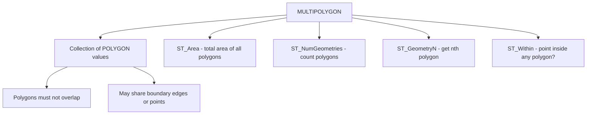

# How to Use MULTIPOLYGON in MySQL

Author: [OneUptime](https://www.github.com/OneUptime)

Tags: MySQL, SQL, Spatial, GIS, Geometry, Database

Description: Learn how to store and query collections of geographic areas using the MULTIPOLYGON data type in MySQL, with territory modeling, area calculation, and containment queries.

---

## What Is MULTIPOLYGON

`MULTIPOLYGON` is a spatial data type in MySQL that stores a collection of one or more `POLYGON` values as a single geometry. The component polygons must not overlap one another, though they may share boundary points. MULTIPOLYGON is useful for representing geographic entities that consist of multiple non-contiguous areas, such as a country with islands, a state with an exclave, a franchise territory spanning multiple districts, or a shipping zone with excluded gaps.



## Syntax

```sql
-- Column definition
column_name MULTIPOLYGON [NOT NULL] [SRID srid_value]

-- Create from WKT (each polygon enclosed in its own parentheses)
ST_GeomFromText(
    'MULTIPOLYGON(((x1 y1, x2 y2, x3 y3, x1 y1)), ((x4 y4, x5 y5, x6 y6, x4 y4)))',
    srid
)

-- Useful functions
ST_NumGeometries(mp)       -- count of member polygons
ST_GeometryN(mp, n)        -- nth polygon (1-based)
ST_Area(mp)                -- total area (sum of all polygons)
ST_Centroid(mp)            -- centroid of the entire collection
ST_AsText(mp)              -- WKT representation
```

## Examples

### Create a Table with a MULTIPOLYGON Column

```sql
CREATE TABLE territories (
    id          INT          PRIMARY KEY AUTO_INCREMENT,
    entity_name VARCHAR(100) NOT NULL,
    territory   MULTIPOLYGON NOT NULL SRID 4326,
    SPATIAL INDEX idx_territory (territory)
);
```

### Insert MULTIPOLYGON Values

```sql
-- A company with territories in two separate city districts
INSERT INTO territories (entity_name, territory) VALUES
(
    'Metro Delivery Co - NYC Zones',
    ST_GeomFromText(
        'MULTIPOLYGON(
            ((-74.020 40.700, -73.970 40.700, -73.970 40.730, -74.020 40.730, -74.020 40.700)),
            ((-73.990 40.750, -73.950 40.750, -73.950 40.780, -73.990 40.780, -73.990 40.750))
        )',
        4326
    )
),
(
    'Island State Example',
    ST_GeomFromText(
        'MULTIPOLYGON(
            ((-74.050 40.680, -74.010 40.680, -74.010 40.710, -74.050 40.710, -74.050 40.680)),
            ((-73.800 40.750, -73.760 40.750, -73.760 40.780, -73.800 40.780, -73.800 40.750)),
            ((-73.900 40.820, -73.860 40.820, -73.860 40.850, -73.900 40.850, -73.900 40.820))
        )',
        4326
    )
);
```

### Query MULTIPOLYGON Properties

```sql
SELECT
    entity_name,
    ST_NumGeometries(territory)          AS polygon_count,
    ROUND(ST_Area(territory), 8)         AS total_area_sq_degrees,
    ST_AsText(ST_Centroid(territory))    AS centroid
FROM territories;
```

```text
+------------------------------+---------------+-----------------------+-------------------------------+
| entity_name                  | polygon_count | total_area_sq_degrees | centroid                      |
+------------------------------+---------------+-----------------------+-------------------------------+
| Metro Delivery Co - NYC Zones| 2             |          0.00300000   | POINT(-73.9875 40.7475)       |
| Island State Example         | 3             |          0.00360000   | POINT(-73.86 40.76)           |
+------------------------------+---------------+-----------------------+-------------------------------+
```

### Check If a Point Falls Inside Any Polygon in the Collection

```sql
SET @test_point = ST_GeomFromText('POINT(-74.000 40.715)', 4326);

SELECT entity_name
FROM territories
WHERE ST_Within(@test_point, territory);
```

```text
+------------------------------+
| entity_name                  |
+------------------------------+
| Metro Delivery Co - NYC Zones|
+------------------------------+
```

### Extract Individual Polygons

```sql
SELECT
    entity_name,
    ST_AsText(ST_GeometryN(territory, 1)) AS polygon_1,
    ST_AsText(ST_GeometryN(territory, 2)) AS polygon_2
FROM territories
WHERE entity_name = 'Metro Delivery Co - NYC Zones';
```

```text
+------------------------------+-----------------------------------------------+-----------------------------------------------+
| entity_name                  | polygon_1                                     | polygon_2                                     |
+------------------------------+-----------------------------------------------+-----------------------------------------------+
| Metro Delivery Co - NYC Zones| POLYGON((-74.02 40.7,-73.97 40.7,...))        | POLYGON((-73.99 40.75,-73.95 40.75,...))       |
+------------------------------+-----------------------------------------------+-----------------------------------------------+
```

### Find Territories That Intersect a Search Region

```sql
SET @search_region = ST_GeomFromText(
    'POLYGON((-74.060 40.670, -73.940 40.670, -73.940 40.730, -74.060 40.730, -74.060 40.670))',
    4326
);

SELECT entity_name
FROM territories
WHERE ST_Intersects(territory, @search_region);
```

```text
+------------------------------+
| entity_name                  |
+------------------------------+
| Metro Delivery Co - NYC Zones|
| Island State Example         |
+------------------------------+
```

### Compute Per-Polygon Area with a Numbers Table

```sql
WITH RECURSIVE nums AS (
    SELECT 1 AS n
    UNION ALL
    SELECT n + 1 FROM nums WHERE n < 10
)
SELECT
    t.entity_name,
    nums.n                                       AS polygon_index,
    ROUND(ST_Area(ST_GeometryN(t.territory, nums.n)), 8) AS area_sq_degrees
FROM territories t
JOIN nums ON nums.n <= ST_NumGeometries(t.territory)
ORDER BY t.entity_name, nums.n;
```

```text
+------------------------------+---------------+-----------------+
| entity_name                  | polygon_index | area_sq_degrees |
+------------------------------+---------------+-----------------+
| Island State Example         | 1             |      0.00120000 |
| Island State Example         | 2             |      0.00120000 |
| Island State Example         | 3             |      0.00120000 |
| Metro Delivery Co - NYC Zones| 1             |      0.00150000 |
| Metro Delivery Co - NYC Zones| 2             |      0.00150000 |
+------------------------------+---------------+-----------------+
```

## Best Practices

- Ensure component polygons do not overlap; `ST_IsValid` will return 0 for overlapping MULTIPOLYGON geometries.
- Use SRID 4326 for real-world geographic area modeling.
- Add a `SPATIAL INDEX` to support fast `ST_Within`, `ST_Intersects`, and `MBRContains` queries.
- Use `ST_Area` for total combined area and `ST_GeometryN` to get the area of each individual polygon.
- For country or region boundaries, consider importing from public GIS datasets like Natural Earth rather than creating complex WKT strings manually.

## Summary

`MULTIPOLYGON` stores a set of non-overlapping `POLYGON` values as a single geometry. Insert with `ST_GeomFromText('MULTIPOLYGON(((...)), ((...))', srid)`. Use `ST_NumGeometries` to count polygons, `ST_GeometryN` to access individual polygons, `ST_Area` for total combined area, and `ST_Within` or `ST_Intersects` for spatial containment and overlap queries. Spatial indexes accelerate queries across large datasets.
