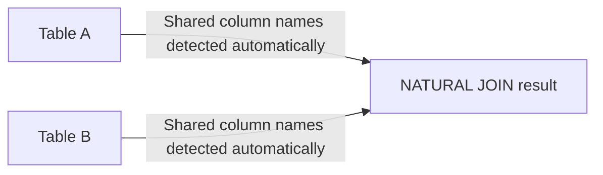

# How to Use NATURAL JOIN in MySQL

Author: [nawazdhandala](https://www.github.com/nawazdhandala)

Tags: MySQL, SQL, JOIN, Database, Query

Description: Learn how NATURAL JOIN works in MySQL, how it automatically matches columns by name, its risks with schema changes, and when to use explicit JOIN instead.

---

## What is NATURAL JOIN?

A NATURAL JOIN automatically joins two tables on all columns that share the same name and a compatible data type. You do not write an ON clause - MySQL discovers the matching column names at runtime. If no columns share a name, the result is a cross join (all rows combined).



## Syntax

```sql
SELECT column_list
FROM table_a
NATURAL JOIN table_b;
```

The shared columns appear only once in the result set.

## Setup: Sample Tables

```sql
CREATE TABLE departments (
    dept_id   INT PRIMARY KEY AUTO_INCREMENT,
    dept_name VARCHAR(100) NOT NULL
);

CREATE TABLE employees (
    emp_id    INT PRIMARY KEY AUTO_INCREMENT,
    name      VARCHAR(100) NOT NULL,
    dept_id   INT,
    salary    DECIMAL(10,2)
);

INSERT INTO departments (dept_name) VALUES
    ('Engineering'),
    ('Marketing'),
    ('Finance');

INSERT INTO employees (name, dept_id, salary) VALUES
    ('Alice', 1, 95000.00),
    ('Bob',   2, 72000.00),
    ('Carol', 1, 105000.00),
    ('Dave',  3, 88000.00),
    ('Eve',  NULL, 65000.00);
```

## Basic NATURAL JOIN Example

Both tables share the column `dept_id`, so the join uses that column automatically.

```sql
SELECT emp_id, name, dept_id, dept_name, salary
FROM employees
NATURAL JOIN departments;
```

```text
+--------+-------+---------+-------------+-----------+
| emp_id | name  | dept_id | dept_name   | salary    |
+--------+-------+---------+-------------+-----------+
|      1 | Alice |       1 | Engineering | 95000.00  |
|      2 | Bob   |       2 | Marketing   | 72000.00  |
|      3 | Carol |       1 | Engineering | 105000.00 |
|      4 | Dave  |       3 | Finance     | 88000.00  |
+--------+-------+---------+-------------+-----------+
```

Eve is excluded because `dept_id` is NULL - identical behaviour to an INNER JOIN.

## Equivalent Explicit INNER JOIN

NATURAL JOIN is shorthand. The explicit form is always clearer and preferred in production code.

```sql
-- This query returns the same result as the NATURAL JOIN above
SELECT e.emp_id, e.name, e.dept_id, d.dept_name, e.salary
FROM employees e
INNER JOIN departments d ON e.dept_id = d.dept_id;
```

## Danger: Multiple Shared Column Names

If two tables share more than one column name, NATURAL JOIN uses all of them as join conditions. This can produce unexpected results.

```sql
CREATE TABLE orders (
    order_id INT PRIMARY KEY AUTO_INCREMENT,
    emp_id   INT,
    dept_id  INT,          -- shared with employees AND departments
    amount   DECIMAL(10,2)
);

INSERT INTO orders (emp_id, dept_id, amount) VALUES
    (1, 1, 500.00),
    (2, 2, 300.00),
    (3, 1, 750.00);

-- Joins on BOTH emp_id AND dept_id simultaneously - may not be intended
SELECT *
FROM employees
NATURAL JOIN orders;
```

Always inspect the column names of both tables before using NATURAL JOIN.

## Danger: Schema Changes Break Queries Silently

If a column is later added to one of the tables with a name that happens to match a column in the other table, the NATURAL JOIN silently changes its join condition.

```sql
-- Suppose a 'created_at' column is added to both tables later.
-- The NATURAL JOIN will now also require created_at to match,
-- which will likely return zero rows or wrong rows with no error.
```

This is the main reason most teams avoid NATURAL JOIN in production.

## NATURAL LEFT JOIN and NATURAL RIGHT JOIN

NATURAL JOIN supports outer join variants.

```sql
-- Keep all employees, even those without a matching department
SELECT emp_id, name, dept_id, dept_name
FROM employees
NATURAL LEFT JOIN departments;
```

```text
+--------+-------+---------+-------------+
| emp_id | name  | dept_id | dept_name   |
+--------+-------+---------+-------------+
|      1 | Alice |       1 | Engineering |
|      2 | Bob   |       2 | Marketing   |
|      3 | Carol |       1 | Engineering |
|      4 | Dave  |       3 | Finance     |
|      5 | Eve   |    NULL | NULL        |
+--------+-------+---------+-------------+
```

## NATURAL JOIN vs INNER JOIN vs USING

```mermaid
graph TD
    A[Join type] --> B{Do you want implicit column matching?}
    B -->|YES, small controlled schemas| C[NATURAL JOIN - risky, convenient]
    B -->|YES, explicit column name| D[JOIN ... USING(col) - safer]
    B -->|NO, full control| E[JOIN ... ON a.col = b.col - recommended]
```

`JOIN ... USING(dept_id)` is a middle ground: it matches on a named column (like NATURAL JOIN) but you specify the column explicitly (safer against schema changes).

```sql
-- Using USING clause - same result as NATURAL JOIN but explicit
SELECT emp_id, name, dept_id, dept_name, salary
FROM employees
JOIN departments USING (dept_id);
```

## Best Practices

- Prefer explicit `JOIN ... ON` or `JOIN ... USING` over NATURAL JOIN in production code.
- Use NATURAL JOIN only in quick, ad-hoc queries on well-understood, stable schemas.
- Before using NATURAL JOIN, run `DESCRIBE table_name` on both tables to confirm exactly which columns will be matched.
- Never rely on NATURAL JOIN in stored procedures or application code where schema changes could occur.

## Summary

NATURAL JOIN automatically joins tables on all columns sharing the same name. While convenient for quick queries, it is fragile: schema changes can silently alter or break the join condition. Prefer `JOIN ... USING(column)` when you want to join on a single named column without spelling out both table aliases, or use an explicit `JOIN ... ON` for full control and clarity in production code.
