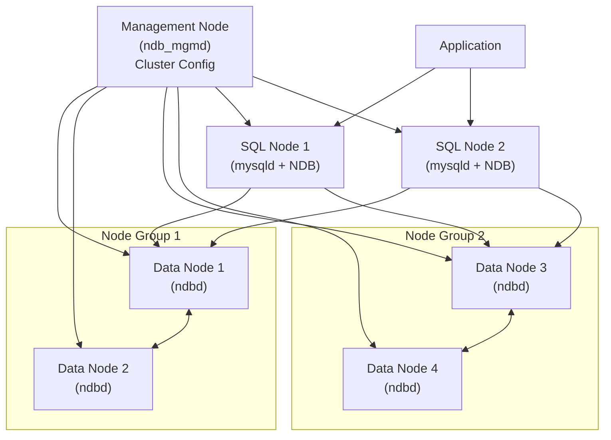

# How to Set Up MySQL NDB Cluster

Author: [nawazdhandala](https://www.github.com/nawazdhandala)

Tags: MySQL, NDB Cluster, High Availability, Scalability, Database

Description: Learn how to set up MySQL NDB Cluster with management nodes, data nodes, and SQL nodes for in-memory distributed storage with automatic sharding.

---

## How MySQL NDB Cluster Works

MySQL NDB Cluster (Network DataBase Cluster) is a distributed, shared-nothing database architecture designed for high availability and real-time performance. It stores all data in memory by default (with disk persistence), automatically shards data across data nodes, and synchronously replicates data between node groups.



Key components:
- **Management node** (`ndb_mgmd`) - manages cluster configuration and startup; does not store data
- **Data nodes** (`ndbd` or `ndbmtd`) - store and replicate data across node groups
- **SQL nodes** (`mysqld`) - provide the MySQL API; connect to data nodes for NDB tables

## Prerequisites

Download the MySQL NDB Cluster package from MySQL downloads. The cluster software is separate from the standard MySQL server:

```bash
# Download MySQL Cluster on each node
sudo apt-get install -y mysql-cluster-community-server \
    mysql-cluster-community-client \
    mysql-cluster-community-data-node \
    mysql-cluster-community-management-server
```

## Configuration

### Step 1 - Configure the Management Node

Create the cluster configuration file on the management node at `/var/lib/mysql-cluster/config.ini`:

```ini
[ndb_mgmd]
NodeId     = 1
HostName   = 192.168.1.10
DataDir    = /var/lib/mysql-cluster

[ndbd default]
NoOfReplicas  = 2
DataMemory    = 512M
IndexMemory   = 128M

[ndbd]
NodeId   = 2
HostName = 192.168.1.11
DataDir  = /var/lib/mysql-data

[ndbd]
NodeId   = 3
HostName = 192.168.1.12
DataDir  = /var/lib/mysql-data

[mysqld]
NodeId   = 4
HostName = 192.168.1.13

[mysqld]
NodeId   = 5
HostName = 192.168.1.14
```

### Step 2 - Configure the Data Nodes

Create `/etc/my.cnf` on each data node:

```ini
[mysqld]
ndbcluster

[mysql_cluster]
ndb-connectstring = 192.168.1.10
```

Create the data directory:

```bash
sudo mkdir -p /var/lib/mysql-data
sudo chown mysql:mysql /var/lib/mysql-data
```

### Step 3 - Configure the SQL Nodes

Create `/etc/my.cnf` on each SQL node:

```ini
[mysqld]
ndbcluster
default_storage_engine = ndbcluster
ndb-connectstring       = 192.168.1.10

[mysql_cluster]
ndb-connectstring = 192.168.1.10
```

### Step 4 - Start the Cluster

Start the management node first:

```bash
ndb_mgmd --initial --config-file=/var/lib/mysql-cluster/config.ini
```

Start each data node:

```bash
# On each data node
ndbd --initial
```

Start the SQL nodes:

```bash
# On each SQL node
sudo systemctl start mysql
```

### Step 5 - Verify the Cluster

Connect to the management client:

```bash
ndb_mgm
```

Inside the management client:

```text
ndb_mgm> SHOW
Connected to Management Server at: 192.168.1.10:1186
Cluster Configuration
---------------------
[ndbd(NDB)]     2 node(s)
id=2    @192.168.1.11  (mysql-8.0.28 ndb-8.0.28, Nodegroup: 0, *)
id=3    @192.168.1.12  (mysql-8.0.28 ndb-8.0.28, Nodegroup: 0)

[ndb_mgmd(MGM)] 1 node(s)
id=1    @192.168.1.10  (mysql-8.0.28 ndb-8.0.28)

[mysqld(API)]   2 node(s)
id=4    @192.168.1.13  (mysql-8.0.28 ndb-8.0.28)
id=5    @192.168.1.14  (mysql-8.0.28 ndb-8.0.28)
```

## Creating NDB Tables

Connect to a SQL node and create a database with NDB tables:

```sql
CREATE DATABASE cluster_db;
USE cluster_db;

-- NDB tables must have a primary key
CREATE TABLE orders (
    order_id   INT          NOT NULL AUTO_INCREMENT,
    customer   VARCHAR(100) NOT NULL,
    amount     DECIMAL(10,2) NOT NULL,
    created_at DATETIME     NOT NULL,
    PRIMARY KEY (order_id)
) ENGINE=NDBCLUSTER;

INSERT INTO orders (customer, amount, created_at)
VALUES ('Alice', 99.99, NOW()),
       ('Bob',   149.50, NOW());
```

Verify data is distributed across nodes:

```sql
SELECT node_id, fragment_num, fixed_elem_count
FROM   information_schema.ndb_transid_mysql_connection_map
LIMIT  10;
```

## Cluster Operations

### Rolling Restart of Data Nodes

```text
ndb_mgm> 2 RESTART
ndb_mgm> 3 RESTART
```

### Graceful Shutdown

```text
ndb_mgm> SHUTDOWN
```

### Monitor Node Status

```text
ndb_mgm> ALL STATUS
```

## Best Practices

- Use `ndbmtd` (multi-threaded data node) for better CPU utilization on modern hardware.
- Always configure `NoOfReplicas = 2` (minimum) for data redundancy; the cluster automatically keeps two copies.
- NDB tables require a primary key; design your schema with this in mind.
- Use the NDB Cluster for workloads requiring high write throughput and automatic failover.
- Keep management nodes on dedicated, stable hosts; losing the management node does not stop operations but prevents restarts.
- Monitor DataMemory usage - when it fills up, NDB will refuse new inserts.

## Summary

MySQL NDB Cluster provides an in-memory, distributed database solution with automatic data sharding and synchronous replication across node groups. The setup involves a management node for coordination, data nodes for storage, and SQL nodes for the MySQL interface. All tables must use the `NDBCLUSTER` storage engine, which handles distribution and high availability transparently.
