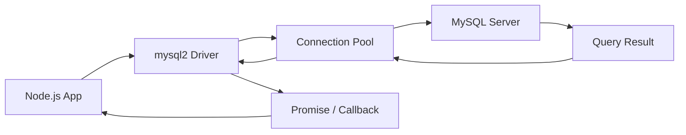

# How to Set Up MySQL with Node.js using mysql2 Driver

Author: [nawazdhandala](https://www.github.com/nawazdhandala)

Tags: MySQL, Node.js, mysql2, JavaScript, Database, Connection Pool

Description: Learn how to connect a Node.js application to MySQL using the mysql2 driver, including connection pools, prepared statements, and async/await queries.

---

## How mysql2 Works

`mysql2` is the most popular MySQL client for Node.js. It is a drop-in replacement for the older `mysql` package with added support for prepared statements, connection pooling, and native async/await via Promises. It communicates with MySQL using the native MySQL protocol.



## Installation

```bash
npm install mysql2
```

## Basic Connection

```javascript
const mysql = require('mysql2/promise');

async function main() {
    const connection = await mysql.createConnection({
        host:     'localhost',
        port:     3306,
        user:     'appuser',
        password: 'secret',
        database: 'myapp',
        timezone: 'Z'   // Use UTC for all datetime values
    });

    const [rows] = await connection.execute('SELECT 1 + 1 AS result');
    console.log(rows[0].result);  // 2

    await connection.end();
}

main().catch(console.error);
```

## Connection Pool (Recommended for Production)

A pool reuses connections instead of creating a new TCP connection per query.

```javascript
const mysql = require('mysql2/promise');

const pool = mysql.createPool({
    host:               'localhost',
    user:               'appuser',
    password:           'secret',
    database:           'myapp',
    waitForConnections: true,
    connectionLimit:    10,
    queueLimit:         0,
    timezone:           'Z'
});

module.exports = pool;
```

**Using the pool:**

```javascript
const pool = require('./db');

async function getUsers() {
    const [rows] = await pool.execute('SELECT id, name, email FROM users');
    return rows;
}

async function getUserById(id) {
    const [rows] = await pool.execute(
        'SELECT id, name, email FROM users WHERE id = ?',
        [id]
    );
    return rows[0] || null;
}
```

## Setup: Create Sample Table

```sql
CREATE TABLE users (
    id         INT AUTO_INCREMENT PRIMARY KEY,
    name       VARCHAR(100) NOT NULL,
    email      VARCHAR(150) NOT NULL UNIQUE,
    created_at DATETIME NOT NULL DEFAULT NOW()
);
```

## Prepared Statements

Always use prepared statements (with `?` placeholders) to prevent SQL injection. `mysql2` automatically parameterizes values.

```javascript
async function createUser(name, email) {
    const [result] = await pool.execute(
        'INSERT INTO users (name, email) VALUES (?, ?)',
        [name, email]
    );
    return result.insertId;
}

async function updateUser(id, name) {
    const [result] = await pool.execute(
        'UPDATE users SET name = ? WHERE id = ?',
        [name, id]
    );
    return result.affectedRows;
}

async function deleteUser(id) {
    const [result] = await pool.execute(
        'DELETE FROM users WHERE id = ?',
        [id]
    );
    return result.affectedRows;
}
```

## Transactions

```javascript
async function transferFunds(fromId, toId, amount) {
    const conn = await pool.getConnection();
    try {
        await conn.beginTransaction();

        await conn.execute(
            'UPDATE accounts SET balance = balance - ? WHERE id = ?',
            [amount, fromId]
        );
        await conn.execute(
            'UPDATE accounts SET balance = balance + ? WHERE id = ?',
            [amount, toId]
        );

        await conn.commit();
        console.log('Transfer complete');
    } catch (err) {
        await conn.rollback();
        throw err;
    } finally {
        conn.release();
    }
}
```

## Streaming Large Result Sets

For large tables, stream results to avoid loading all rows into memory:

```javascript
async function exportAllUsers(writable) {
    const conn = await pool.getConnection();
    const stream = conn.connection.query('SELECT * FROM users').stream();

    stream.on('data', (row) => writable.write(JSON.stringify(row) + '\n'));
    stream.on('end',  ()    => { writable.end(); conn.release(); });
    stream.on('error', (err) => { conn.release(); throw err; });
}
```

## Query vs. Execute

```text
Method       Caching  Use For
----------   -------  ---------------------------------
query()      No       Dynamic SQL, DDL statements
execute()    Yes      Parameterized DML (SELECT/INSERT/UPDATE/DELETE)
```

```javascript
// Use query for DDL:
await pool.query('CREATE TABLE IF NOT EXISTS logs (id INT AUTO_INCREMENT PRIMARY KEY, msg TEXT)');

// Use execute for DML with parameters:
await pool.execute('INSERT INTO logs (msg) VALUES (?)', ['app started']);
```

## Error Handling

```javascript
async function safeQuery(sql, params = []) {
    try {
        const [rows] = await pool.execute(sql, params);
        return rows;
    } catch (err) {
        if (err.code === 'ER_DUP_ENTRY') {
            throw new Error('Duplicate entry: ' + err.sqlMessage);
        }
        throw err;
    }
}
```

## Best Practices

- Always use `execute()` with `?` placeholders instead of string concatenation to prevent SQL injection.
- Use a connection pool in production; avoid `createConnection()` per request.
- Set `timezone: 'Z'` in the pool config so datetime values are handled as UTC.
- Release pool connections in a `finally` block when using `pool.getConnection()`.
- Set `connectionLimit` based on your MySQL server's `max_connections` setting - a good starting point is 10-20% of `max_connections`.
- Use `mysql2/promise` for async/await support; the base `mysql2` module uses callbacks.

## Summary

`mysql2` is the standard MySQL driver for Node.js, offering prepared statements, connection pooling, and full Promise/async-await support. Create a shared pool with `mysql.createPool()` and use `pool.execute(sql, params)` for all parameterized queries. Wrap multi-statement operations in `beginTransaction`/`commit`/`rollback` for atomicity. Always release connections in a `finally` block and use `?` placeholders to prevent SQL injection.
