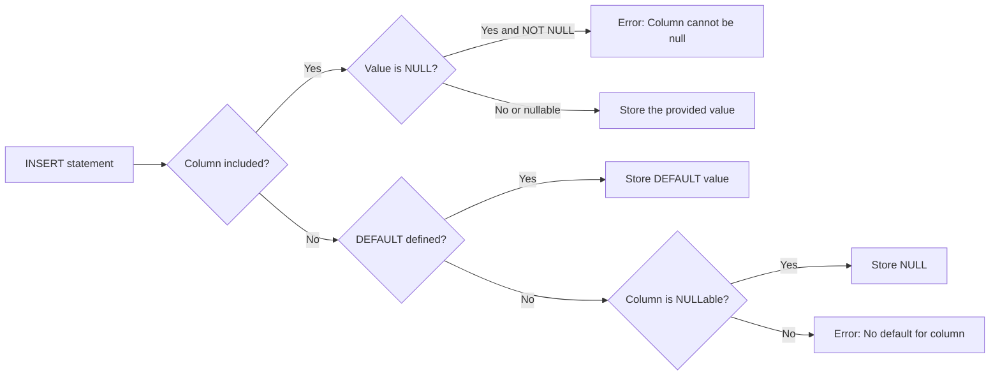

# How to Use NOT NULL and DEFAULT Constraints in MySQL

Author: [nawazdhandala](https://www.github.com/nawazdhandala)

Tags: MySQL, SQL, DDL, Constraint, NOT NULL, DEFAULT, Schema

Description: Apply NOT NULL and DEFAULT constraints in MySQL table definitions to enforce data integrity and provide sensible fallback values for missing columns.

---

## How It Works

`NOT NULL` prevents a column from storing a NULL value, enforcing that every row must provide a value. `DEFAULT` specifies a value MySQL uses automatically when an INSERT statement does not include that column. Together they eliminate most NULL-related bugs and make inserts cleaner.



## NOT NULL Constraint

`NOT NULL` is placed after the data type in a column definition. MySQL rejects any INSERT or UPDATE that would store NULL in the column.

### Syntax

```sql
column_name data_type NOT NULL
```

### Example

```sql
CREATE TABLE users (
    id       INT UNSIGNED AUTO_INCREMENT PRIMARY KEY,
    username VARCHAR(50)  NOT NULL,
    email    VARCHAR(255) NOT NULL,
    bio      TEXT                       -- NULLable: bio is optional
);
```

Attempting to insert a NULL into a NOT NULL column raises an error.

```sql
INSERT INTO users (username, email) VALUES (NULL, 'alice@example.com');
```

```text
ERROR 1048 (23000): Column 'username' cannot be null
```

## DEFAULT Constraint

`DEFAULT` assigns a value when the column is omitted from the INSERT column list.

### Syntax

```sql
column_name data_type [NOT NULL] DEFAULT literal_value
column_name data_type [NOT NULL] DEFAULT (expression)  -- MySQL 8.0+
```

### Common DEFAULT Values

```sql
CREATE TABLE orders (
    id           INT UNSIGNED AUTO_INCREMENT PRIMARY KEY,
    status       VARCHAR(20)   NOT NULL DEFAULT 'pending',
    total_amount DECIMAL(10,2) NOT NULL DEFAULT 0.00,
    is_paid      BOOLEAN       NOT NULL DEFAULT FALSE,
    created_at   DATETIME      NOT NULL DEFAULT CURRENT_TIMESTAMP,
    updated_at   DATETIME      NOT NULL DEFAULT CURRENT_TIMESTAMP
                                        ON UPDATE CURRENT_TIMESTAMP,
    notes        TEXT                   DEFAULT NULL
);
```

Inserting without specifying `status`, `total_amount`, or timestamps:

```sql
INSERT INTO orders (id) VALUES (DEFAULT);
-- or simply:
INSERT INTO orders () VALUES ();

SELECT * FROM orders\G
```

```text
*************************** 1. row ***************************
         id: 1
     status: pending
total_amount: 0.00
    is_paid: 0
 created_at: 2024-06-01 10:00:00
 updated_at: 2024-06-01 10:00:00
      notes: NULL
```

## Expression Defaults (MySQL 8.0+)

MySQL 8.0.13 introduced support for expression defaults wrapped in parentheses.

```sql
CREATE TABLE audit_log (
    id         INT UNSIGNED AUTO_INCREMENT PRIMARY KEY,
    event_type VARCHAR(100) NOT NULL,
    event_date DATE         NOT NULL DEFAULT (CURDATE()),
    created_at DATETIME     NOT NULL DEFAULT (NOW()),
    uuid_val   VARCHAR(36)  NOT NULL DEFAULT (UUID())
);
```

## Combining NOT NULL and DEFAULT

The most common pattern is `NOT NULL DEFAULT value`, which means the column must always have a value but you can skip it in the INSERT if the default is acceptable.

```sql
CREATE TABLE products (
    id           INT UNSIGNED   AUTO_INCREMENT PRIMARY KEY,
    name         VARCHAR(255)   NOT NULL,
    price        DECIMAL(10,2)  NOT NULL,
    stock_count  INT UNSIGNED   NOT NULL DEFAULT 0,
    is_active    BOOLEAN        NOT NULL DEFAULT TRUE,
    created_at   DATETIME       NOT NULL DEFAULT CURRENT_TIMESTAMP
);

-- Insert only required columns
INSERT INTO products (name, price) VALUES ('Widget', 9.99);

SELECT * FROM products\G
```

```text
*************************** 1. row ***************************
          id: 1
        name: Widget
       price: 9.99
 stock_count: 0
   is_active: 1
  created_at: 2024-06-01 10:00:00
```

## Adding NOT NULL and DEFAULT to Existing Columns

```sql
-- Add DEFAULT to an existing nullable column
ALTER TABLE products
    MODIFY COLUMN stock_count INT UNSIGNED NOT NULL DEFAULT 0;

-- Make a nullable column NOT NULL (first ensure no NULLs exist)
UPDATE products SET description = '' WHERE description IS NULL;
ALTER TABLE products
    MODIFY COLUMN description VARCHAR(500) NOT NULL DEFAULT '';
```

## Checking for NULLable Columns

```sql
SELECT COLUMN_NAME, IS_NULLABLE, COLUMN_DEFAULT, DATA_TYPE
FROM information_schema.COLUMNS
WHERE TABLE_SCHEMA = DATABASE()
  AND TABLE_NAME = 'products'
ORDER BY ORDINAL_POSITION;
```

```text
+-------------+-------------+-----------------------+-----------+
| COLUMN_NAME | IS_NULLABLE | COLUMN_DEFAULT        | DATA_TYPE |
+-------------+-------------+-----------------------+-----------+
| id          | NO          | NULL                  | int       |
| name        | NO          | NULL                  | varchar   |
| price       | NO          | NULL                  | decimal   |
| stock_count | NO          | 0                     | int       |
| is_active   | NO          | 1                     | tinyint   |
| created_at  | NO          | CURRENT_TIMESTAMP     | datetime  |
+-------------+-------------+-----------------------+-----------+
```

## Best Practices

- Apply `NOT NULL` to every column that must always have a value; this documents intent and prevents bugs.
- Use `DEFAULT CURRENT_TIMESTAMP` on `created_at` columns and `DEFAULT CURRENT_TIMESTAMP ON UPDATE CURRENT_TIMESTAMP` on `updated_at` columns.
- Provide a meaningful `DEFAULT` for status and flag columns (e.g., `DEFAULT 'pending'`, `DEFAULT FALSE`).
- Before adding `NOT NULL` to an existing column, audit and fix any existing NULL values first.
- Avoid using `DEFAULT NULL` explicitly on optional columns; NULL without any DEFAULT is equivalent - the explicit form is just documentation.

## Summary

`NOT NULL` prevents NULL values in a column and forces every INSERT or UPDATE to supply a non-NULL value. `DEFAULT` provides a fallback value when a column is omitted from the INSERT statement. The combination `NOT NULL DEFAULT value` is the sweet spot for most required columns: inserts stay concise while the schema remains strict. Use expression defaults (`DEFAULT (expression)`) in MySQL 8.0+ for dynamic values like `CURDATE()` and `UUID()`.
