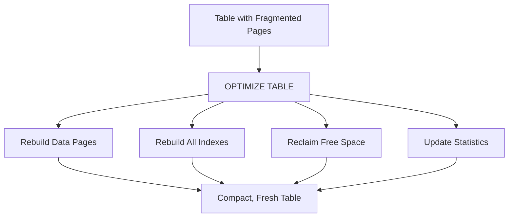

# How to Use MySQL OPTIMIZE TABLE to Defragment InnoDB

Author: [nawazdhandala](https://www.github.com/nawazdhandala)

Tags: MySQL, SQL, OPTIMIZE TABLE, InnoDB, Performance, Database Administration

Description: Learn how to use MySQL OPTIMIZE TABLE to reclaim disk space, reduce fragmentation, and rebuild indexes after large deletes or updates in InnoDB tables.

---

## How OPTIMIZE TABLE Works

When rows are deleted or updated in MySQL, the freed space is not immediately returned to the operating system. Over time this leads to fragmentation: wasted pages within the table file that slow down full scans and consume disk. `OPTIMIZE TABLE` rebuilds the table and its indexes from scratch, compacts the storage, reclaims free space, and updates statistics in a single operation.

For InnoDB, `OPTIMIZE TABLE` is implemented as `ALTER TABLE ... FORCE`, which rebuilds the table in-place using the online DDL mechanism in MySQL 5.6+.



## Syntax

```sql
OPTIMIZE [NO_WRITE_TO_BINLOG | LOCAL] TABLE table_name [, table_name ...]
```

- `NO_WRITE_TO_BINLOG` / `LOCAL`: Prevents replication of the OPTIMIZE to replicas.

## When OPTIMIZE TABLE Helps

```text
Scenario                                     Benefit
--------                                     -------
Deleted > 20-30% of rows from a large table  Reclaims disk space
After many UPDATE operations on TEXT/BLOB    Reduces page fragmentation
Table reads have slowed over time            Improves sequential scan speed
Before archiving old data                    Compact storage for archive tables
After backfilling a new column               Reorganize updated pages
```

## Checking Fragmentation Before Optimizing

```sql
SELECT
    TABLE_NAME,
    TABLE_ROWS,
    ROUND(DATA_LENGTH  / 1024 / 1024, 2) AS data_mb,
    ROUND(INDEX_LENGTH / 1024 / 1024, 2) AS index_mb,
    ROUND(DATA_FREE    / 1024 / 1024, 2) AS free_mb,
    ROUND(DATA_FREE / (DATA_LENGTH + INDEX_LENGTH + DATA_FREE) * 100, 1) AS frag_pct
FROM information_schema.TABLES
WHERE TABLE_SCHEMA = 'myapp'
  AND DATA_FREE > 0
ORDER BY frag_pct DESC;
```

A `frag_pct` above 20-30% is a reasonable threshold for optimization.

## Setup: Demonstrate Fragmentation

```sql
CREATE TABLE events (
    id         INT AUTO_INCREMENT PRIMARY KEY,
    event_type VARCHAR(50),
    payload    TEXT,
    created_at DATETIME NOT NULL DEFAULT NOW()
) ENGINE=InnoDB;

-- Insert 100K rows:
INSERT INTO events (event_type, payload)
SELECT
    ELT(FLOOR(RAND()*3)+1, 'click', 'view', 'purchase'),
    REPEAT('x', 200)
FROM information_schema.COLUMNS c1
CROSS JOIN information_schema.COLUMNS c2
LIMIT 100000;

-- Delete 50% of rows to create fragmentation:
DELETE FROM events WHERE MOD(id, 2) = 0;
```

Check fragmentation:

```sql
SELECT
    ROUND(DATA_LENGTH  / 1024 / 1024, 2) AS data_mb,
    ROUND(DATA_FREE    / 1024 / 1024, 2) AS free_mb
FROM information_schema.TABLES
WHERE TABLE_SCHEMA = 'myapp' AND TABLE_NAME = 'events';
```

## Running OPTIMIZE TABLE

```sql
OPTIMIZE TABLE events;
```

```text
+--------------+----------+----------+-------------------------------------------------------------------+
| Table        | Op       | Msg_type | Msg_text                                                          |
+--------------+----------+----------+-------------------------------------------------------------------+
| myapp.events | optimize | note     | Table does not support optimize, doing recreate + analyze instead |
| myapp.events | optimize | status   | OK                                                                |
+--------------+----------+----------+-------------------------------------------------------------------+
```

The "note" is expected for InnoDB - MySQL is informing you that it performed a table rebuild (equivalent to `ALTER TABLE ... FORCE`) rather than a native optimize.

Check fragmentation after:

```sql
SELECT
    ROUND(DATA_LENGTH  / 1024 / 1024, 2) AS data_mb,
    ROUND(DATA_FREE    / 1024 / 1024, 2) AS free_mb
FROM information_schema.TABLES
WHERE TABLE_SCHEMA = 'myapp' AND TABLE_NAME = 'events';
```

`DATA_FREE` should now be near 0.

## Optimize Multiple Tables

```sql
OPTIMIZE TABLE events, logs, audit_trail;
```

## Optimize All Tables in a Database (Command Line)

```bash
mysqlcheck -u root -p --optimize mydb

# Optimize all databases:
mysqlcheck -u root -p --optimize --all-databases
```

## Performance Impact and Locking

For InnoDB in MySQL 5.6+, `OPTIMIZE TABLE` uses online DDL by default:

```text
Lock level:  Shared metadata lock during rebuild (DML allowed)
Duration:    Proportional to table size and index count
Disk space:  Requires up to 2x the table size temporarily
CPU:         High during rebuild (index sort passes)
```

For very large tables in production, consider using `pt-online-schema-change` from Percona Toolkit instead, which rebuilds tables with minimal locking.

## Automating OPTIMIZE TABLE

```sql
-- Create a maintenance event to optimize high-churn tables weekly:
CREATE EVENT weekly_optimize
ON SCHEDULE EVERY 1 WEEK
STARTS '2026-04-05 03:00:00'
DO
    OPTIMIZE LOCAL TABLE events, logs;
```

## Alternative: innodb_file_per_table

When `innodb_file_per_table = ON` (default in MySQL 5.6+), each InnoDB table has its own `.ibd` file. This allows `OPTIMIZE TABLE` to return space to the OS. When the system tablespace is used (single shared file), space is returned to InnoDB but not to the OS.

```sql
SHOW VARIABLES LIKE 'innodb_file_per_table';
```

## OPTIMIZE TABLE vs. ALTER TABLE FORCE

These are functionally equivalent for InnoDB:

```sql
OPTIMIZE TABLE my_table;
-- Same as:
ALTER TABLE my_table FORCE;
-- Or:
ALTER TABLE my_table ENGINE=InnoDB;
```

Use `ALTER TABLE ... FORCE` when you want to explicitly control the ALGORITHM and LOCK options:

```sql
ALTER TABLE events FORCE, ALGORITHM=INPLACE, LOCK=NONE;
```

## Best Practices

- Do not run `OPTIMIZE TABLE` routinely on all tables - it is only beneficial for tables with significant fragmentation.
- Check `DATA_FREE` in `INFORMATION_SCHEMA.TABLES` to identify candidate tables before optimizing.
- Run OPTIMIZE during maintenance windows for very large tables; it is I/O and CPU intensive.
- Use `mysqlcheck --optimize` from a cron job for batch optimization of maintenance-eligible tables.
- For tables with continuous high-churn (logs, events), consider partitioning and dropping old partitions instead of OPTIMIZE - partition drops are instantaneous.
- Use Percona's `pt-online-schema-change` for zero-downtime rebuilds on large production tables.

## Summary

`OPTIMIZE TABLE` rebuilds an InnoDB table from scratch, reclaiming fragmented pages and free space left by DELETE and UPDATE operations. It also rebuilds indexes and refreshes statistics in a single pass. For InnoDB, it is implemented as an online table rebuild with a shared metadata lock, allowing concurrent DML in MySQL 5.6+. Check `DATA_FREE` in `INFORMATION_SCHEMA.TABLES` to identify fragmented tables before optimizing. For very large production tables, use `pt-online-schema-change` for a safer, lower-impact rebuild.
