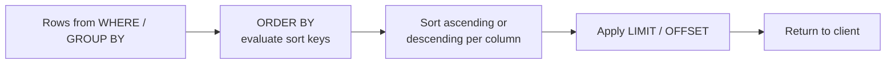

# How to Use ORDER BY in MySQL to Sort Results

Author: [nawazdhandala](https://www.github.com/nawazdhandala)

Tags: MySQL, SQL, DML, ORDER BY, Query, Sort

Description: Sort MySQL query results with ORDER BY using single and multiple columns, ASC and DESC directions, expressions, and NULL ordering rules.

---

## How It Works

`ORDER BY` sorts the result set before it is returned to the client. Without `ORDER BY`, MySQL does not guarantee any particular row order - the order depends on storage and execution plan details and can change between queries.



## Syntax

```sql
SELECT columns
FROM table
[WHERE ...]
ORDER BY expression [ASC | DESC]
         [, expression [ASC | DESC], ...]
[LIMIT n];
```

`ASC` (ascending) is the default and can be omitted. `DESC` sorts from largest to smallest.

## Sample Data

```sql
CREATE TABLE employees (
    id         INT UNSIGNED AUTO_INCREMENT PRIMARY KEY,
    first_name VARCHAR(50)    NOT NULL,
    last_name  VARCHAR(50)    NOT NULL,
    department VARCHAR(50)    NOT NULL,
    salary     DECIMAL(10, 2) NOT NULL,
    hired_on   DATE           NOT NULL
);

INSERT INTO employees (first_name, last_name, department, salary, hired_on) VALUES
    ('Alice',  'Smith',    'Engineering', 95000.00, '2021-03-15'),
    ('Bob',    'Jones',    'Marketing',   72000.00, '2020-07-01'),
    ('Carol',  'Williams', 'Engineering', 105000.00,'2019-11-20'),
    ('Dave',   'Brown',    'Sales',       60000.00, '2022-01-10'),
    ('Eve',    'Davis',    'Engineering', 88000.00, '2023-06-05'),
    ('Frank',  'Miller',   'Marketing',   78000.00, '2021-09-30'),
    ('Grace',  'Wilson',   'Sales',       65000.00, '2020-04-22');
```

## Single Column - Ascending

```sql
SELECT first_name, last_name, salary
FROM employees
ORDER BY salary ASC;
```

```text
+------------+-----------+-----------+
| first_name | last_name | salary    |
+------------+-----------+-----------+
| Dave       | Brown     |  60000.00 |
| Grace      | Wilson    |  65000.00 |
| Bob        | Jones     |  72000.00 |
| Frank      | Miller    |  78000.00 |
| Eve        | Davis     |  88000.00 |
| Alice      | Smith     |  95000.00 |
| Carol      | Williams  | 105000.00 |
+------------+-----------+-----------+
```

## Single Column - Descending

```sql
SELECT first_name, last_name, salary
FROM employees
ORDER BY salary DESC;
```

## Multiple Columns

Sort by `department` ascending first, then by `salary` descending within each department.

```sql
SELECT first_name, department, salary
FROM employees
ORDER BY department ASC, salary DESC;
```

```text
+------------+--------------+-----------+
| first_name | department   | salary    |
+------------+--------------+-----------+
| Carol      | Engineering  | 105000.00 |
| Alice      | Engineering  |  95000.00 |
| Eve        | Engineering  |  88000.00 |
| Frank      | Marketing    |  78000.00 |
| Bob        | Marketing    |  72000.00 |
| Grace      | Sales        |  65000.00 |
| Dave       | Sales        |  60000.00 |
+------------+--------------+-----------+
```

## Sorting by Column Position (Not Recommended)

You can reference columns by their position in the SELECT list. This is legal but fragile - avoid in production code.

```sql
SELECT first_name, salary FROM employees ORDER BY 2 DESC;
-- 2 refers to 'salary'
```

## Sorting by an Expression

```sql
-- Sort by length of last name
SELECT first_name, last_name
FROM employees
ORDER BY CHAR_LENGTH(last_name) DESC, last_name ASC;
```

## Sorting by an Alias

Aliases defined in the SELECT clause can be used in ORDER BY.

```sql
SELECT
    first_name,
    salary,
    salary * 1.10 AS salary_with_raise
FROM employees
ORDER BY salary_with_raise DESC;
```

## Sorting by CASE Expression

Use a `CASE` expression for custom sort orders.

```sql
-- Sort Engineering first, then Marketing, then Sales
SELECT first_name, department
FROM employees
ORDER BY
    CASE department
        WHEN 'Engineering' THEN 1
        WHEN 'Marketing'   THEN 2
        WHEN 'Sales'       THEN 3
        ELSE 4
    END,
    first_name ASC;
```

```text
+------------+--------------+
| first_name | department   |
+------------+--------------+
| Alice      | Engineering  |
| Carol      | Engineering  |
| Eve        | Engineering  |
| Bob        | Marketing    |
| Frank      | Marketing    |
| Dave       | Sales        |
| Grace      | Sales        |
+------------+--------------+
```

## NULL Ordering

In MySQL, `NULL` values sort before non-NULL values when using `ORDER BY col ASC` (NULLs appear first).

```sql
ALTER TABLE employees ADD COLUMN bonus DECIMAL(10,2);
UPDATE employees SET bonus = 5000.00 WHERE id IN (1, 3);
-- Others have NULL bonus

SELECT first_name, bonus FROM employees ORDER BY bonus ASC;
```

```text
+------------+---------+
| first_name | bonus   |
+------------+---------+
| Bob        |    NULL |
| Dave       |    NULL |
| Eve        |    NULL |
| Frank      |    NULL |
| Grace      |    NULL |
| Alice      | 5000.00 |
| Carol      | 5000.00 |
+------------+---------+
```

To sort NULLs last in ascending order, use `IS NULL` as a secondary sort key.

```sql
SELECT first_name, bonus
FROM employees
ORDER BY bonus IS NULL ASC, bonus ASC;
-- bonus IS NULL = 0 (FALSE) for non-NULL, 1 (TRUE) for NULL
-- So non-NULL rows sort first
```

```text
+------------+---------+
| first_name | bonus   |
+------------+---------+
| Alice      | 5000.00 |
| Carol      | 5000.00 |
| Bob        |    NULL |
| Dave       |    NULL |
...
```

## ORDER BY with LIMIT

```sql
-- Top 3 earners
SELECT first_name, salary
FROM employees
ORDER BY salary DESC
LIMIT 3;
```

```text
+------------+-----------+
| first_name | salary    |
+------------+-----------+
| Carol      | 105000.00 |
| Alice      |  95000.00 |
| Eve        |  88000.00 |
+------------+-----------+
```

## ORDER BY in Subqueries

Standard SQL does not require subquery results to preserve order. In MySQL, `ORDER BY` in a subquery without `LIMIT` is ignored. If you need ordered subquery results, add a `LIMIT` clause.

```sql
SELECT * FROM (
    SELECT first_name, salary FROM employees ORDER BY salary DESC LIMIT 3
) AS top_earners;
```

## Best Practices

- Always include `ORDER BY` when row order matters; never rely on the storage order.
- Use indexed columns in `ORDER BY` to enable filesort avoidance (MySQL can use an index scan instead).
- A composite index `(department, salary)` satisfies `ORDER BY department, salary` with no filesort.
- Avoid sorting by functions applied to columns (`ORDER BY YEAR(hired_on)`) as these cannot use indexes.
- Use `ORDER BY` together with `LIMIT` for efficient top-N queries.

## Summary

`ORDER BY` specifies the sort order of a MySQL query's result set. You can sort by one or more columns, each independently ascending (`ASC`) or descending (`DESC`). Use expressions, aliases, and `CASE` expressions for custom sort orders. NULL values sort before non-NULL values in ascending order; use `bonus IS NULL ASC` as a secondary key to push NULLs to the end. Always pair `ORDER BY` with `LIMIT` for top-N queries, and use indexed columns to avoid expensive filesort operations.
