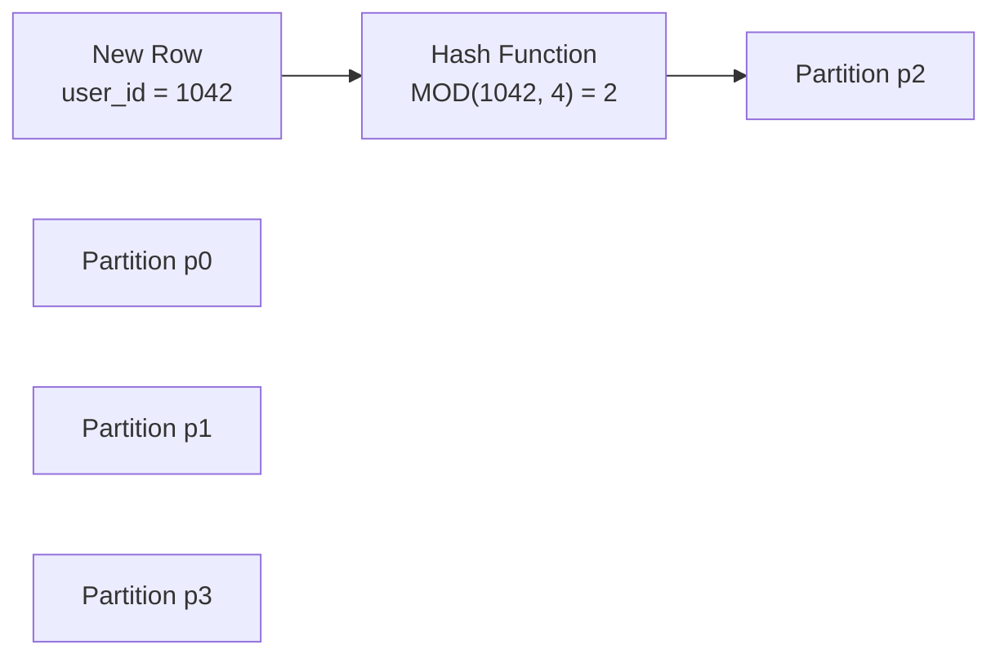

# How to Partition Tables in MySQL by HASH

Author: [nawazdhandala](https://www.github.com/nawazdhandala)

Tags: MySQL, Partition, Hash Partition, Performance, InnoDB

Description: Learn how to use MySQL HASH partitioning to distribute rows evenly across partitions using a hash of a column value, balancing storage and I/O load.

---

## How HASH Partitioning Works

HASH partitioning automatically distributes rows across a fixed number of partitions by computing a modulo of the hash of the partition expression against the number of partitions. You do not define value ranges or lists - MySQL does the assignment automatically.

The partition number is determined as:

```text
partition_number = MOD(partition_expression, number_of_partitions)
```



HASH partitioning is ideal when:
- You want even data distribution
- There is no natural range or list for partitioning
- You want to spread I/O across multiple storage devices

## Creating a HASH Partitioned Table

### Basic HASH Partition by Integer Column

```sql
CREATE TABLE user_activity (
    activity_id BIGINT      NOT NULL,
    user_id     INT         NOT NULL,
    activity    VARCHAR(50) NOT NULL,
    created_at  DATETIME    NOT NULL,
    PRIMARY KEY (activity_id, user_id)
) ENGINE=InnoDB
PARTITION BY HASH (user_id)
PARTITIONS 8;
```

This distributes rows across 8 partitions based on `user_id`.

### HASH Partition by Expression

```sql
CREATE TABLE session_data (
    session_id VARCHAR(64)  NOT NULL,
    user_id    INT          NOT NULL,
    data       JSON,
    created_at DATETIME     NOT NULL,
    PRIMARY KEY (session_id, user_id)
) ENGINE=InnoDB
PARTITION BY HASH (user_id)
PARTITIONS 16;
```

### HASH Partition by Date

```sql
CREATE TABLE log_entries (
    log_id     BIGINT   NOT NULL,
    log_date   DATE     NOT NULL,
    message    TEXT,
    PRIMARY KEY (log_id, log_date)
) ENGINE=InnoDB
PARTITION BY HASH (MONTH(log_date))
PARTITIONS 12;
```

This distributes rows across 12 partitions - one per month.

## LINEAR HASH Partitioning

MySQL supports a `LINEAR HASH` variant that uses a power-of-two algorithm. It is faster to add and remove partitions, but may result in less even data distribution:

```sql
CREATE TABLE orders (
    order_id    BIGINT        NOT NULL,
    customer_id INT           NOT NULL,
    amount      DECIMAL(10,2) NOT NULL,
    order_date  DATE          NOT NULL,
    PRIMARY KEY (order_id, customer_id)
) ENGINE=InnoDB
PARTITION BY LINEAR HASH (customer_id)
PARTITIONS 4;
```

## Adding Partitions

Increase the number of HASH partitions (triggers a full table reorganization):

```sql
ALTER TABLE user_activity ADD PARTITION PARTITIONS 8;
-- Now has 16 total partitions
```

## Coalescing Partitions

Reduce the number of partitions by merging:

```sql
ALTER TABLE user_activity COALESCE PARTITION 4;
-- Reduces from 16 back to 12
```

## Checking Data Distribution

Verify how evenly rows are distributed across partitions:

```sql
SELECT partition_name,
       partition_ordinal_position,
       table_rows,
       data_length
FROM   information_schema.PARTITIONS
WHERE  table_schema = 'myapp_db'
AND    table_name   = 'user_activity'
ORDER  BY partition_ordinal_position;
```

Ideally, `table_rows` should be similar across all partitions.

## Partition Pruning with HASH

Unlike RANGE and LIST, HASH partitioning only allows pruning when the WHERE clause provides an exact value for the partition column:

```sql
-- Pruning WORKS - exact user_id value
EXPLAIN SELECT * FROM user_activity WHERE user_id = 1042;

-- Pruning does NOT work - range scan hits all partitions
EXPLAIN SELECT * FROM user_activity WHERE user_id BETWEEN 1000 AND 2000;
```

Verify with EXPLAIN:

```sql
EXPLAIN SELECT * FROM user_activity WHERE user_id = 1042\G
```

```text
partitions: p2
```

## Choosing the Number of Partitions

Guidelines for choosing the partition count:

```text
- Start with 8 or 16 partitions for most use cases
- Use powers of 2 with LINEAR HASH for predictable distribution
- Consider the number of CPU cores and disks available
- More partitions = more files; watch out for OS open file limits
- A good rule: 2x to 4x the number of CPU cores
```

## Best Practices

- Use HASH partitioning when you need even distribution and do not query by partition key ranges.
- Choose partition counts that are powers of 2 when using LINEAR HASH.
- Verify data distribution after population with `information_schema.PARTITIONS`.
- Avoid using expressions that change over time (e.g., current date functions) as HASH keys - they would move existing rows to wrong partitions on update.
- Use HASH partitioning with InnoDB for transactional workloads.
- Avoid very large partition counts (more than 1024) due to overhead in file management.

## Summary

MySQL HASH partitioning distributes rows automatically across a fixed number of partitions by computing `MOD(hash_expression, partition_count)`. It requires no knowledge of data ranges or categories and is ideal for uniform data distribution. Partition pruning only works for exact equality matches on the partition key. Use `LINEAR HASH` when you expect to frequently add or remove partitions.
