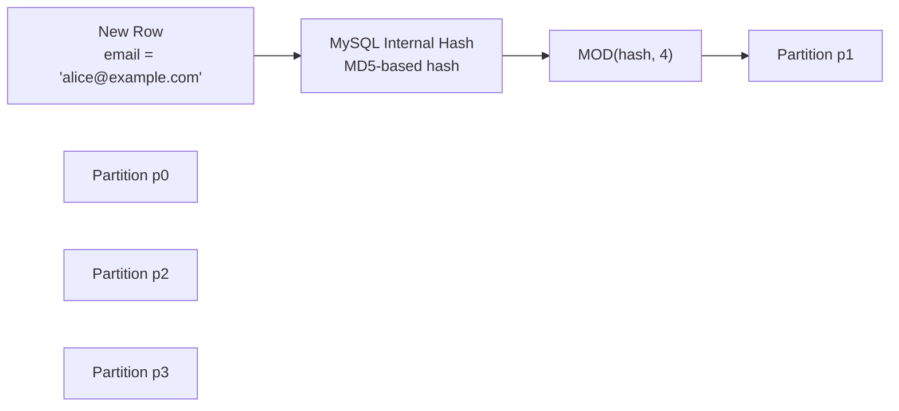

# How to Partition Tables in MySQL by KEY

Author: [nawazdhandala](https://www.github.com/nawazdhandala)

Tags: MySQL, Partition, Key Partition, Performance, InnoDB

Description: Learn how to use MySQL KEY partitioning, which uses MySQL's internal hashing function to distribute rows evenly across partitions using any column type.

---

## How KEY Partitioning Works

KEY partitioning is similar to HASH partitioning but uses MySQL's internal MD5-based hash function instead of a user-defined expression. KEY partitioning can work with any column data type (including strings and dates), unlike HASH which requires an integer expression.



Key characteristics:
- Uses MySQL's built-in hashing - no need to write a custom hash expression
- Works with all MySQL-supported column types: INTEGER, VARCHAR, DATE, etc.
- If no column is specified, MySQL uses the primary key column(s)
- Good for even distribution when the partition column has high cardinality

## Creating a KEY Partitioned Table

### Partition by Integer Column

```sql
CREATE TABLE sensor_readings (
    reading_id  BIGINT      NOT NULL,
    sensor_id   INT         NOT NULL,
    value       FLOAT       NOT NULL,
    recorded_at DATETIME    NOT NULL,
    PRIMARY KEY (reading_id, sensor_id)
) ENGINE=InnoDB
PARTITION BY KEY (sensor_id)
PARTITIONS 8;
```

### Partition by String Column

```sql
CREATE TABLE user_profiles (
    profile_id  INT           NOT NULL AUTO_INCREMENT,
    username    VARCHAR(64)   NOT NULL,
    email       VARCHAR(255)  NOT NULL,
    country     CHAR(2)       NOT NULL,
    PRIMARY KEY (profile_id, username)
) ENGINE=InnoDB
PARTITION BY KEY (username)
PARTITIONS 16;
```

### Partition by Multiple Columns

```sql
CREATE TABLE audit_log (
    log_id      BIGINT       NOT NULL,
    tenant_id   INT          NOT NULL,
    user_id     INT          NOT NULL,
    action      VARCHAR(50)  NOT NULL,
    created_at  DATETIME     NOT NULL,
    PRIMARY KEY (log_id, tenant_id, user_id)
) ENGINE=InnoDB
PARTITION BY KEY (tenant_id, user_id)
PARTITIONS 32;
```

### Partition by Primary Key (no column specified)

If you omit the column list, MySQL uses the primary key:

```sql
CREATE TABLE products (
    product_id   INT          NOT NULL AUTO_INCREMENT,
    product_name VARCHAR(100) NOT NULL,
    category_id  INT          NOT NULL,
    price        DECIMAL(8,2) NOT NULL,
    PRIMARY KEY (product_id)
) ENGINE=InnoDB
PARTITION BY KEY()
PARTITIONS 4;
```

### LINEAR KEY Partitioning

Similar to LINEAR HASH, LINEAR KEY uses a power-of-two algorithm for faster partition management:

```sql
CREATE TABLE clicks (
    click_id   BIGINT      NOT NULL,
    session_id VARCHAR(64) NOT NULL,
    page_url   VARCHAR(512) NOT NULL,
    clicked_at DATETIME     NOT NULL,
    PRIMARY KEY (click_id, session_id)
) ENGINE=InnoDB
PARTITION BY LINEAR KEY (session_id)
PARTITIONS 16;
```

## Difference Between KEY and HASH

```sql
-- HASH: requires integer expression
PARTITION BY HASH (user_id)         -- OK: integer column
PARTITION BY HASH (YEAR(event_date)) -- OK: integer expression

-- KEY: works with any data type
PARTITION BY KEY (username)         -- OK: VARCHAR column
PARTITION BY KEY (email)            -- OK: VARCHAR column
PARTITION BY KEY (order_date)       -- OK: DATE column
```

## Adding Partitions

```sql
ALTER TABLE sensor_readings ADD PARTITION PARTITIONS 8;
-- Increases from 8 to 16 partitions
```

## Coalescing Partitions

```sql
ALTER TABLE sensor_readings COALESCE PARTITION 4;
-- Reduces from 16 to 12 partitions
```

## Checking Distribution

```sql
SELECT partition_name,
       partition_ordinal_position,
       table_rows,
       data_length / 1024 / 1024 AS data_mb
FROM   information_schema.PARTITIONS
WHERE  table_schema = 'myapp_db'
AND    table_name   = 'sensor_readings'
ORDER  BY partition_ordinal_position;
```

## Partition Pruning with KEY

KEY partitioning supports pruning only on exact equality:

```sql
-- Pruning WORKS
EXPLAIN SELECT * FROM sensor_readings WHERE sensor_id = 42\G

-- Pruning does NOT work - all partitions scanned
EXPLAIN SELECT * FROM sensor_readings WHERE sensor_id > 100\G
```

## KEY vs HASH: When to Use Which

```text
Use KEY when:
- The partition column is not an integer (VARCHAR, DATE, etc.)
- You want MySQL to handle hashing automatically
- You want consistent behavior without writing custom expressions

Use HASH when:
- You want a custom, predictable integer expression
- You need YEAR(), MONTH(), or other date functions in the expression
- You want control over how rows are distributed
```

## Best Practices

- Use KEY partitioning when your natural partition key is a string or date, not an integer.
- Keep the partition count at a power of 2 for predictable distribution with LINEAR KEY.
- Monitor distribution with `information_schema.PARTITIONS` after data load.
- KEY partitioning on the primary key (no column specified) is the simplest setup.
- Avoid very high cardinality column expressions - KEY works best when the partition key has diverse values.
- Use LINEAR KEY in environments where partition counts change frequently.

## Summary

MySQL KEY partitioning uses MySQL's internal hashing to distribute rows across a fixed number of partitions. Unlike HASH, it accepts any data type for the partition column, including VARCHAR, DATE, and DATETIME. It is the simplest form of hash-based partitioning and works well when you want even distribution without defining a custom hash expression. Partition pruning applies only to equality predicates on the partition column.
