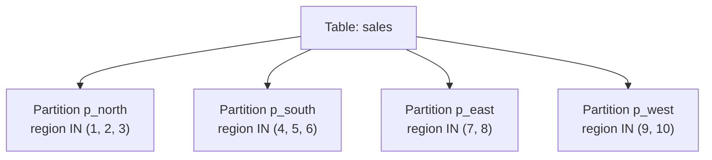

# How to Partition Tables in MySQL by LIST

Author: [nawazdhandala](https://www.github.com/nawazdhandala)

Tags: MySQL, Partition, List Partition, Performance, InnoDB

Description: Learn how to use MySQL LIST partitioning to split tables by discrete column values, such as region codes or status categories, for targeted query performance.

---

## How LIST Partitioning Works

LIST partitioning is similar to RANGE partitioning, but instead of specifying a range of values, you specify an explicit list of discrete integer values for each partition. This is ideal for categorical columns like region codes, department IDs, or status flags.



Key difference from RANGE: each partition stores rows matching a specific set of values, not a range. There is no `MAXVALUE` equivalent - if an inserted value does not match any partition's list, MySQL returns an error.

## Creating a LIST Partitioned Table

### Partition by Region Code

```sql
CREATE TABLE sales (
    sale_id    INT           NOT NULL,
    region_id  INT           NOT NULL,
    sale_date  DATE          NOT NULL,
    amount     DECIMAL(10,2) NOT NULL,
    PRIMARY KEY (sale_id, region_id)
) ENGINE=InnoDB
PARTITION BY LIST (region_id) (
    PARTITION p_north VALUES IN (1, 2, 3, 4),
    PARTITION p_south VALUES IN (5, 6, 7, 8),
    PARTITION p_east  VALUES IN (9, 10, 11),
    PARTITION p_west  VALUES IN (12, 13, 14, 15)
);
```

### Partition by Status

```sql
CREATE TABLE job_queue (
    job_id     BIGINT      NOT NULL,
    status     INT         NOT NULL,  -- 0=pending, 1=running, 2=done, 3=failed, 4=cancelled
    created_at DATETIME    NOT NULL,
    payload    JSON,
    PRIMARY KEY (job_id, status)
) ENGINE=InnoDB
PARTITION BY LIST (status) (
    PARTITION p_active   VALUES IN (0, 1),
    PARTITION p_done     VALUES IN (2),
    PARTITION p_error    VALUES IN (3, 4)
);
```

### LIST COLUMNS for Non-Integer Values

MySQL 5.5+ supports `PARTITION BY LIST COLUMNS` which allows string and date values:

```sql
CREATE TABLE customers (
    customer_id   INT          NOT NULL,
    country_code  CHAR(2)      NOT NULL,
    name          VARCHAR(100) NOT NULL,
    PRIMARY KEY (customer_id, country_code)
) ENGINE=InnoDB
PARTITION BY LIST COLUMNS (country_code) (
    PARTITION p_americas VALUES IN ('US', 'CA', 'MX', 'BR'),
    PARTITION p_europe   VALUES IN ('GB', 'DE', 'FR', 'IT', 'ES'),
    PARTITION p_apac     VALUES IN ('JP', 'CN', 'AU', 'IN', 'SG'),
    PARTITION p_other    VALUES IN ('ZA', 'AE', 'EG')
);
```

## Adding a Partition

Add a new partition for a new region:

```sql
ALTER TABLE sales ADD PARTITION (
    PARTITION p_central VALUES IN (16, 17, 18)
);
```

## Removing a Partition

Drop a partition and all its data:

```sql
ALTER TABLE sales DROP PARTITION p_north;
```

## Reorganizing Partitions

Merge two existing partitions into one:

```sql
ALTER TABLE sales REORGANIZE PARTITION p_north, p_east INTO (
    PARTITION p_northeast VALUES IN (1, 2, 3, 4, 9, 10, 11)
);
```

Split a partition into two:

```sql
ALTER TABLE job_queue REORGANIZE PARTITION p_active INTO (
    PARTITION p_pending VALUES IN (0),
    PARTITION p_running VALUES IN (1)
);
```

## Verifying Partition Pruning

```sql
EXPLAIN SELECT * FROM sales WHERE region_id IN (1, 2)\G
```

Expected output:

```text
partitions: p_north
```

Queries filtered by the partition column will only scan the relevant partition.

## Handling Values Not in Any Partition

If you attempt to insert a value not covered by any partition list, MySQL returns an error:

```sql
INSERT INTO sales (sale_id, region_id, sale_date, amount)
VALUES (9999, 99, '2026-03-31', 500.00);
-- ERROR 1526: Table has no partition for value 99
```

Plan ahead and either include a catch-all mechanism in application code, or add all expected values to partition lists.

## Querying Partition Information

```sql
SELECT partition_name,
       partition_expression,
       partition_description,
       table_rows
FROM   information_schema.PARTITIONS
WHERE  table_schema = 'myapp_db'
AND    table_name   = 'sales';
```

## Truncating a Single Partition

Clear all data from one region without affecting others:

```sql
ALTER TABLE sales TRUNCATE PARTITION p_south;
```

## Best Practices

- Use LIST COLUMNS for string-type partition keys (country codes, status strings).
- Always include all possible values in your partition lists - missing values cause INSERT errors.
- Use LIST partitioning for low-cardinality categorical columns with stable value sets.
- Combine with RANGE sub-partitioning if you need both category and date filtering.
- Plan for value additions - reorganize partitions as new categories are introduced.
- Add all values your application might produce before deploying to production.

## Summary

MySQL LIST partitioning assigns rows to partitions based on matching a column's value against explicitly defined value sets. Use `PARTITION BY LIST` for integer columns and `PARTITION BY LIST COLUMNS` for strings or dates. It is most effective for categorical data like region codes, status values, or country codes, where queries frequently filter by these categories. Unlike RANGE partitioning, there is no catch-all partition - every inserted value must match a defined list.
