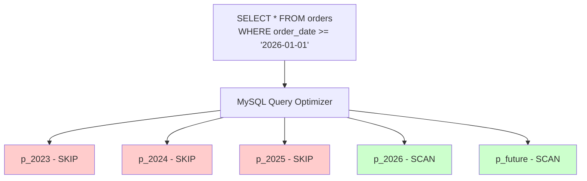

# How to Use Partition Pruning in MySQL for Performance

Author: [nawazdhandala](https://www.github.com/nawazdhandala)

Tags: MySQL, Partition, Partition Pruning, Performance, Query Optimization

Description: Learn how MySQL partition pruning eliminates irrelevant partitions from query execution, how to verify it is working, and how to write queries that enable pruning.

---

## How Partition Pruning Works

Partition pruning is the query optimizer's ability to skip partitions that cannot contain rows matching a query's WHERE clause. Instead of scanning all partitions, MySQL determines which partitions could possibly contain matching rows and only reads those.



Performance impact: a table with 12 monthly RANGE partitions and a date filter may scan only 1-2 partitions instead of all 12, reducing I/O by up to 90%.

## Verifying Partition Pruning with EXPLAIN

Use `EXPLAIN` to see which partitions are scanned:

```sql
CREATE TABLE orders (
    order_id   INT  NOT NULL,
    order_date DATE NOT NULL,
    amount     DECIMAL(10,2),
    PRIMARY KEY (order_id, order_date)
) ENGINE=InnoDB
PARTITION BY RANGE (YEAR(order_date)) (
    PARTITION p_2023 VALUES LESS THAN (2024),
    PARTITION p_2024 VALUES LESS THAN (2025),
    PARTITION p_2025 VALUES LESS THAN (2026),
    PARTITION p_2026 VALUES LESS THAN (2027),
    PARTITION p_future VALUES LESS THAN MAXVALUE
);
```

Without pruning (full scan):

```sql
EXPLAIN SELECT * FROM orders WHERE amount > 100\G
```

```text
partitions: p_2023,p_2024,p_2025,p_2026,p_future
```

With pruning:

```sql
EXPLAIN SELECT * FROM orders WHERE order_date = '2026-03-31'\G
```

```text
partitions: p_2026
```

## Pruning Conditions by Partition Type

### RANGE Partitioning

Pruning works with comparison operators on the partition expression:

```sql
-- Prunes to p_2026 only
SELECT * FROM orders WHERE YEAR(order_date) = 2026;

-- Prunes to p_2026 and p_future
SELECT * FROM orders WHERE YEAR(order_date) >= 2026;

-- Prunes to p_2024 and p_2025
SELECT * FROM orders
WHERE order_date BETWEEN '2024-01-01' AND '2025-12-31';
```

Pruning does NOT work when the partition column is inside a function that MySQL cannot resolve at parse time:

```sql
-- Pruning does NOT work - function applied to column
SELECT * FROM orders WHERE DATE_FORMAT(order_date, '%Y') = '2026';

-- Pruning DOES work - function in the partition expression matches
SELECT * FROM orders WHERE YEAR(order_date) = 2026;
```

### LIST Partitioning

Pruning works with `=`, `IN`, and `<>` on the partition column:

```sql
CREATE TABLE sales (
    sale_id   INT NOT NULL,
    region_id INT NOT NULL,
    amount    DECIMAL(10,2),
    PRIMARY KEY (sale_id, region_id)
) ENGINE=InnoDB
PARTITION BY LIST (region_id) (
    PARTITION p_north VALUES IN (1, 2, 3),
    PARTITION p_south VALUES IN (4, 5, 6)
);

-- Prunes to p_north
EXPLAIN SELECT * FROM sales WHERE region_id = 2\G

-- Prunes to p_north and p_south
EXPLAIN SELECT * FROM sales WHERE region_id IN (1, 4)\G
```

### HASH and KEY Partitioning

Pruning only works for exact equality:

```sql
CREATE TABLE user_activity (
    id      BIGINT NOT NULL,
    user_id INT    NOT NULL,
    PRIMARY KEY (id, user_id)
) ENGINE=InnoDB
PARTITION BY HASH (user_id)
PARTITIONS 8;

-- Pruning WORKS - exact value
EXPLAIN SELECT * FROM user_activity WHERE user_id = 42\G

-- Pruning does NOT work - range
EXPLAIN SELECT * FROM user_activity WHERE user_id > 100\G
```

## Dynamic Pruning

MySQL supports dynamic partition pruning where the pruned partition list is determined at runtime, for example when the WHERE clause uses a prepared statement parameter:

```sql
PREPARE stmt FROM 'SELECT * FROM orders WHERE YEAR(order_date) = ?';
SET @yr = 2026;
EXECUTE stmt USING @yr;
```

MySQL performs dynamic pruning and only scans the relevant partition.

## Partition Pruning with JOINs

Pruning also works in JOIN conditions:

```sql
SELECT o.order_id, o.amount, c.name
FROM   orders o
JOIN   customers c ON o.customer_id = c.customer_id
WHERE  YEAR(o.order_date) = 2026;
```

Only the 2026 partition of `orders` is scanned.

## Monitoring Partitions Accessed

Use `EXPLAIN PARTITIONS` or check the optimizer trace to see which partitions are accessed:

```sql
SET optimizer_trace = 'enabled=on';

SELECT * FROM orders WHERE YEAR(order_date) = 2026;

SELECT JSON_EXTRACT(trace, '$.steps[*].join_optimization.partitions_usable')
FROM   information_schema.OPTIMIZER_TRACE;

SET optimizer_trace = 'enabled=off';
```

## Common Pruning Pitfalls

Pruning fails when:
- The partition key is wrapped in a function not used in the partition expression definition
- Using `OR` with conditions spanning multiple columns
- Using `!=` or `NOT IN` on LIST partitions (MySQL cannot determine which partitions to skip)

```sql
-- These do NOT prune efficiently
SELECT * FROM orders WHERE order_date != '2025-01-01';
SELECT * FROM orders WHERE CONCAT(YEAR(order_date), '') = '2026';
```

## Best Practices

- Design queries to filter on the partition key using the same expression as in the partition definition.
- Use `EXPLAIN` to verify pruning before deploying queries in production.
- For RANGE partitioned date tables, use `YEAR()`, `MONTH()`, or `UNIX_TIMESTAMP()` consistently in both the partition definition and WHERE clauses.
- Avoid applying additional functions to the partition column in WHERE clauses.
- Test pruning with realistic production queries, not just simple examples.

## Summary

MySQL partition pruning allows the optimizer to skip entire partitions that cannot satisfy a query's WHERE clause, dramatically reducing I/O for large partitioned tables. It works most reliably with RANGE and LIST partitioning using equality or range comparisons on the partition key. Always verify pruning with `EXPLAIN` and design table partitioning around your most common query patterns.
