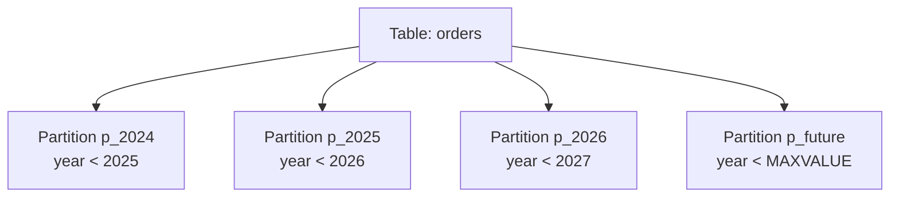

# How to Partition Tables in MySQL by RANGE

Author: [nawazdhandala](https://www.github.com/nawazdhandala)

Tags: MySQL, Partition, Range, Performance, InnoDB

Description: Learn how to use MySQL RANGE partitioning to split large tables into date or value-based segments, improving query performance and simplifying data lifecycle management.

---

## How RANGE Partitioning Works

RANGE partitioning divides table rows into partitions based on whether a column value falls within a specific range. Each partition holds rows where the partitioning column value is less than a defined upper bound.



MySQL can skip irrelevant partitions entirely during query execution - a process called partition pruning. A query filtered by `WHERE order_date >= '2026-01-01'` only scans the 2026 partition.

## Creating a RANGE Partitioned Table

### Partition by Year

```sql
CREATE TABLE orders (
    order_id    INT          NOT NULL,
    customer_id INT          NOT NULL,
    order_date  DATE         NOT NULL,
    amount      DECIMAL(10,2) NOT NULL,
    PRIMARY KEY (order_id, order_date)
) ENGINE=InnoDB
PARTITION BY RANGE (YEAR(order_date)) (
    PARTITION p_2023 VALUES LESS THAN (2024),
    PARTITION p_2024 VALUES LESS THAN (2025),
    PARTITION p_2025 VALUES LESS THAN (2026),
    PARTITION p_2026 VALUES LESS THAN (2027),
    PARTITION p_future VALUES LESS THAN MAXVALUE
);
```

The `MAXVALUE` partition acts as a catch-all for future data.

### Partition by Monthly UNIX Timestamp

```sql
CREATE TABLE events (
    event_id   BIGINT   NOT NULL,
    event_time DATETIME NOT NULL,
    event_type VARCHAR(50),
    payload    JSON,
    PRIMARY KEY (event_id, event_time)
) ENGINE=InnoDB
PARTITION BY RANGE (UNIX_TIMESTAMP(event_time)) (
    PARTITION p_202501 VALUES LESS THAN (UNIX_TIMESTAMP('2025-02-01 00:00:00')),
    PARTITION p_202502 VALUES LESS THAN (UNIX_TIMESTAMP('2025-03-01 00:00:00')),
    PARTITION p_202503 VALUES LESS THAN (UNIX_TIMESTAMP('2025-04-01 00:00:00')),
    PARTITION p_202504 VALUES LESS THAN (UNIX_TIMESTAMP('2025-05-01 00:00:00')),
    PARTITION p_future VALUES LESS THAN MAXVALUE
);
```

### Partition by Integer Range

```sql
CREATE TABLE user_scores (
    user_id INT    NOT NULL,
    score   INT    NOT NULL,
    level   VARCHAR(10),
    PRIMARY KEY (user_id, score)
) ENGINE=InnoDB
PARTITION BY RANGE (score) (
    PARTITION p_bronze  VALUES LESS THAN (1000),
    PARTITION p_silver  VALUES LESS THAN (5000),
    PARTITION p_gold    VALUES LESS THAN (10000),
    PARTITION p_diamond VALUES LESS THAN MAXVALUE
);
```

## Adding New Partitions

Before the `MAXVALUE` partition fills up, reorganize it to add a new named partition:

```sql
ALTER TABLE orders REORGANIZE PARTITION p_future INTO (
    PARTITION p_2027    VALUES LESS THAN (2028),
    PARTITION p_future  VALUES LESS THAN MAXVALUE
);
```

## Dropping Old Partitions

Drop an old partition to remove historical data instantly (much faster than DELETE):

```sql
-- Drop all 2023 data instantly
ALTER TABLE orders DROP PARTITION p_2023;
```

This is a metadata-only operation - no row-by-row deletion.

## Verifying Partition Pruning

Use EXPLAIN to verify MySQL is using partition pruning:

```sql
EXPLAIN SELECT * FROM orders
WHERE order_date BETWEEN '2026-01-01' AND '2026-12-31'\G
```

Look for the `partitions` column in the output - it should show only the relevant partition(s):

```text
partitions: p_2026
```

## Checking Partition Row Counts

```sql
SELECT partition_name,
       table_rows,
       data_length,
       index_length
FROM   information_schema.PARTITIONS
WHERE  table_schema = 'myapp_db'
AND    table_name   = 'orders'
ORDER  BY partition_name;
```

## Converting an Existing Table to RANGE Partitioned

```sql
-- Existing non-partitioned table
ALTER TABLE orders
PARTITION BY RANGE (YEAR(order_date)) (
    PARTITION p_old     VALUES LESS THAN (2024),
    PARTITION p_2024    VALUES LESS THAN (2025),
    PARTITION p_2025    VALUES LESS THAN (2026),
    PARTITION p_future  VALUES LESS THAN MAXVALUE
);
```

Note: the partitioning column must be part of the primary key or a unique index.

## Best Practices

- Include the partition key in the primary key: `PRIMARY KEY (order_id, order_date)`.
- Always include a `MAXVALUE` partition to accept new data until the next partition is added.
- Use partition management scripts to add new monthly/yearly partitions automatically.
- Drop old partitions instead of DELETing rows for faster archival.
- Verify pruning with EXPLAIN before deploying RANGE-partitioned tables in production.
- RANGE partitioning works best when queries regularly filter by the partition key.

## Summary

MySQL RANGE partitioning divides a table's rows into segments based on a column value falling within defined ranges. It is ideal for time-series data, where each partition covers a date range. Old partitions can be dropped instantly to archive historical data, and partition pruning allows MySQL to skip irrelevant partitions entirely when running filtered queries.
