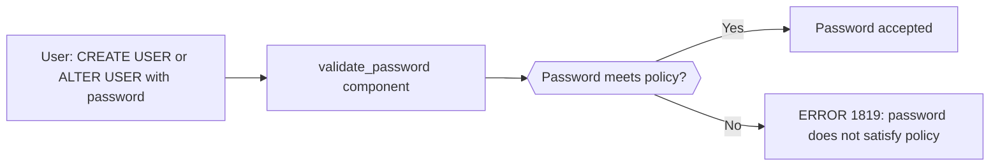

# How to Configure MySQL Password Policy

Author: [nawazdhandala](https://www.github.com/nawazdhandala)

Tags: MySQL, Security, Password Policy, Validate Password, Authentication

Description: Learn how to configure MySQL password validation, strength requirements, expiration policies, and authentication plugins to enforce secure passwords across all user accounts.

---

## How MySQL Password Validation Works

MySQL provides a `validate_password` component (MySQL 8.0+) or plugin (MySQL 5.7) that enforces password strength rules when users set or change their passwords. Passwords that do not meet the policy requirements are rejected.



## Installing the Validate Password Component

MySQL 8.0 uses a component (not a plugin):

```sql
-- Install the component
INSTALL COMPONENT 'file://component_validate_password';

-- Verify installation
SELECT component_urn FROM mysql.component WHERE component_urn LIKE '%validate_password%';
```

For MySQL 5.7, use the plugin:

```sql
INSTALL PLUGIN validate_password SONAME 'validate_password.so';
```

Enable permanently via configuration:

```ini
# /etc/mysql/mysql.conf.d/mysqld.cnf
[mysqld]
# MySQL 8.0+
validate_password.policy  = STRONG
validate_password.length  = 12
validate_password.mixed_case_count = 1
validate_password.number_count     = 1
validate_password.special_char_count = 1
```

## Password Policy Levels

MySQL supports three policy levels, each adding more requirements:

```sql
-- LOW: only length check
SET GLOBAL validate_password.policy = 'LOW';

-- MEDIUM (default): length + mixed case + numbers + special chars
SET GLOBAL validate_password.policy = 'MEDIUM';

-- STRONG: MEDIUM + must not match words in dictionary file
SET GLOBAL validate_password.policy = 'STRONG';
```

## Configuring Policy Variables

View all current password policy settings:

```sql
SHOW VARIABLES LIKE 'validate_password%';
```

Typical production settings:

```sql
SET GLOBAL validate_password.policy              = 'STRONG';
SET GLOBAL validate_password.length             = 12;
SET GLOBAL validate_password.mixed_case_count   = 1;
SET GLOBAL validate_password.number_count       = 1;
SET GLOBAL validate_password.special_char_count = 1;
```

Add a dictionary file for STRONG policy:

```bash
# Create a dictionary of forbidden words
sudo bash -c 'cat > /etc/mysql/dictionary.txt << EOF
password
mysql
database
admin
root
welcome
letmein
EOF'
```

```sql
SET GLOBAL validate_password.dictionary_file = '/etc/mysql/dictionary.txt';
```

## Password Expiration

Set passwords to expire after a number of days:

### Global Default

```ini
[mysqld]
default_password_lifetime = 90
```

Or dynamically:

```sql
SET GLOBAL default_password_lifetime = 90;
```

### Per-User Expiration

```sql
-- Expire every 90 days
CREATE USER 'john'@'%' IDENTIFIED BY 'SecurePass123!'
    PASSWORD EXPIRE INTERVAL 90 DAY;

-- Expire immediately (force reset on next login)
ALTER USER 'john'@'%' PASSWORD EXPIRE;

-- Never expire (for service accounts)
CREATE USER 'app_svc'@'localhost' IDENTIFIED BY 'SvcPass123!'
    PASSWORD EXPIRE NEVER;

-- Use global default
ALTER USER 'john'@'%' PASSWORD EXPIRE DEFAULT;
```

## Password Reuse Policy

Prevent users from reusing recent passwords:

```ini
[mysqld]
password_history = 5          -- Cannot reuse last 5 passwords
password_reuse_interval = 180 -- Cannot reuse passwords used in last 180 days
```

Per-user:

```sql
CREATE USER 'alice'@'%' IDENTIFIED BY 'AlicePass123!'
    PASSWORD HISTORY 5
    PASSWORD REUSE INTERVAL 180 DAY;
```

## Failed Login Tracking and Account Locking

Lock accounts after too many failed login attempts (MySQL 8.0):

```sql
CREATE USER 'alice'@'%' IDENTIFIED BY 'AlicePass123!'
    FAILED_LOGIN_ATTEMPTS 5
    PASSWORD_LOCK_TIME 1;  -- Lock for 1 day after 5 failed attempts
```

Unlock a locked account:

```sql
ALTER USER 'alice'@'%' ACCOUNT UNLOCK;
```

## Authentication Plugins

MySQL 8.0 uses `caching_sha2_password` by default (faster and more secure than `mysql_native_password`):

```sql
-- Create user with the default (caching_sha2_password)
CREATE USER 'alice'@'%' IDENTIFIED BY 'AlicePass123!';

-- Create user with legacy plugin (for old client compatibility)
CREATE USER 'legacy_user'@'%' IDENTIFIED WITH mysql_native_password BY 'LegacyPass123!';

-- Check authentication plugin for all users
SELECT user, host, plugin FROM mysql.user ORDER BY user;
```

Change the default for new users:

```ini
[mysqld]
default_authentication_plugin = caching_sha2_password
```

## Checking Password Strength Programmatically

Validate a potential password before setting it:

```sql
SELECT VALIDATE_PASSWORD_STRENGTH('weak') AS strength_0_to_100;
SELECT VALIDATE_PASSWORD_STRENGTH('StrongPass123!@#') AS strength_0_to_100;
```

A score of 100 means the password passes the STRONG policy.

## Applying the Policy to Existing Users

Find users with expired passwords:

```sql
SELECT user, host, password_expired, password_last_changed, password_lifetime
FROM   mysql.user
WHERE  password_expired = 'Y'
ORDER  BY user;
```

Force all users to change passwords at next login:

```sql
-- Find and expire all non-system passwords
SELECT CONCAT('ALTER USER ''', user, '''@''', host, ''' PASSWORD EXPIRE;')
FROM   mysql.user
WHERE  user NOT IN ('mysql.sys', 'mysql.session', 'mysql.infoschema', 'root');
```

## Best Practices

- Use `validate_password.policy = STRONG` in production with a dictionary file of common words.
- Set `validate_password.length >= 12` for human users; service accounts can have longer auto-generated passwords.
- Apply `PASSWORD EXPIRE NEVER` to service accounts (but rotate them regularly via automation).
- Set `PASSWORD EXPIRE INTERVAL 90 DAY` for human user accounts.
- Set `FAILED_LOGIN_ATTEMPTS 5 PASSWORD_LOCK_TIME 1` to block brute-force attacks.
- Use `caching_sha2_password` (default in MySQL 8.0) instead of the older `mysql_native_password`.
- Regularly audit `mysql.user` for accounts with expired passwords or no expiry policy.

## Summary

MySQL password policy is enforced by the `validate_password` component (MySQL 8.0+), which checks length, complexity, and optionally a dictionary against every new password. Set the policy to STRONG with a minimum length of 12 characters, configure password expiration for human users, and use account locking to prevent brute-force attacks. Service accounts should use `PASSWORD EXPIRE NEVER` with long, randomly generated passwords rotated by automation.
