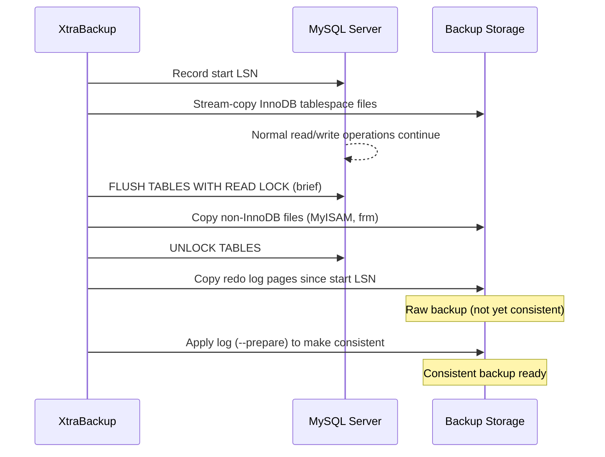

# How to Use Percona XtraBackup for MySQL Hot Backups

Author: [nawazdhandala](https://www.github.com/nawazdhandala)

Tags: MySQL, Backup, Percona, XtraBackup, Hot Backup, InnoDB

Description: Learn how to use Percona XtraBackup to perform non-blocking hot backups of MySQL InnoDB databases, including full and incremental backup workflows.

---

## How Percona XtraBackup Works

Percona XtraBackup is a free, open-source physical backup tool for MySQL and Percona Server. It copies InnoDB data files at the storage level while the server is running, then applies the InnoDB redo log to make the backup consistent - all without taking a global read lock (except for a brief moment when flushing non-InnoDB tables).



## Installation

Install Percona XtraBackup 8.0 (for MySQL 8.0):

```bash
# Ubuntu/Debian
wget https://downloads.percona.com/downloads/Percona-XtraBackup-8.0/\
Percona-XtraBackup-8.0.32-26/binary/debian/focal/x86_64/\
percona-xtrabackup-80_8.0.32-26-1.focal_amd64.deb
sudo dpkg -i percona-xtrabackup-80_8.0.32-26-1.focal_amd64.deb
sudo apt-get install -f

# RHEL/CentOS (via Percona repo)
sudo yum install -y https://repo.percona.com/yum/percona-release-latest.noarch.rpm
sudo percona-release enable tools release
sudo yum install -y percona-xtrabackup-80
```

Create a backup user in MySQL:

```sql
CREATE USER 'xtrabackup'@'localhost' IDENTIFIED BY 'XtraPass123!';
GRANT BACKUP_ADMIN, PROCESS, RELOAD, LOCK TABLES,
      REPLICATION CLIENT, CREATE TABLESPACE, SYSTEM_VARIABLES_ADMIN,
      SELECT ON *.* TO 'xtrabackup'@'localhost';
FLUSH PRIVILEGES;
```

## Full Backup

Perform a full backup:

```bash
xtrabackup \
    --backup \
    --user=xtrabackup \
    --password=XtraPass123! \
    --target-dir=/backups/mysql/full_$(date +%Y%m%d)
```

The backup at this point is not consistent. Apply the redo log to prepare it:

```bash
xtrabackup \
    --prepare \
    --target-dir=/backups/mysql/full_$(date +%Y%m%d)
```

After `--prepare`, the backup directory is consistent and ready to restore.

## Incremental Backup

### Step 1 - Full Backup (Base)

```bash
xtrabackup \
    --backup \
    --user=xtrabackup \
    --password=XtraPass123! \
    --target-dir=/backups/mysql/full_base
```

### Step 2 - First Incremental

```bash
xtrabackup \
    --backup \
    --user=xtrabackup \
    --password=XtraPass123! \
    --target-dir=/backups/mysql/incr_day1 \
    --incremental-basedir=/backups/mysql/full_base
```

### Step 3 - Second Incremental (based on first)

```bash
xtrabackup \
    --backup \
    --user=xtrabackup \
    --password=XtraPass123! \
    --target-dir=/backups/mysql/incr_day2 \
    --incremental-basedir=/backups/mysql/incr_day1
```

### Step 4 - Prepare the Full Backup (do not rollback uncommitted transactions yet)

```bash
xtrabackup \
    --prepare \
    --apply-log-only \
    --target-dir=/backups/mysql/full_base
```

### Step 5 - Apply First Incremental

```bash
xtrabackup \
    --prepare \
    --apply-log-only \
    --target-dir=/backups/mysql/full_base \
    --incremental-dir=/backups/mysql/incr_day1
```

### Step 6 - Apply Second Incremental (last one - no --apply-log-only)

```bash
xtrabackup \
    --prepare \
    --target-dir=/backups/mysql/full_base \
    --incremental-dir=/backups/mysql/incr_day2
```

The full_base directory now contains a consistent backup including all incremental changes.

## Streaming and Compressing Backups

Stream directly to a remote host and compress:

```bash
xtrabackup \
    --backup \
    --user=xtrabackup \
    --password=XtraPass123! \
    --stream=xbstream \
    --compress \
    --target-dir=./ | ssh backup-server "xbstream -x -C /backups/mysql/latest"
```

Or stream to a local compressed archive:

```bash
xtrabackup \
    --backup \
    --user=xtrabackup \
    --password=XtraPass123! \
    --stream=xbstream \
    --compress \
    --target-dir=./ > /backups/mysql/full_$(date +%Y%m%d).xbstream
```

Decompress before prepare:

```bash
xbstream -x -C /backups/mysql/full_20260331 \
    < /backups/mysql/full_20260331.xbstream
xtrabackup --decompress --target-dir=/backups/mysql/full_20260331
```

## Restoring a Backup

### Step 1 - Stop MySQL

```bash
sudo systemctl stop mysql
```

### Step 2 - Clear the Data Directory

```bash
sudo rm -rf /var/lib/mysql/*
```

### Step 3 - Copy Back

```bash
xtrabackup \
    --copy-back \
    --target-dir=/backups/mysql/full_base
```

### Step 4 - Fix Permissions and Start

```bash
sudo chown -R mysql:mysql /var/lib/mysql
sudo systemctl start mysql
```

## Automating with a Bash Script

```bash
#!/bin/bash
set -euo pipefail

BACKUP_BASE="/backups/mysql"
DATE=$(date +%Y%m%d_%H%M%S)
TARGET="$BACKUP_BASE/full_$DATE"
LOG="$BACKUP_BASE/xtrabackup_$DATE.log"

echo "Starting XtraBackup at $(date)" | tee "$LOG"

xtrabackup \
    --backup \
    --user=xtrabackup \
    --password=XtraPass123! \
    --compress \
    --target-dir="$TARGET" 2>>"$LOG"

xtrabackup \
    --prepare \
    --target-dir="$TARGET" 2>>"$LOG"

echo "Backup completed: $TARGET" | tee -a "$LOG"

# Remove backups older than 7 days
find "$BACKUP_BASE" -maxdepth 1 -name "full_*" -mtime +7 -exec rm -rf {} \;
```

## Best Practices

- Always run `--prepare` before storing the backup; without it the backup is not consistent.
- Use `--apply-log-only` for all but the last incremental prepare to preserve redo log for subsequent incrementals.
- Test restores regularly on a staging server to verify backup integrity.
- Compress backups with `--compress` to reduce storage by 50-70%.
- Monitor backup duration and alert if it exceeds expected thresholds.
- Use the `--parallel` flag to speed up file copying on multi-core systems.

## Summary

Percona XtraBackup performs non-blocking physical backups by copying InnoDB files while the server runs and then applying redo log changes with `--prepare`. Incremental backups save time and space by only copying changed pages. The two-step process (backup then prepare) ensures a consistent, restorable backup that can be copied back to any compatible MySQL server.
