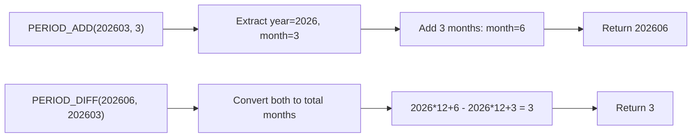

# How to Use PERIOD_ADD() and PERIOD_DIFF() Functions in MySQL

Author: [nawazdhandala](https://www.github.com/nawazdhandala)

Tags: MySQL, SQL, Date Function, Database

Description: Learn how to use MySQL PERIOD_ADD() and PERIOD_DIFF() to add months to a YYMM period and calculate the difference in months between two periods.

---

## Overview

`PERIOD_ADD()` and `PERIOD_DIFF()` operate on MySQL "period" values, which are compact integer representations of year-month combinations in `YYMM` or `YYYYMM` format. They are useful for month-based calculations without working with full date objects.

---

## Period Format

A period is an integer in one of two formats:

| Format  | Example    | Meaning        |
|---------|------------|----------------|
| `YYMM`  | `2603`     | March 2026     |
| `YYYYMM`| `202603`   | March 2026     |

**Important:** Periods are NOT dates. They are raw integer values. Period `202603` means "2026, month 3" with no day component.

Two-digit year interpretation:
- `00-69` is interpreted as `2000-2069`
- `70-99` is interpreted as `1970-1999`

---

## PERIOD_ADD() Function

Adds a number of months to a period value and returns the resulting period in `YYYYMM` format.

**Syntax:**

```sql
PERIOD_ADD(P, N)
```

- `P` - period in `YYMM` or `YYYYMM` format.
- `N` - number of months to add (can be negative).
- Returns a period in `YYYYMM` format.
- Returns `0` if `P` is `0`.

### Basic Examples

```sql
SELECT PERIOD_ADD(202603, 3);
-- Returns: 202606  (June 2026)

SELECT PERIOD_ADD(202603, 12);
-- Returns: 202703  (March 2027)

SELECT PERIOD_ADD(202603, -3);
-- Returns: 202512  (December 2025)

SELECT PERIOD_ADD(202601, 1);
-- Returns: 202602

SELECT PERIOD_ADD(202612, 1);
-- Returns: 202701  (wraps to January 2027)

-- Short format
SELECT PERIOD_ADD(2603, 6);
-- Returns: 202609  (September 2026)
```

---

## PERIOD_DIFF() Function

Returns the number of months between two period values. The result is positive if the first period is later than the second.

**Syntax:**

```sql
PERIOD_DIFF(P1, P2)
```

- Returns `P1 - P2` in months.
- A positive result means `P1` is later.
- A negative result means `P1` is earlier.

### Basic Examples

```sql
SELECT PERIOD_DIFF(202606, 202603);
-- Returns: 3  (June 2026 is 3 months after March 2026)

SELECT PERIOD_DIFF(202603, 202606);
-- Returns: -3

SELECT PERIOD_DIFF(202703, 202603);
-- Returns: 12

SELECT PERIOD_DIFF(202603, 202603);
-- Returns: 0  (same period)

SELECT PERIOD_DIFF(202601, 202512);
-- Returns: 1  (January 2026 is 1 month after December 2025)
```

---

## How Period Arithmetic Works



---

## Converting Dates to Periods

To use these functions with real dates, convert with `DATE_FORMAT()` or `EXTRACT()`:

```sql
-- Convert a date to YYYYMM period
SELECT DATE_FORMAT('2026-03-31', '%Y%m') + 0;
-- Returns: 202603

-- Or using YEAR and MONTH
SELECT YEAR('2026-03-31') * 100 + MONTH('2026-03-31');
-- Returns: 202603

-- Combine with PERIOD_ADD
SELECT PERIOD_ADD(DATE_FORMAT(CURDATE(), '%Y%m') + 0, 6);
-- Returns period 6 months from now
```

---

## Practical: Subscription Month Calculations

```sql
CREATE TABLE subscriptions (
    id INT AUTO_INCREMENT PRIMARY KEY,
    user_id INT,
    start_period INT,
    duration_months INT
);

INSERT INTO subscriptions (user_id, start_period, duration_months) VALUES
(1, 202601, 12),
(2, 202603, 6),
(3, 202606, 3);

-- Calculate end period for each subscription
SELECT
    user_id,
    start_period,
    duration_months,
    PERIOD_ADD(start_period, duration_months) AS end_period
FROM subscriptions;
```

Result:

| user_id | start_period | duration_months | end_period |
|---------|--------------|-----------------|------------|
| 1       | 202601       | 12              | 202701     |
| 2       | 202603       | 6               | 202609     |
| 3       | 202606       | 3               | 202609     |

---

## Finding Months Between Two Dates

```sql
-- Months between two dates
SELECT PERIOD_DIFF(
    DATE_FORMAT('2026-12-31', '%Y%m') + 0,
    DATE_FORMAT('2026-03-01', '%Y%m') + 0
) AS months_between;
-- Returns: 9
```

---

## Months Remaining Until End of Year

```sql
SELECT
    PERIOD_DIFF(
        YEAR(CURDATE()) * 100 + 12,
        YEAR(CURDATE()) * 100 + MONTH(CURDATE())
    ) AS months_remaining_in_year;
```

---

## Limitations of Period Functions

- Periods have no concept of days, only year and month.
- `PERIOD_ADD()` and `PERIOD_DIFF()` cannot handle weeks, days, hours, or seconds.
- For full date arithmetic, use `DATE_ADD()`, `DATE_SUB()`, `TIMESTAMPDIFF()`, or `DATEDIFF()` instead.
- Period `0` is treated specially and returns `0` from `PERIOD_ADD()`.

---

## PERIOD_DIFF() vs TIMESTAMPDIFF() for Months

```sql
-- PERIOD_DIFF: month-level, ignores day within month
SELECT PERIOD_DIFF(202603, 202601);
-- Returns: 2  (March minus January = 2 months)

-- TIMESTAMPDIFF: exact calendar month difference
SELECT TIMESTAMPDIFF(MONTH, '2026-01-15', '2026-03-10');
-- Returns: 1  (less than 2 full months from Jan 15 to Mar 10)
```

Use `PERIOD_DIFF()` for "how many calendar months apart" logic and `TIMESTAMPDIFF(MONTH, ...)` for "how many complete months elapsed" logic.

---

## Summary

`PERIOD_ADD()` adds a number of months to a `YYMM` or `YYYYMM` period integer, returning a new period in `YYYYMM` format. `PERIOD_DIFF()` calculates the difference in months between two periods. These functions are suited for month-granularity billing, subscription tracking, and calendar period arithmetic where day-level precision is not needed. For finer-grained date arithmetic, use `DATE_ADD()`, `DATE_SUB()`, or `TIMESTAMPDIFF()` instead.
