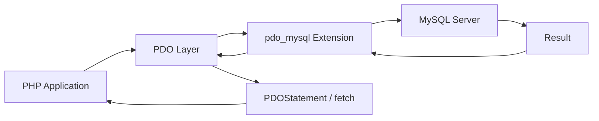

# How to Set Up MySQL with PHP using PDO

Author: [nawazdhandala](https://www.github.com/nawazdhandala)

Tags: MySQL, PHP, PDO, Database, Prepared Statement

Description: Learn how to connect a PHP application to MySQL using PDO with prepared statements, error handling, transactions, and reusable database helper patterns.

---

## How PHP PDO Works

PDO (PHP Data Objects) is the standard database abstraction layer for PHP. It provides a unified interface for multiple database engines. For MySQL, PDO uses the `pdo_mysql` extension under the hood. PDO supports prepared statements, named and positional placeholders, transactions, and cursor types.



## Prerequisites

Ensure `pdo_mysql` is enabled in `php.ini`:

```text
extension=pdo_mysql
```

## Database Connection

```php
<?php

function createConnection(): PDO {
    $dsn = 'mysql:host=localhost;port=3306;dbname=myapp;charset=utf8mb4';
    $options = [
        PDO::ATTR_ERRMODE            => PDO::ERRMODE_EXCEPTION,
        PDO::ATTR_DEFAULT_FETCH_MODE => PDO::FETCH_ASSOC,
        PDO::ATTR_EMULATE_PREPARES   => false,   // Use native prepared statements
        PDO::MYSQL_ATTR_INIT_COMMAND => "SET time_zone = '+00:00'",
    ];

    return new PDO($dsn, 'appuser', 'secret', $options);
}

// Singleton pattern for a single request lifecycle:
function getDb(): PDO {
    static $pdo = null;
    if ($pdo === null) {
        $pdo = createConnection();
    }
    return $pdo;
}
```

## Setup: Sample Table

```sql
CREATE TABLE users (
    id         INT AUTO_INCREMENT PRIMARY KEY,
    name       VARCHAR(100) NOT NULL,
    email      VARCHAR(150) NOT NULL UNIQUE,
    role       VARCHAR(20)  NOT NULL DEFAULT 'user',
    created_at DATETIME     NOT NULL DEFAULT NOW()
);
```

## CRUD with Prepared Statements

**Create:**

```php
function createUser(string $name, string $email, string $role = 'user'): int {
    $pdo  = getDb();
    $stmt = $pdo->prepare(
        'INSERT INTO users (name, email, role) VALUES (:name, :email, :role)'
    );
    $stmt->execute([
        ':name'  => $name,
        ':email' => $email,
        ':role'  => $role,
    ]);
    return (int) $pdo->lastInsertId();
}
```

**Read single row:**

```php
function getUserById(int $id): ?array {
    $stmt = getDb()->prepare(
        'SELECT id, name, email, role, created_at FROM users WHERE id = :id'
    );
    $stmt->execute([':id' => $id]);
    $row = $stmt->fetch();
    return $row !== false ? $row : null;
}
```

**Read multiple rows:**

```php
function listUsers(string $role = 'user'): array {
    $stmt = getDb()->prepare(
        'SELECT id, name, email, role FROM users WHERE role = :role ORDER BY name'
    );
    $stmt->execute([':role' => $role]);
    return $stmt->fetchAll();
}
```

**Update:**

```php
function updateUserRole(int $id, string $newRole): int {
    $stmt = getDb()->prepare(
        'UPDATE users SET role = :role WHERE id = :id'
    );
    $stmt->execute([':role' => $newRole, ':id' => $id]);
    return $stmt->rowCount();
}
```

**Delete:**

```php
function deleteUser(int $id): int {
    $stmt = getDb()->prepare('DELETE FROM users WHERE id = :id');
    $stmt->execute([':id' => $id]);
    return $stmt->rowCount();
}
```

## Positional Placeholders

You can also use `?` instead of named placeholders:

```php
function findUsersByEmail(string $domain): array {
    $stmt = getDb()->prepare(
        'SELECT id, name, email FROM users WHERE email LIKE ?'
    );
    $stmt->execute(['%@' . $domain]);
    return $stmt->fetchAll();
}
```

## Transactions

```php
function registerAndAssignPlan(string $name, string $email, int $planId): int {
    $pdo = getDb();
    $pdo->beginTransaction();
    try {
        $stmt = $pdo->prepare(
            'INSERT INTO users (name, email) VALUES (:name, :email)'
        );
        $stmt->execute([':name' => $name, ':email' => $email]);
        $userId = (int) $pdo->lastInsertId();

        $stmt2 = $pdo->prepare(
            'INSERT INTO subscriptions (user_id, plan_id) VALUES (:uid, :pid)'
        );
        $stmt2->execute([':uid' => $userId, ':pid' => $planId]);

        $pdo->commit();
        return $userId;
    } catch (\Throwable $e) {
        $pdo->rollBack();
        throw $e;
    }
}
```

## Fetch Modes

```php
$stmt = getDb()->prepare('SELECT id, name, email FROM users LIMIT 5');
$stmt->execute();

// Associative array (default with FETCH_ASSOC):
$rows = $stmt->fetchAll(PDO::FETCH_ASSOC);

// stdClass objects:
$objects = $stmt->fetchAll(PDO::FETCH_OBJ);

// Map into a specific class:
$users = $stmt->fetchAll(PDO::FETCH_CLASS, UserModel::class);

// Column 0 only:
$names = $stmt->fetchAll(PDO::FETCH_COLUMN, 1);
```

## Error Handling

With `PDO::ERRMODE_EXCEPTION`, PDO throws `PDOException` on errors:

```php
try {
    $id = createUser('Alice', 'alice@example.com');
    echo "Created user ID: $id";
} catch (PDOException $e) {
    if ($e->getCode() === '23000') {   // Integrity constraint violation
        echo 'Email already exists';
    } else {
        error_log($e->getMessage());
        echo 'Database error';
    }
}
```

## Best Practices

- Always set `PDO::ATTR_EMULATE_PREPARES => false` to use native MySQL prepared statements, which offer real parameterization.
- Set `PDO::ATTR_ERRMODE => PDO::ERRMODE_EXCEPTION` to catch errors as exceptions rather than silently returning false.
- Never interpolate user input into SQL - always use `:named` or `?` placeholders.
- Set `charset=utf8mb4` in the DSN to support the full Unicode range including emoji.
- Use `SET time_zone = '+00:00'` in `MYSQL_ATTR_INIT_COMMAND` so all datetime operations use UTC.
- Reuse the PDO instance within a request - creating a new connection per query is expensive.

## Summary

PHP PDO with `pdo_mysql` provides a secure, flexible interface to MySQL. Use `PDO::ATTR_EMULATE_PREPARES => false` for real server-side prepared statements, `PDO::ERRMODE_EXCEPTION` for exception-based error handling, and named placeholders (`:name`) or positional placeholders (`?`) for all parameters. Transactions are handled with `beginTransaction()`, `commit()`, and `rollBack()`. A single PDO instance should be reused throughout a request lifecycle to avoid excessive connection overhead.
