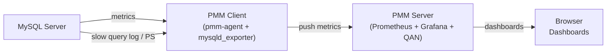

# How to Set Up MySQL Monitoring with Percona Monitoring and Management (PMM)

Author: [nawazdhandala](https://www.github.com/nawazdhandala)

Tags: MySQL, PMM, Percona, Monitoring, Performance

Description: Learn how to install and configure Percona Monitoring and Management (PMM) to monitor MySQL query performance, InnoDB metrics, and replication health with pre-built dashboards.

---

## How PMM Works

Percona Monitoring and Management (PMM) is an open-source observability platform for MySQL, PostgreSQL, and MongoDB. It consists of two components:

- **PMM Server** - a Docker-based server running Grafana, Prometheus, and Percona-specific dashboards
- **PMM Client** - an agent installed on each MySQL host that collects metrics and sends them to the server



PMM provides:
- Pre-built Grafana dashboards for MySQL, InnoDB, replication, and more
- Query Analytics (QAN) for identifying slow and high-load queries
- Advisor alerts for common configuration problems

## Step 1 - Deploy PMM Server

The simplest way to run PMM Server is via Docker:

```bash
docker run -d \
    --name pmm-server \
    --restart always \
    -p 443:443 \
    -p 80:80 \
    -v pmm-data:/srv \
    percona/pmm-server:2
```

Access the PMM UI at `https://localhost`. Default credentials:
- Username: `admin`
- Password: `admin` (change on first login)

## Step 2 - Install PMM Client on MySQL Hosts

```bash
# Ubuntu/Debian
wget https://repo.percona.com/apt/percona-release_latest.generic_all.deb
sudo dpkg -i percona-release_latest.generic_all.deb
sudo percona-release setup pmm2-client
sudo apt-get install -y pmm2-client

# RHEL/CentOS
sudo yum install -y https://repo.percona.com/yum/percona-release-latest.noarch.rpm
sudo percona-release setup pmm2-client
sudo yum install -y pmm2-client
```

## Step 3 - Connect PMM Client to PMM Server

Configure the client to connect to the PMM Server:

```bash
sudo pmm-admin config \
    --server-insecure-tls \
    --server-url=https://admin:admin@<pmm-server-ip>
```

Verify connectivity:

```bash
sudo pmm-admin status
```

## Step 4 - Create a MySQL Monitoring User

Create a dedicated user in MySQL for PMM:

```sql
CREATE USER 'pmm'@'localhost' IDENTIFIED BY 'PmmPass123!' WITH MAX_USER_CONNECTIONS 10;

GRANT SELECT, PROCESS, SUPER, REPLICATION CLIENT, RELOAD,
      BACKUP_ADMIN ON *.* TO 'pmm'@'localhost';

GRANT SELECT, UPDATE, DELETE, DROP ON performance_schema.* TO 'pmm'@'localhost';
```

## Step 5 - Add MySQL to PMM Monitoring

Register the MySQL instance:

```bash
sudo pmm-admin add mysql \
    --username=pmm \
    --password=PmmPass123! \
    --host=localhost \
    --port=3306 \
    --query-source=perfschema \
    --service-name=prod-mysql-01
```

`--query-source=perfschema` uses the Performance Schema for query analytics (recommended for MySQL 5.7+). Use `--query-source=slowlog` for slow query log-based analytics.

Verify the service is registered:

```bash
sudo pmm-admin list
```

## Step 6 - Enable Performance Schema (if not enabled)

```ini
# /etc/mysql/mysql.conf.d/mysqld.cnf
[mysqld]
performance_schema = ON
```

Verify:

```sql
SHOW VARIABLES LIKE 'performance_schema';
```

## Step 7 - Configure Slow Query Log (for slowlog query source)

If using slowlog-based query analytics:

```ini
[mysqld]
slow_query_log       = ON
slow_query_log_file  = /var/log/mysql/mysql-slow.log
long_query_time      = 0
log_queries_not_using_indexes = ON
```

```bash
sudo pmm-admin add mysql \
    --username=pmm \
    --password=PmmPass123! \
    --query-source=slowlog \
    --service-name=prod-mysql-01
```

## Exploring PMM Dashboards

After setup, navigate to Grafana dashboards in the PMM UI:

Key dashboards:
- **MySQL Overview** - connections, QPS, InnoDB metrics, temp tables
- **MySQL InnoDB Metrics** - buffer pool, row lock waits, dirty pages
- **MySQL Query Analytics** - top queries by load, latency, call count
- **MySQL Replication** - lag, I/O thread state, SQL thread state
- **MySQL Table Statistics** - per-table I/O, row access patterns

## Query Analytics (QAN)

Navigate to PMM > Query Analytics to see:

```text
Top Queries by Load:
1. SELECT * FROM orders WHERE status = ? | avg 43ms | calls 12,345
2. UPDATE sessions SET last_seen = ? WHERE id = ? | avg 8ms | calls 98,123
3. INSERT INTO audit_log (...) VALUES (...) | avg 2ms | calls 204,567
```

Click any query to see:
- Execution plan
- Time distribution histogram
- Tables involved
- Example queries with actual values

## Monitoring Multiple MySQL Instances

Add additional MySQL instances to the same PMM client:

```bash
sudo pmm-admin add mysql \
    --username=pmm \
    --password=PmmPass123! \
    --host=replica-01.internal \
    --port=3306 \
    --service-name=prod-mysql-replica-01
```

All instances appear in the PMM UI under the same server dropdown.

## PMM Advisors (Automated Recommendations)

PMM Advisors automatically analyze your MySQL configuration and flag issues. Navigate to PMM > Advisors to see recommendations such as:
- `innodb_buffer_pool_size` is too small
- `max_connections` is close to the limit
- Tables without primary keys
- Tables with very high row counts but no analysis run recently

## Best Practices

- Use `--query-source=perfschema` for MySQL 5.7+ for lower overhead than slowlog parsing.
- Set `long_query_time = 0` if using slowlog mode to capture all queries (for development/staging).
- Add all MySQL instances (primary and replicas) to PMM for complete topology visibility.
- Configure PMM alerting rules to notify on high replication lag, low buffer pool hit rate, or connection exhaustion.
- Retain PMM metrics for at least 30 days for trend analysis and capacity planning.
- Run PMM Server with at least 4 GB of RAM and persistent storage for production use.

## Summary

Percona Monitoring and Management provides a complete MySQL observability solution with PMM Server (running Grafana and Prometheus) and PMM Client on each MySQL host. After creating a monitoring user and registering the MySQL service with `pmm-admin add mysql`, pre-built dashboards show connection counts, InnoDB health, query performance, and replication status. The Query Analytics feature is particularly valuable for identifying the queries that contribute most to database load.
