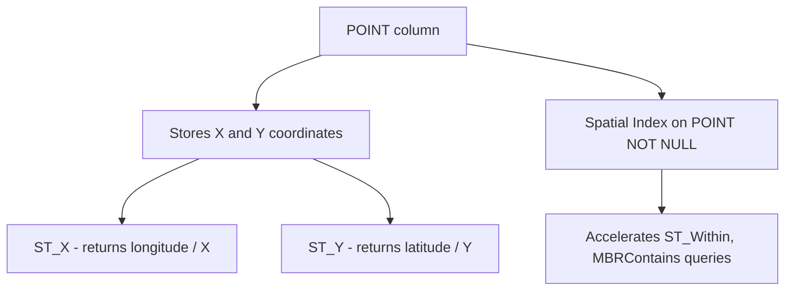

# How to Use POINT Data Type in MySQL

Author: [nawazdhandala](https://www.github.com/nawazdhandala)

Tags: MySQL, SQL, Spatial, GIS, Geometry, Database

Description: Learn how to store and query single geographic coordinates using the POINT data type in MySQL, with ST_GeomFromText, ST_X, ST_Y, and spatial index examples.

---

## What Is the POINT Data Type

`POINT` is a spatial data type in MySQL that represents a single location in a two-dimensional coordinate space. It stores an X value (longitude) and a Y value (latitude) together as a single column value. POINT is the most common spatial type used for storing things like store locations, delivery addresses, or GPS coordinates.

MySQL uses the OpenGIS standard for geometry types. POINT values can be created from Well-Known Text (WKT) using `ST_GeomFromText`, or from coordinates using `ST_PointFromText` and `ST_MakePoint`.



## Syntax

```sql
-- Column definition
column_name POINT [NOT NULL] [SRID srid_value]

-- Create a POINT value from WKT
ST_GeomFromText('POINT(longitude latitude)', srid)

-- Create a POINT value from coordinates
ST_MakePoint(longitude, latitude)

-- Extract coordinates
ST_X(point_column)   -- returns X / longitude
ST_Y(point_column)   -- returns Y / latitude
```

## Examples

### Create a Table with a POINT Column

```sql
CREATE TABLE landmarks (
    id        INT          PRIMARY KEY AUTO_INCREMENT,
    name      VARCHAR(100) NOT NULL,
    category  VARCHAR(50),
    location  POINT        NOT NULL SRID 4326,
    SPATIAL INDEX idx_location (location)
);
```

SRID 4326 is the WGS84 coordinate reference system used by GPS. Specifying the SRID enforces that all inserted values use the same reference system and enables correct geodetic calculations.

### Insert POINT Values

```sql
-- Using ST_GeomFromText (WKT format: longitude latitude)
INSERT INTO landmarks (name, category, location) VALUES
    ('Eiffel Tower',       'Monument',  ST_GeomFromText('POINT(2.2945 48.8584)',    4326)),
    ('Statue of Liberty',  'Monument',  ST_GeomFromText('POINT(-74.0445 40.6892)', 4326)),
    ('Sydney Opera House', 'Arts',      ST_GeomFromText('POINT(151.2153 -33.8568)', 4326)),
    ('Big Ben',            'Monument',  ST_GeomFromText('POINT(-0.1246 51.5007)',   4326)),
    ('Colosseum',          'Monument',  ST_GeomFromText('POINT(12.4922 41.8902)',   4326));

-- Using ST_MakePoint
INSERT INTO landmarks (name, category, location) VALUES
    ('Tokyo Tower', 'Monument', ST_MakePoint(139.7454, 35.6586));
```

### Read POINT Coordinates

```sql
SELECT
    name,
    category,
    ST_X(location) AS longitude,
    ST_Y(location) AS latitude
FROM landmarks
ORDER BY name;
```

```text
+-----------------------+-----------+------------+-----------+
| name                  | category  | longitude  | latitude  |
+-----------------------+-----------+------------+-----------+
| Big Ben               | Monument  |  -0.124600 |  51.50070 |
| Colosseum             | Monument  |  12.492200 |  41.89020 |
| Eiffel Tower          | Monument  |   2.294500 |  48.85840 |
| Statue of Liberty     | Monument  | -74.044500 |  40.68920 |
| Sydney Opera House    | Arts      | 151.215300 | -33.85680 |
| Tokyo Tower           | Monument  | 139.745400 |  35.65860 |
+-----------------------+-----------+------------+-----------+
```

### Calculate Distance Between Two Points

```sql
-- Distance in meters using the WGS84 ellipsoid
SELECT
    name,
    ROUND(
        ST_Distance_Sphere(
            location,
            ST_GeomFromText('POINT(2.2945 48.8584)', 4326)
        )
    ) AS distance_from_eiffel_meters
FROM landmarks
WHERE name != 'Eiffel Tower'
ORDER BY distance_from_eiffel_meters;
```

```text
+-----------------------+-----------------------------+
| name                  | distance_from_eiffel_meters |
+-----------------------+-----------------------------+
| Big Ben               |                      341614 |
| Colosseum             |                     1105702 |
| Statue of Liberty     |                     5837396 |
| Tokyo Tower           |                     9726445 |
| Sydney Opera House    |                    16959485 |
+-----------------------+-----------------------------+
```

### Find Points Within a Bounding Box

```sql
-- Find European landmarks (rough bounding box)
SET @europe_bbox = ST_GeomFromText(
    'POLYGON((-10 35, 40 35, 40 60, -10 60, -10 35))',
    4326
);

SELECT name, ST_X(location) AS lon, ST_Y(location) AS lat
FROM landmarks
WHERE MBRContains(@europe_bbox, location);
```

```text
+--------------+--------+---------+
| name         | lon    | lat     |
+--------------+--------+---------+
| Eiffel Tower | 2.2945 | 48.8584 |
| Big Ben      | -0.1246| 51.5007 |
| Colosseum    | 12.4922| 41.8902 |
+--------------+--------+---------+
```

### Convert POINT to WKT String

```sql
SELECT name, ST_AsText(location) AS wkt
FROM landmarks
LIMIT 3;
```

```text
+-----------------------+-----------------------------+
| name                  | wkt                         |
+-----------------------+-----------------------------+
| Eiffel Tower          | POINT(2.2945 48.8584)       |
| Statue of Liberty     | POINT(-74.0445 40.6892)     |
| Sydney Opera House    | POINT(151.2153 -33.8568)    |
+-----------------------+-----------------------------+
```

### Update a POINT Value

```sql
UPDATE landmarks
SET location = ST_GeomFromText('POINT(2.2950 48.8590)', 4326)
WHERE name = 'Eiffel Tower';
```

## NULL and Constraint Handling

```sql
-- Column allows NULL
CREATE TABLE optional_location (
    id       INT PRIMARY KEY AUTO_INCREMENT,
    name     VARCHAR(100),
    location POINT   -- nullable, no spatial index possible
);

-- Check for rows with no location set
SELECT name FROM optional_location WHERE location IS NULL;

-- Set a location for a row
UPDATE optional_location
SET location = ST_GeomFromText('POINT(0 0)', 4326)
WHERE id = 1;
```

## Best Practices

- Declare POINT columns as `NOT NULL` with a fixed SRID so MySQL can use a spatial index and perform correct geodetic calculations.
- Always use `ST_GeomFromText('POINT(lon lat)', 4326)` format - WKT puts X (longitude) first, then Y (latitude).
- Use `ST_X()` to get longitude and `ST_Y()` to get latitude. The naming is counterintuitive for geographers but follows the OpenGIS convention.
- For distance queries in meters, use `ST_Distance_Sphere` (fast, approximate) or `ST_Distance` with SRID 4326 (exact geodetic).
- Combine a `MBRContains` bounding box (spatial index) with an exact distance filter for efficient radius searches.

## Summary

The `POINT` data type in MySQL stores a single (X, Y) coordinate pair representing a location in a two-dimensional space. Declare POINT columns `NOT NULL` with SRID 4326 for WGS84 geographic coordinates. Insert values with `ST_GeomFromText('POINT(lon lat)', 4326)` or `ST_MakePoint(lon, lat)`. Extract coordinates with `ST_X()` and `ST_Y()`. Add a `SPATIAL INDEX` on the column to accelerate spatial queries using `MBRContains`, `ST_Within`, and related functions.
