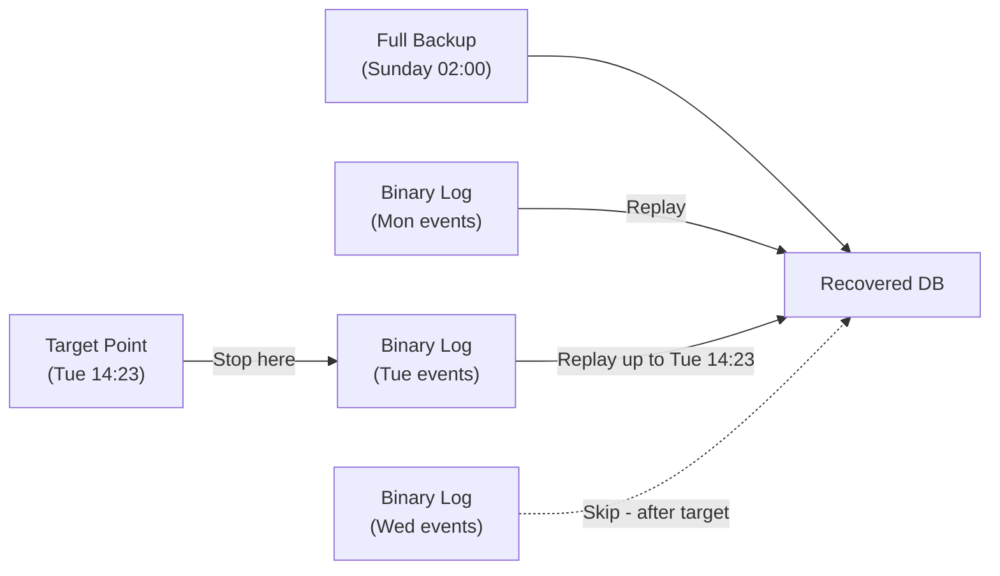

# How to Set Up MySQL Point-in-Time Recovery with Binary Logs

Author: [nawazdhandala](https://www.github.com/nawazdhandala)

Tags: MySQL, Backup, Recovery, Binary Log, Point-in-Time Recovery

Description: Learn how to use MySQL binary logs combined with a full backup to recover a database to any specific point in time, protecting against accidental data loss.

---

## How Point-in-Time Recovery Works

Point-in-Time Recovery (PITR) uses a combination of a full backup and binary log files to restore a database to any moment between the backup and the present. The process is:

1. Restore the most recent full backup
2. Replay binary log events up to the desired point in time



## Step 1 - Enable Binary Logging

Binary logging must be enabled on the MySQL server before any data changes occur. Edit `/etc/mysql/mysql.conf.d/mysqld.cnf`:

```ini
[mysqld]
server-id              = 1
log_bin                = /var/log/mysql/mysql-bin.log
binlog_format          = ROW
expire_logs_days       = 14
max_binlog_size        = 100M
sync_binlog            = 1
```

Restart MySQL:

```bash
sudo systemctl restart mysql
```

Verify binary logging is active:

```sql
SHOW VARIABLES LIKE 'log_bin';
SHOW BINARY LOGS;
```

## Step 2 - Take a Full Backup

Take a consistent backup that includes the binary log position:

```bash
mysqldump -u root -p \
    --single-transaction \
    --flush-logs \
    --master-data=2 \
    --all-databases \
    > /backups/full_$(date +%Y%m%d_%H%M%S).sql
```

The `--flush-logs` flag rotates the binary log so the backup has a clean starting point. The `--master-data=2` flag adds the binary log position as a comment in the dump file.

Check the recorded binary log position in the backup:

```bash
grep "CHANGE MASTER TO" /backups/full_20260331_020000.sql | head -1
```

Output example:

```text
-- CHANGE MASTER TO MASTER_LOG_FILE='mysql-bin.000012', MASTER_LOG_POS=154;
```

## Step 3 - Simulate a Data Loss Scenario

Create some data and then accidentally drop a table:

```sql
USE myapp_db;
INSERT INTO orders (customer, amount) VALUES ('Alice', 99.99);
INSERT INTO orders (customer, amount) VALUES ('Bob',   149.50);

-- Simulate accidental DROP at a specific time
DROP TABLE orders;
```

Record the approximate time the accident happened:

```bash
date
# Example output: Tue Mar 31 14:23:00 UTC 2026
```

## Step 4 - Find the Target Position in Binary Logs

Use `mysqlbinlog` to inspect binary log events and find the exact position just before the DROP:

```bash
mysqlbinlog \
    --base64-output=DECODE-ROWS \
    --verbose \
    /var/log/mysql/mysql-bin.000012 | grep -A 10 "DROP TABLE"
```

Find the position number just before the DROP event. For example, if DROP is at position 4567, you want to restore up to position 4566.

Alternatively, use datetime:

```bash
mysqlbinlog \
    --base64-output=DECODE-ROWS \
    --verbose \
    --start-datetime="2026-03-31 02:00:00" \
    --stop-datetime="2026-03-31 14:22:59" \
    /var/log/mysql/mysql-bin.000012 | less
```

## Step 5 - Restore the Full Backup

Stop the application from writing to the database, then restore the full backup:

```bash
mysql -u root -p < /backups/full_20260331_020000.sql
```

## Step 6 - Apply Binary Logs Up to the Recovery Point

Apply all binary log events from the backup's log position up to just before the DROP:

Using a stop position:

```bash
mysqlbinlog \
    --start-position=154 \
    --stop-position=4566 \
    /var/log/mysql/mysql-bin.000012 | mysql -u root -p
```

Using a stop datetime:

```bash
mysqlbinlog \
    --start-datetime="2026-03-31 02:00:00" \
    --stop-datetime="2026-03-31 14:22:59" \
    /var/log/mysql/mysql-bin.000012 | mysql -u root -p
```

If the events span multiple binary log files, apply them all in sequence:

```bash
mysqlbinlog \
    --start-position=154 \
    /var/log/mysql/mysql-bin.000012 \
    /var/log/mysql/mysql-bin.000013 \
    --stop-datetime="2026-03-31 14:22:59" \
    | mysql -u root -p
```

## Step 7 - Verify Recovery

```sql
USE myapp_db;
SHOW TABLES;
SELECT COUNT(*) FROM orders;
SELECT * FROM orders ORDER BY order_id DESC LIMIT 10;
```

## Automating Binary Log Archival

Binary logs on the server can be purged. Archive them offsite regularly:

```bash
#!/bin/bash
# Archive binary logs to backup storage
BINLOG_DIR="/var/log/mysql"
ARCHIVE_DIR="/backups/binlogs/$(date +%Y%m%d)"

mkdir -p "$ARCHIVE_DIR"

# Copy all binary logs (the active log may be incomplete)
mysql -u root -p -e "FLUSH BINARY LOGS;"

# Copy all but the last (active) binary log
ls "$BINLOG_DIR"/mysql-bin.[0-9]* | head -n -1 | \
    xargs -I{} cp {} "$ARCHIVE_DIR/"

echo "Binary logs archived to $ARCHIVE_DIR"
```

## Best Practices

- Enable `sync_binlog = 1` for durability; each transaction commit is synced to disk.
- Use `binlog_format = ROW` for more reliable and complete binary log events.
- Archive binary logs to a separate disk or remote storage regularly.
- Always take full backups with `--master-data=2` or `--source-data=2` to record the log position.
- Set `expire_logs_days` long enough to cover your recovery window (at least 14 days).
- Practice PITR recovery on a staging server quarterly so the process is well-understood.

## Summary

MySQL point-in-time recovery combines a full backup with binary log replay to restore a database to any specific moment. Enable binary logging on the server, take full backups with log position recorded (`--master-data=2`), and use `mysqlbinlog` with `--stop-datetime` or `--stop-position` to replay only the transactions needed. This protects against accidental data deletions and table drops.
