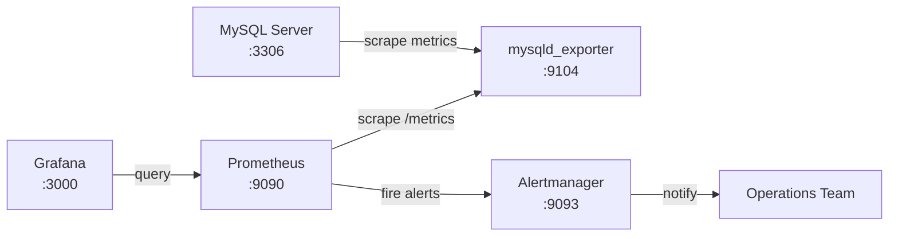

# How to Set Up MySQL Monitoring with Prometheus and Grafana

Author: [nawazdhandala](https://www.github.com/nawazdhandala)

Tags: MySQL, Prometheus, Grafana, Monitoring, Observability

Description: Learn how to set up MySQL monitoring using mysqld_exporter, Prometheus, and Grafana with pre-built dashboards and alerting rules for key MySQL metrics.

---

## Architecture Overview

The monitoring stack consists of three components:



- **mysqld_exporter** - exports MySQL metrics in Prometheus format
- **Prometheus** - scrapes and stores time-series metrics
- **Grafana** - visualizes metrics with dashboards and alerting

## Step 1 - Create a MySQL Monitoring User

```sql
CREATE USER 'exporter'@'localhost' IDENTIFIED BY 'ExporterPass123!' WITH MAX_USER_CONNECTIONS 3;

GRANT PROCESS, REPLICATION CLIENT, SELECT ON *.* TO 'exporter'@'localhost';
GRANT SELECT ON performance_schema.* TO 'exporter'@'localhost';

FLUSH PRIVILEGES;
```

## Step 2 - Install and Configure mysqld_exporter

Download the latest exporter:

```bash
wget https://github.com/prometheus/mysqld_exporter/releases/download/v0.15.1/\
mysqld_exporter-0.15.1.linux-amd64.tar.gz
tar -xzf mysqld_exporter-0.15.1.linux-amd64.tar.gz
sudo mv mysqld_exporter-0.15.1.linux-amd64/mysqld_exporter /usr/local/bin/
```

Create a credentials file for the exporter:

```ini
# /etc/mysqld_exporter/.my.cnf (chmod 600, owned by mysqld_exporter user)
[client]
user     = exporter
password = ExporterPass123!
host     = localhost
```

Create a systemd service:

```ini
# /etc/systemd/system/mysqld_exporter.service
[Unit]
Description=MySQL Exporter for Prometheus
After=network.target mysql.service

[Service]
User=mysqld_exporter
Group=mysqld_exporter
ExecStart=/usr/local/bin/mysqld_exporter \
    --config.my-cnf=/etc/mysqld_exporter/.my.cnf \
    --collect.info_schema.processlist \
    --collect.info_schema.innodb_metrics \
    --collect.info_schema.tablestats \
    --collect.info_schema.tables \
    --collect.info_schema.userstats \
    --collect.engine_innodb_status \
    --collect.slave_status \
    --web.listen-address=:9104
Restart=always

[Install]
WantedBy=multi-user.target
```

Create the user and enable the service:

```bash
sudo useradd -r -s /sbin/nologin mysqld_exporter
sudo mkdir -p /etc/mysqld_exporter
# Create .my.cnf with credentials above
sudo chown -R mysqld_exporter:mysqld_exporter /etc/mysqld_exporter
sudo systemctl daemon-reload
sudo systemctl enable --now mysqld_exporter
```

Verify metrics are available:

```bash
curl http://localhost:9104/metrics | grep mysql_global_status_connections
```

## Step 3 - Configure Prometheus to Scrape mysqld_exporter

Add the MySQL job to `prometheus.yml`:

```yaml
# /etc/prometheus/prometheus.yml
global:
  scrape_interval: 15s
  evaluation_interval: 15s

scrape_configs:
  - job_name: 'mysql'
    static_configs:
      - targets:
          - 'db-primary:9104'
          - 'db-replica-01:9104'
          - 'db-replica-02:9104'
        labels:
          env: production
```

Reload Prometheus:

```bash
sudo systemctl reload prometheus
```

Verify targets are UP in Prometheus: `http://prometheus:9090/targets`

## Step 4 - Import MySQL Dashboard in Grafana

The most popular MySQL dashboard is Percona's MySQL Overview (ID: 7362) from Grafana.com:

In Grafana:
1. Navigate to Dashboards > Import
2. Enter dashboard ID `7362`
3. Select your Prometheus datasource
4. Click Import

Alternative popular dashboards:
- ID `6239` - MySQL Overview
- ID `11323` - MySQL Exporter Quickstart

## Key Metrics to Track

### Connection Metrics

```text
mysql_global_status_threads_connected       - Current connections
mysql_global_status_max_used_connections    - Peak connections ever
mysql_global_variables_max_connections      - Max connections limit
```

### Query Rates

```text
rate(mysql_global_status_questions[5m])     - Queries per second
rate(mysql_global_status_slow_queries[5m])  - Slow queries per second
mysql_global_status_threads_running         - Queries currently running
```

### InnoDB Buffer Pool

```text
mysql_global_status_innodb_buffer_pool_reads            - Disk reads (cache miss)
mysql_global_status_innodb_buffer_pool_read_requests    - Total read requests
```

### Replication (on replicas)

```text
mysql_slave_status_seconds_behind_master    - Replica lag in seconds
mysql_slave_status_slave_io_running         - I/O thread status (1=running)
mysql_slave_status_slave_sql_running        - SQL thread status (1=running)
```

## Step 5 - Set Up Alerting Rules

Create a Prometheus alerting rules file:

```yaml
# /etc/prometheus/rules/mysql_alerts.yml
groups:
  - name: mysql
    rules:
      - alert: MySQLDown
        expr: mysql_up == 0
        for: 1m
        labels:
          severity: critical
        annotations:
          summary: "MySQL is down on {{ $labels.instance }}"

      - alert: MySQLTooManyConnections
        expr: >
          mysql_global_status_threads_connected /
          mysql_global_variables_max_connections > 0.8
        for: 5m
        labels:
          severity: warning
        annotations:
          summary: "MySQL connections at {{ $value | humanizePercentage }} on {{ $labels.instance }}"

      - alert: MySQLSlowQueryRateHigh
        expr: rate(mysql_global_status_slow_queries[5m]) > 5
        for: 5m
        labels:
          severity: warning
        annotations:
          summary: "High slow query rate: {{ $value | humanize }} QPS on {{ $labels.instance }}"

      - alert: MySQLReplicationLagHigh
        expr: mysql_slave_status_seconds_behind_master > 30
        for: 2m
        labels:
          severity: warning
        annotations:
          summary: "Replication lag {{ $value }}s on {{ $labels.instance }}"

      - alert: MySQLReplicationNotRunning
        expr: mysql_slave_status_slave_io_running == 0 OR mysql_slave_status_slave_sql_running == 0
        for: 1m
        labels:
          severity: critical
        annotations:
          summary: "Replication thread stopped on {{ $labels.instance }}"

      - alert: MySQLBufferPoolHitRateLow
        expr: >
          1 - (
            rate(mysql_global_status_innodb_buffer_pool_reads[5m]) /
            rate(mysql_global_status_innodb_buffer_pool_read_requests[5m])
          ) < 0.99
        for: 10m
        labels:
          severity: warning
        annotations:
          summary: "Buffer pool hit rate {{ $value | humanizePercentage }} on {{ $labels.instance }}"
```

Reference the rules file in `prometheus.yml`:

```yaml
rule_files:
  - /etc/prometheus/rules/mysql_alerts.yml
```

## Best Practices

- Scrape mysqld_exporter every 15-30 seconds for responsive alerts.
- Enable `--collect.slave_status` even on primary servers (it returns no data if not a replica).
- Enable `--collect.info_schema.innodb_metrics` for detailed InnoDB counters.
- Use labels (`env: production`, `role: primary`) to distinguish instances in dashboards.
- Set alert thresholds conservatively at first and tighten them based on observed normal ranges.
- Store Prometheus data for at least 30 days for capacity planning.

## Summary

MySQL monitoring with Prometheus and Grafana uses `mysqld_exporter` to expose MySQL metrics, Prometheus to scrape and store them, and Grafana for visualization. After creating a read-only monitoring user, configure the exporter as a systemd service and add it to Prometheus scrape targets. Import a pre-built Grafana dashboard for immediate visibility into connections, query rates, buffer pool efficiency, and replication health, then add Prometheus alerting rules for critical conditions.
