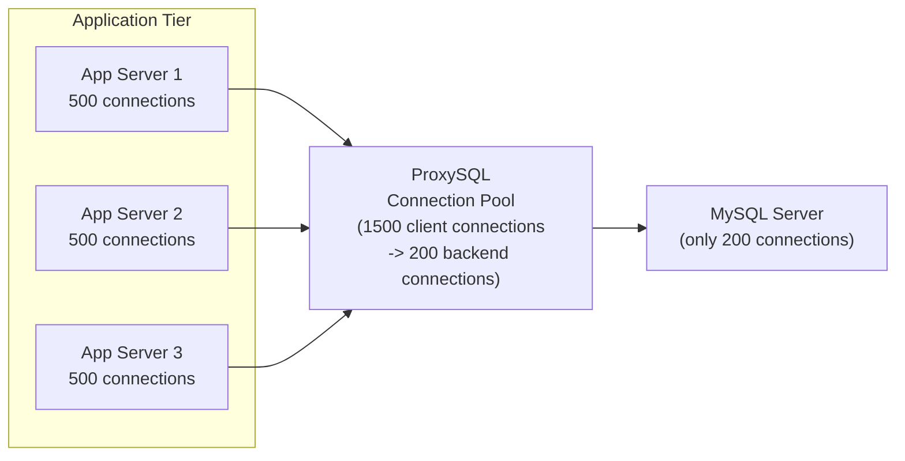

# How to Use MySQL Connection Pooling with ProxySQL

Author: [nawazdhandala](https://www.github.com/nawazdhandala)

Tags: MySQL, ProxySQL, Connection Pooling, Performance, Scalability

Description: Learn how to configure ProxySQL as a MySQL connection pool to reduce connection overhead, limit per-server connections, and improve application scalability.

---

## How ProxySQL Connection Pooling Works

MySQL creates a thread for each client connection, consuming memory and CPU. At scale, thousands of short-lived connections from application servers can overwhelm MySQL. ProxySQL solves this by maintaining a pool of persistent backend connections to MySQL and multiplexing many client connections over them.



ProxySQL multiplexes client connections: a client connection is detached from a backend connection while idle and reused by another client. This allows 1500 application connections to share 200 backend MySQL connections.

## Installation

```bash
# Ubuntu/Debian
wget https://github.com/sysown/proxysql/releases/download/v2.5.5/proxysql_2.5.5-ubuntu20_amd64.deb
sudo dpkg -i proxysql_2.5.5-ubuntu20_amd64.deb
sudo systemctl start proxysql
sudo systemctl enable proxysql
```

## Basic Connection Pool Configuration

Connect to the ProxySQL admin interface:

```bash
mysql -u admin -padmin -h 127.0.0.1 -P 6032
```

### Step 1 - Add Backend MySQL Server

```sql
INSERT INTO mysql_servers (hostgroup_id, hostname, port, max_connections, comment)
VALUES (10, '192.168.1.10', 3306, 200, 'MySQL Primary');

LOAD MYSQL SERVERS TO RUNTIME;
SAVE MYSQL SERVERS TO DISK;
```

The `max_connections` field limits how many backend connections ProxySQL opens to this MySQL server.

### Step 2 - Configure the Monitor User

```sql
-- Create monitor user in MySQL first
-- (run this in MySQL, not ProxySQL admin)
CREATE USER 'proxysql_monitor'@'%' IDENTIFIED BY 'MonitorPass123!';
GRANT USAGE ON *.* TO 'proxysql_monitor'@'%';
FLUSH PRIVILEGES;

-- Configure in ProxySQL
UPDATE global_variables SET variable_value = 'proxysql_monitor'
WHERE variable_name = 'mysql-monitor_username';

UPDATE global_variables SET variable_value = 'MonitorPass123!'
WHERE variable_name = 'mysql-monitor_password';

LOAD MYSQL VARIABLES TO RUNTIME;
SAVE MYSQL VARIABLES TO DISK;
```

### Step 3 - Add Application User

```sql
-- Create in MySQL first
-- (run in MySQL)
CREATE USER 'appuser'@'%' IDENTIFIED BY 'AppPass123!';
GRANT SELECT, INSERT, UPDATE, DELETE ON myapp_db.* TO 'appuser'@'%';
FLUSH PRIVILEGES;

-- Add to ProxySQL
INSERT INTO mysql_users (username, password, default_hostgroup, max_connections)
VALUES ('appuser', 'AppPass123!', 10, 1000);

LOAD MYSQL USERS TO RUNTIME;
SAVE MYSQL USERS TO DISK;
```

`max_connections` here limits how many total client connections this user can have through ProxySQL.

## Connection Pool Tuning Parameters

```sql
-- Maximum backend connections ProxySQL will open per server (global default)
SET GLOBAL mysql-max_connections = 2048;

-- How long an idle backend connection stays in the pool (ms)
SET GLOBAL mysql-connection_max_age_ms = 0;       -- 0 = no age limit

-- Timeout for backend connection attempts (ms)
SET GLOBAL mysql-connect_timeout_server = 3000;

-- Timeout waiting for a backend connection from the pool (ms)
SET GLOBAL mysql-connect_timeout_server_max = 10000;

-- How long a client connection can wait for a free backend connection
SET GLOBAL mysql-wait_timeout = 28800000;  -- 8 hours

-- Ping interval to keep backend connections alive (ms)
SET GLOBAL mysql-ping_interval_server_msec = 120000;  -- 2 minutes

-- Timeout for pings to backends
SET GLOBAL mysql-ping_timeout_server = 500;

LOAD MYSQL VARIABLES TO RUNTIME;
SAVE MYSQL VARIABLES TO DISK;
```

## Connection Multiplexing

ProxySQL multiplexes connections by default. A backend connection is returned to the pool after each query (when not in a transaction). This allows many client connections to share fewer backend connections.

View current multiplexing state:

```sql
SELECT hostgroup, srv_host, srv_port,
       status,
       connused,    -- backend connections in use
       connfree,    -- backend connections available in pool
       connok,      -- total successful connections
       connconn     -- current backend connections
FROM   stats_mysql_connection_pool;
```

## Per-Server Connection Limits

Set different limits for different servers:

```sql
-- Primary: max 200 backend connections
INSERT INTO mysql_servers (hostgroup_id, hostname, port, max_connections)
VALUES (10, '192.168.1.10', 3306, 200);

-- Replica 1: max 300 backend connections (more read capacity)
INSERT INTO mysql_servers (hostgroup_id, hostname, port, max_connections)
VALUES (20, '192.168.1.11', 3306, 300);

-- Replica 2: max 300 backend connections
INSERT INTO mysql_servers (hostgroup_id, hostname, port, max_connections)
VALUES (20, '192.168.1.12', 3306, 300);

LOAD MYSQL SERVERS TO RUNTIME;
SAVE MYSQL SERVERS TO DISK;
```

## Connection Pool Statistics

Monitor pool efficiency:

```sql
-- Overall pool stats per server
SELECT hostgroup,
       srv_host,
       status,
       connused AS active_backend_conns,
       connfree AS pooled_idle_conns,
       queries  AS total_queries
FROM   stats_mysql_connection_pool
ORDER  BY hostgroup, srv_host;

-- Client connection stats
SELECT user,
       client_host,
       backend_host,
       connected_at,
       time_ms AS session_duration_ms,
       current_query
FROM   stats_mysql_processlist
WHERE  current_query != ''
ORDER  BY time_ms DESC
LIMIT  20;
```

## Preventing Connection Storms

A connection storm happens when all application servers restart simultaneously and flood the pool. Use `mysql-throttle_connections_per_sec_to_hostgroup` to rate-limit new connection creation:

```sql
SET GLOBAL mysql-throttle_connections_per_sec_to_hostgroup = 100;
LOAD MYSQL VARIABLES TO RUNTIME;
```

This limits ProxySQL to opening at most 100 new backend connections per second.

## Health Checking

ProxySQL continuously checks backend server health:

```sql
-- View recent health check results
SELECT hostname, port, time_start_us, ping_success, ping_error
FROM   monitor.mysql_server_ping_log
ORDER  BY time_start_us DESC
LIMIT  20;

-- View connection check results
SELECT hostname, port, time_start_us, connect_success, connect_error
FROM   monitor.mysql_server_connect_log
ORDER  BY time_start_us DESC
LIMIT  20;
```

## Best Practices

- Set `max_connections` per backend server slightly below MySQL's `max_connections` to leave room for direct administrative connections.
- Use ProxySQL on the application servers themselves (co-located) for lowest latency.
- Monitor `connused` and `connfree` ratios; if `connfree` is consistently 0, increase `max_connections` on the backend or add more backend servers.
- Set `mysql-connection_max_age_ms` to a reasonable value (e.g., 3600000 for 1 hour) to recycle long-lived connections.
- Enable connection multiplexing (the default) to maximize pool efficiency.
- Test failover behavior by stopping a backend server and verifying ProxySQL routes to healthy backends.

## Summary

ProxySQL connection pooling sits between applications and MySQL, maintaining a pool of persistent backend connections that are multiplexed across many client connections. Configure backend servers with `max_connections` limits, add a monitor user for health checking, and tune pool parameters like `ping_interval_server_msec` for connection keep-alive. Monitor pool efficiency with `stats_mysql_connection_pool` and alert when idle connections drop to zero, indicating pool exhaustion.
