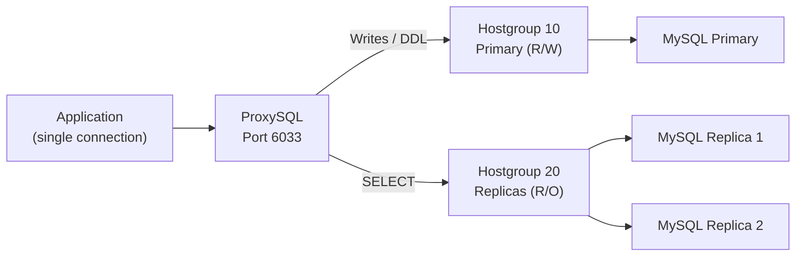

# How to Set Up MySQL Read/Write Splitting with ProxySQL

Author: [nawazdhandala](https://www.github.com/nawazdhandala)

Tags: MySQL, ProxySQL, Read-Write Splitting, Load Balancing, Replication

Description: Learn how to configure ProxySQL for MySQL read/write splitting, routing write queries to the primary and distributing reads across replicas automatically.

---

## How Read/Write Splitting Works with ProxySQL

ProxySQL is a high-performance MySQL proxy that sits between your application and MySQL servers. It parses every SQL statement and routes it to the appropriate hostgroup based on configurable query rules. Writes (INSERT, UPDATE, DELETE, etc.) go to the primary, while SELECT statements are distributed across replicas.



## Installation

Install ProxySQL on a proxy host (Ubuntu/Debian):

```bash
wget https://github.com/sysown/proxysql/releases/download/v2.5.5/proxysql_2.5.5-ubuntu20_amd64.deb
sudo dpkg -i proxysql_2.5.5-ubuntu20_amd64.deb
sudo systemctl start proxysql
sudo systemctl enable proxysql
```

## Configuration via the Admin Interface

ProxySQL exposes a MySQL-compatible admin interface on port 6032. Connect to it:

```bash
mysql -u admin -padmin -h 127.0.0.1 -P 6032 --prompt='ProxySQL Admin> '
```

### Step 1 - Add MySQL Backend Servers

Add the primary and replicas to ProxySQL:

```sql
-- Add the primary to hostgroup 10
INSERT INTO mysql_servers (hostgroup_id, hostname, port, weight, comment)
VALUES (10, '192.168.1.10', 3306, 1000, 'Primary');

-- Add replicas to hostgroup 20
INSERT INTO mysql_servers (hostgroup_id, hostname, port, weight, comment)
VALUES (20, '192.168.1.11', 3306, 1000, 'Replica 1');

INSERT INTO mysql_servers (hostgroup_id, hostname, port, weight, comment)
VALUES (20, '192.168.1.12', 3306, 1000, 'Replica 2');
```

### Step 2 - Configure the Replication Hostgroup

Tell ProxySQL which hostgroup is primary and which is replica:

```sql
INSERT INTO mysql_replication_hostgroups (writer_hostgroup, reader_hostgroup, comment)
VALUES (10, 20, 'MySQL Replication');

LOAD MYSQL SERVERS TO RUNTIME;
SAVE MYSQL SERVERS TO DISK;
```

### Step 3 - Create a Monitor User on MySQL

ProxySQL needs to monitor MySQL server health. Create this user on the primary (replication will propagate it):

```sql
-- On the MySQL primary
CREATE USER 'proxysql_monitor'@'%' IDENTIFIED BY 'MonitorPass123!';
GRANT USAGE, REPLICATION CLIENT ON *.* TO 'proxysql_monitor'@'%';
FLUSH PRIVILEGES;
```

Configure ProxySQL to use this user:

```sql
-- In ProxySQL admin
UPDATE global_variables SET variable_value = 'proxysql_monitor'
WHERE variable_name = 'mysql-monitor_username';

UPDATE global_variables SET variable_value = 'MonitorPass123!'
WHERE variable_name = 'mysql-monitor_password';

LOAD MYSQL VARIABLES TO RUNTIME;
SAVE MYSQL VARIABLES TO DISK;
```

### Step 4 - Add Application User

Create the application user in ProxySQL and on MySQL:

```sql
-- On the MySQL primary
CREATE USER 'appuser'@'%' IDENTIFIED BY 'AppPass123!';
GRANT ALL PRIVILEGES ON myapp_db.* TO 'appuser'@'%';
FLUSH PRIVILEGES;

-- In ProxySQL admin
INSERT INTO mysql_users (username, password, default_hostgroup, active)
VALUES ('appuser', 'AppPass123!', 10, 1);

LOAD MYSQL USERS TO RUNTIME;
SAVE MYSQL USERS TO DISK;
```

### Step 5 - Configure Query Rules for Read/Write Splitting

Set up routing rules so SELECTs go to replicas and writes go to primary:

```sql
-- Route all SELECT statements to the reader hostgroup (20)
INSERT INTO mysql_query_rules (rule_id, active, match_pattern, destination_hostgroup, apply)
VALUES (1, 1, '^SELECT.*FOR UPDATE', 10, 1);

INSERT INTO mysql_query_rules (rule_id, active, match_pattern, destination_hostgroup, apply)
VALUES (2, 1, '^SELECT', 20, 1);

LOAD MYSQL QUERY RULES TO RUNTIME;
SAVE MYSQL QUERY RULES TO DISK;
```

Rule 1 routes `SELECT ... FOR UPDATE` to the primary because it acquires a lock. Rule 2 routes all other SELECTs to replicas.

## Connecting Applications Through ProxySQL

Applications connect to ProxySQL on port 6033 using standard MySQL credentials:

```bash
mysql -u appuser -pAppPass123! -h 127.0.0.1 -P 6033 myapp_db
```

## Verifying Read/Write Splitting

Check query routing statistics:

```sql
-- In ProxySQL admin
SELECT hostgroup, srv_host, status, queries, bytes_data_recv
FROM   stats_mysql_connection_pool;

-- Check per-rule routing stats
SELECT rule_id, hits, destination_hostgroup, match_pattern
FROM   stats_mysql_query_rules;
```

Check which server handled a query:

```sql
-- In ProxySQL admin
SELECT * FROM stats_mysql_processlist\G
```

## Advanced: Sticky Connections for Transactions

When an application opens a transaction, all queries in that transaction must go to the primary. Enable transaction-aware routing:

```sql
UPDATE global_variables
SET    variable_value = 'true'
WHERE  variable_name  = 'mysql-handle_warnings';

-- Enable multiplexing control (default: ON)
UPDATE global_variables
SET    variable_value = '1'
WHERE  variable_name  = 'mysql-multiplexing';

LOAD MYSQL VARIABLES TO RUNTIME;
SAVE MYSQL VARIABLES TO DISK;
```

ProxySQL automatically detects `BEGIN`/`START TRANSACTION` and routes the session to the writer hostgroup for the duration.

## Best Practices

- Place ProxySQL on the same host as the application to minimize latency.
- Use separate MySQL users for monitoring and application access.
- Set realistic health-check intervals (`mysql-monitor_connect_interval`, `mysql-monitor_ping_interval`).
- Tune `max_connections` per backend server to match MySQL's `max_connections`.
- Regularly review `stats_mysql_query_rules` to verify rules are routing traffic as expected.
- Use ProxySQL's query cache feature carefully - only cache idempotent, low-cardinality results.

## Summary

ProxySQL intercepts MySQL traffic and routes it based on SQL query rules. By assigning writers to hostgroup 10 and readers to hostgroup 20, and adding rules that match `SELECT` patterns, all read queries are automatically distributed across replicas while writes always reach the primary. ProxySQL also monitors backend health and removes failed servers from rotation automatically.
