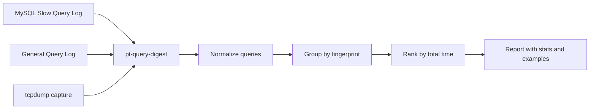

# How to Use MySQL pt-query-digest for Query Analysis

Author: [nawazdhandala](https://www.github.com/nawazdhandala)

Tags: MySQL, SQL, pt-query-digest, Percona Toolkit, Performance, Slow Query Log

Description: Learn how to use Percona Toolkit's pt-query-digest to analyze MySQL slow query logs and identify the most impactful queries for optimization.

---

## How pt-query-digest Works

`pt-query-digest` is a command-line tool from Percona Toolkit that parses MySQL slow query logs, general query logs, and tcpdump captures. It groups similar queries by their normalized fingerprint, then reports aggregated statistics such as total execution time, average latency, rows examined, and query count. This makes it easy to identify the top queries to optimize without manually sifting through thousands of log lines.



## Installation

**On Ubuntu / Debian:**

```bash
sudo apt-get install percona-toolkit
```

**On RHEL / CentOS:**

```bash
sudo yum install percona-toolkit
```

**Manual install:**

```bash
wget https://www.percona.com/downloads/percona-toolkit/LATEST/binary/tarball/percona-toolkit-3.6.0_x86_64.tar.gz
tar -xzf percona-toolkit-3.6.0_x86_64.tar.gz
sudo cp percona-toolkit-3.6.0/bin/pt-query-digest /usr/local/bin/
```

## Enabling the Slow Query Log

```sql
-- Enable slow query log:
SET GLOBAL slow_query_log = ON;

-- Set threshold (default 10 seconds; lower for development):
SET GLOBAL long_query_time = 1;

-- Log queries that examine many rows even if fast:
SET GLOBAL log_queries_not_using_indexes = ON;

-- Check current log file location:
SHOW VARIABLES LIKE 'slow_query_log_file';
```

Or set permanently in `my.cnf`:

```text
[mysqld]
slow_query_log          = 1
slow_query_log_file     = /var/log/mysql/slow.log
long_query_time         = 1
log_queries_not_using_indexes = 1
```

## Basic pt-query-digest Usage

```bash
# Analyze the slow query log:
pt-query-digest /var/log/mysql/slow.log

# Pipe output to a file:
pt-query-digest /var/log/mysql/slow.log > report.txt
```

## Sample Output Explained

```text
# 360ms user time, 30ms system time, 35.42M rss, 80.46M vsz
# Current date: Tue Mar 31 11:00:00 2026
# Hostname: db-server-01
# Files: /var/log/mysql/slow.log
# Overall: 15.23k queries total, 18 unique, 40.00 QPS, 8.19x concurrency _____

# Query 1: 1.98k QPS, 5.01x concurrency, ID 0xABC123... at byte 12345
# This item is included in the report because it matches --limit.
#              pct   total     min     max     avg     95%  stddev  median
# Count         26   4012
# Exec time     62   18m     52ms    12s    268ms    1.2s   497ms   119ms
# Lock time      1    29s    100us    10s    7ms     22ms    80ms   430us
# Rows sent      0  1.62k      0       1       0    0.99      0       0
# Rows examine  91   1.5G   193   9.7M   393k    1.4M   681k  154k
# Query size    0  64.00k      5      52      16      27      9      14

SELECT orders.id, orders.status, users.name
FROM orders
JOIN users ON orders.user_id = users.id
WHERE orders.status = 'pending' AND orders.created_at > '2026-01-01'\G
```

Key metrics:

```text
Metric          Meaning
------          -------
pct             Percentage of total from this query class
total           Sum across all executions
min / max / avg Execution time distribution
95%             95th percentile latency
Rows examined   Rows scanned (high = missing index)
Rows sent       Rows returned to client
QPS             Queries per second
```

## Common Flags

```bash
# Show top 10 queries by total execution time (default):
pt-query-digest --limit 10 slow.log

# Rank by total rows examined instead of time:
pt-query-digest --order-by Rows_examined:sum slow.log

# Filter to a specific database:
pt-query-digest --filter '$event->{db} eq "myapp"' slow.log

# Show only queries matching a pattern:
pt-query-digest --filter '$event->{fingerprint} =~ /orders/' slow.log

# Report from a specific time range:
pt-query-digest --since '2026-03-31 08:00:00' --until '2026-03-31 12:00:00' slow.log

# Include query fingerprints in output:
pt-query-digest --print slow.log

# Analyze general query log:
pt-query-digest --type genlog /var/log/mysql/general.log
```

## Analyzing Binary Log

Convert binary log to text first:

```bash
mysqlbinlog /var/lib/mysql/mysql-bin.000001 > binlog.txt
pt-query-digest --type binlog binlog.txt
```

## Capturing Live Traffic with tcpdump

```bash
# Capture MySQL port 3306 traffic:
tcpdump -s 65535 -x -nn -q -tttt -i eth0 port 3306 > mysql-traffic.pcap

# Analyze with pt-query-digest:
pt-query-digest --type tcpdump mysql-traffic.pcap
```

## Writing Results to MySQL

Store digest results in a MySQL table for trending over time:

```bash
pt-query-digest \
    --review h=localhost,u=root,p=secret,D=pt_analysis \
    --history h=localhost,u=root,p=secret,D=pt_analysis \
    --no-report \
    slow.log
```

This creates `query_review` and `query_history` tables in the `pt_analysis` database.

## Interpreting the Report: What to Fix First

Rank by total time spent in the query class (the default). Queries that run millions of times with moderate latency often cause more total load than rare slow queries.

```text
Priority     Signal
--------     ------
Add index    High "Rows examined" relative to "Rows sent" (ratio > 100:1)
Query rewrite  High latency, few rows examined (complex subquery or join)
Caching      High count + low rows examined (repeated identical reads)
Pagination   High rows sent in aggregate (missing LIMIT)
Schema fix   High lock time (missing index on WHERE/JOIN columns)
```

## Workflow


## Best Practices

- Set `long_query_time = 0.1` (100ms) during a profiling session to capture medium-latency queries that add up in aggregate.
- Rotate the slow query log before each analysis session so the report covers a known time window.
- Always run `EXPLAIN` on the queries `pt-query-digest` identifies before making index changes.
- Use `--order-by Rows_examined:sum` to find queries doing the most full-table-scan work even if each individual query appears fast.
- Store historical results with `--history` to track whether optimizations improved query performance over time.
- Disable `log_queries_not_using_indexes` in production on busy servers - it can flood the slow log.

## Summary

`pt-query-digest` is the most efficient way to analyze MySQL query performance at scale. It parses slow query logs, groups identical queries by fingerprint, and reports aggregate statistics sorted by total execution time. Key metrics to focus on are total time, average latency, rows examined vs. rows sent ratio, and lock time. The typical workflow is: enable the slow query log, run a workload, analyze with `pt-query-digest`, use `EXPLAIN` on top offenders, add indexes or rewrite queries, and verify improvements. It is an essential tool in any MySQL performance optimization workflow.
