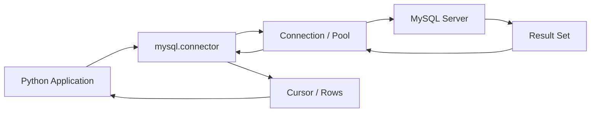

# How to Set Up MySQL with Python using mysql-connector-python

Author: [nawazdhandala](https://www.github.com/nawazdhandala)

Tags: MySQL, Python, mysql-connector-python, Database, Connection Pool

Description: Learn how to connect a Python application to MySQL using mysql-connector-python with prepared statements, connection pooling, and transaction handling.

---

## How mysql-connector-python Works

`mysql-connector-python` is the official MySQL connector for Python, maintained by Oracle. It implements the MySQL protocol in pure Python (no C dependencies required) and supports prepared statements, connection pooling, and both synchronous and asynchronous interfaces.



## Installation

```bash
pip install mysql-connector-python
```

## Basic Connection

```python
import mysql.connector

conn = mysql.connector.connect(
    host='localhost',
    port=3306,
    user='appuser',
    password='secret',
    database='myapp',
    time_zone='+00:00'   # Use UTC
)

cursor = conn.cursor(dictionary=True)
cursor.execute('SELECT 1 + 1 AS result')
row = cursor.fetchone()
print(row['result'])  # 2

cursor.close()
conn.close()
```

## Connection Pool

```python
from mysql.connector import pooling

pool = pooling.MySQLConnectionPool(
    pool_name='myapp_pool',
    pool_size=10,
    host='localhost',
    user='appuser',
    password='secret',
    database='myapp',
    time_zone='+00:00'
)

def get_connection():
    return pool.get_connection()
```

## Setup: Sample Table

```sql
CREATE TABLE products (
    id          INT AUTO_INCREMENT PRIMARY KEY,
    name        VARCHAR(100) NOT NULL,
    price       DECIMAL(10,2) NOT NULL,
    stock       INT NOT NULL DEFAULT 0,
    created_at  DATETIME NOT NULL DEFAULT NOW()
);
```

## CRUD Operations

```python
def create_product(name: str, price: float, stock: int) -> int:
    conn = get_connection()
    cursor = conn.cursor()
    try:
        cursor.execute(
            'INSERT INTO products (name, price, stock) VALUES (%s, %s, %s)',
            (name, price, stock)
        )
        conn.commit()
        return cursor.lastrowid
    finally:
        cursor.close()
        conn.close()


def get_product(product_id: int) -> dict | None:
    conn = get_connection()
    cursor = conn.cursor(dictionary=True)
    try:
        cursor.execute(
            'SELECT id, name, price, stock FROM products WHERE id = %s',
            (product_id,)
        )
        return cursor.fetchone()
    finally:
        cursor.close()
        conn.close()


def list_products(min_price: float = 0.0) -> list[dict]:
    conn = get_connection()
    cursor = conn.cursor(dictionary=True)
    try:
        cursor.execute(
            'SELECT id, name, price, stock FROM products WHERE price >= %s ORDER BY price',
            (min_price,)
        )
        return cursor.fetchall()
    finally:
        cursor.close()
        conn.close()


def update_stock(product_id: int, delta: int) -> int:
    conn = get_connection()
    cursor = conn.cursor()
    try:
        cursor.execute(
            'UPDATE products SET stock = stock + %s WHERE id = %s',
            (delta, product_id)
        )
        conn.commit()
        return cursor.rowcount
    finally:
        cursor.close()
        conn.close()
```

## Prepared Statements with Named Parameters

```python
def search_products(name_pattern: str, max_price: float) -> list[dict]:
    conn = get_connection()
    cursor = conn.cursor(dictionary=True, prepared=True)
    try:
        cursor.execute(
            'SELECT id, name, price FROM products WHERE name LIKE %s AND price <= %s',
            (f'%{name_pattern}%', max_price)
        )
        return cursor.fetchall()
    finally:
        cursor.close()
        conn.close()
```

## Transactions

```python
def purchase_product(product_id: int, quantity: int, user_id: int):
    conn = get_connection()
    try:
        conn.start_transaction()
        cursor = conn.cursor(dictionary=True)

        # Lock the row and check stock
        cursor.execute(
            'SELECT stock FROM products WHERE id = %s FOR UPDATE',
            (product_id,)
        )
        product = cursor.fetchone()
        if not product or product['stock'] < quantity:
            conn.rollback()
            raise ValueError('Insufficient stock')

        # Deduct stock
        cursor.execute(
            'UPDATE products SET stock = stock - %s WHERE id = %s',
            (quantity, product_id)
        )

        # Record order
        cursor.execute(
            'INSERT INTO orders (user_id, product_id, quantity) VALUES (%s, %s, %s)',
            (user_id, product_id, quantity)
        )

        conn.commit()
        return cursor.lastrowid
    except Exception:
        conn.rollback()
        raise
    finally:
        cursor.close()
        conn.close()
```

## Iterating Large Result Sets

For large tables, use `fetchmany` to avoid loading all rows into memory:

```python
def export_products(batch_size: int = 1000):
    conn = get_connection()
    cursor = conn.cursor(dictionary=True)
    try:
        cursor.execute('SELECT * FROM products ORDER BY id')
        while True:
            batch = cursor.fetchmany(batch_size)
            if not batch:
                break
            for row in batch:
                yield row
    finally:
        cursor.close()
        conn.close()
```

## Error Handling

```python
from mysql.connector import Error, errorcode

def safe_insert(name: str, price: float) -> int | None:
    conn = get_connection()
    cursor = conn.cursor()
    try:
        cursor.execute(
            'INSERT INTO products (name, price) VALUES (%s, %s)',
            (name, price)
        )
        conn.commit()
        return cursor.lastrowid
    except Error as err:
        if err.errno == errorcode.ER_DUP_ENTRY:
            print('Duplicate entry detected')
        else:
            print(f'MySQL Error {err.errno}: {err.msg}')
        conn.rollback()
        return None
    finally:
        cursor.close()
        conn.close()
```

## Best Practices

- Use `%s` placeholders (not f-strings or `%` formatting) for all query parameters to prevent SQL injection.
- Use `cursor(dictionary=True)` to get rows as dicts instead of tuples for cleaner code.
- Use a connection pool in production - never create a new connection per request.
- Always call `cursor.close()` and `conn.close()` (or `conn.close()` returns it to the pool) in a `finally` block.
- Set `time_zone='+00:00'` in the pool config to ensure consistent UTC handling.
- Use `buffered=True` on the cursor when calling stored procedures or when mixing reads and writes on the same connection.

## Summary

`mysql-connector-python` is the official MySQL driver for Python, supporting prepared statements, connection pooling, transactions, and dictionary-style cursor results. Use `%s` placeholders for all parameters, `pooling.MySQLConnectionPool` for production connection management, and `start_transaction()` / `commit()` / `rollback()` for atomic operations. Always close cursors and connections in `finally` blocks to prevent connection leaks.
