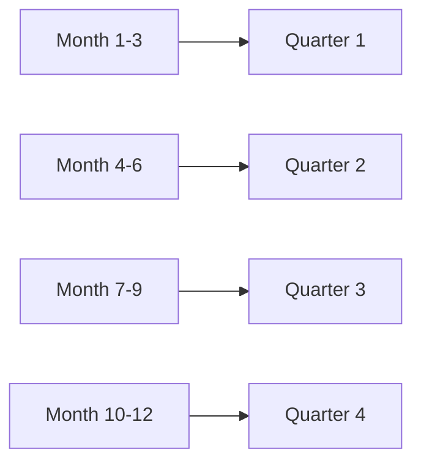

# How to Use QUARTER() Function in MySQL

Author: [nawazdhandala](https://www.github.com/nawazdhandala)

Tags: MySQL, SQL, Date Function, Database

Description: Learn how to use MySQL QUARTER() to return the fiscal quarter (1-4) of a date for quarterly reporting, grouping, and business analysis.

---

## What Is the QUARTER() Function?

`QUARTER()` returns the quarter of the year for a given date as an integer from 1 to 4.

**Syntax:**

```sql
QUARTER(date)
```

| Quarter | Months             |
|---------|--------------------|
| 1       | January, February, March |
| 2       | April, May, June   |
| 3       | July, August, September |
| 4       | October, November, December |

- Returns `NULL` if `date` is `NULL`.

---

## Basic Examples

```sql
SELECT QUARTER('2026-01-15');
-- Returns: 1

SELECT QUARTER('2026-04-01');
-- Returns: 2

SELECT QUARTER('2026-07-31');
-- Returns: 3

SELECT QUARTER('2026-12-31');
-- Returns: 4

SELECT QUARTER(NOW());
-- Returns: current quarter

SELECT QUARTER(NULL);
-- Returns: NULL
```

---

## How QUARTER() Maps Months



---

## Quarterly Revenue Report

```sql
CREATE TABLE sales (
    id INT AUTO_INCREMENT PRIMARY KEY,
    sale_date DATE,
    amount DECIMAL(10, 2)
);

INSERT INTO sales (sale_date, amount) VALUES
('2026-01-15', 1500.00),
('2026-02-20', 2300.00),
('2026-04-10', 1800.00),
('2026-07-05', 3200.00),
('2026-10-22', 2700.00),
('2026-11-30', 1900.00);

SELECT
    YEAR(sale_date)    AS year,
    QUARTER(sale_date) AS quarter,
    COUNT(*)           AS transactions,
    SUM(amount)        AS revenue
FROM sales
WHERE YEAR(sale_date) = 2026
GROUP BY YEAR(sale_date), QUARTER(sale_date)
ORDER BY year, quarter;
```

Result:

| year | quarter | transactions | revenue  |
|------|---------|--------------|----------|
| 2026 | 1       | 2            | 3800.00  |
| 2026 | 2       | 1            | 1800.00  |
| 2026 | 3       | 1            | 3200.00  |
| 2026 | 4       | 2            | 4600.00  |

---

## Filtering by Quarter

```sql
-- All Q2 sales
SELECT * FROM sales
WHERE QUARTER(sale_date) = 2
  AND YEAR(sale_date) = 2026;

-- Current quarter's data
SELECT * FROM sales
WHERE QUARTER(sale_date) = QUARTER(CURDATE())
  AND YEAR(sale_date) = YEAR(CURDATE());
```

---

## Adding Quarter Labels

```sql
SELECT
    sale_date,
    amount,
    CONCAT('Q', QUARTER(sale_date), ' ', YEAR(sale_date)) AS quarter_label
FROM sales
ORDER BY sale_date;
```

Result:

| sale_date  | amount  | quarter_label |
|------------|---------|---------------|
| 2026-01-15 | 1500.00 | Q1 2026       |
| 2026-04-10 | 1800.00 | Q2 2026       |
| 2026-07-05 | 3200.00 | Q3 2026       |

---

## Quarter-over-Quarter Comparison

```sql
-- Compare Q1 2026 vs Q1 2025
SELECT
    YEAR(sale_date)    AS year,
    QUARTER(sale_date) AS quarter,
    SUM(amount)        AS revenue
FROM sales
WHERE QUARTER(sale_date) = 1
  AND YEAR(sale_date) IN (2025, 2026)
GROUP BY YEAR(sale_date), QUARTER(sale_date)
ORDER BY year;
```

---

## Date Range Equivalent for QUARTER()

For index-friendly querying, convert quarter numbers to explicit date ranges:

```sql
-- Q2 2026 using explicit range (index-friendly)
SELECT * FROM sales
WHERE sale_date >= '2026-04-01'
  AND sale_date <  '2026-07-01';

-- Q2 using QUARTER() (not index-friendly on large tables)
SELECT * FROM sales
WHERE QUARTER(sale_date) = 2
  AND YEAR(sale_date) = 2026;
```

---

## QUARTER() with EXTRACT()

`EXTRACT(QUARTER FROM date)` is the SQL standard equivalent:

```sql
SELECT EXTRACT(QUARTER FROM '2026-07-15');
-- Returns: 3

-- These are equivalent
SELECT QUARTER('2026-07-15');
SELECT EXTRACT(QUARTER FROM '2026-07-15');
```

---

## Non-Calendar Fiscal Quarters

MySQL's `QUARTER()` always maps to calendar quarters (Q1 = Jan-Mar). For fiscal years that start in a different month (e.g., April for UK fiscal year), you need a custom expression:

```sql
-- UK fiscal year: Q1 starts April, Q4 ends March
SELECT
    sale_date,
    amount,
    CASE
        WHEN MONTH(sale_date) BETWEEN 4  AND 6  THEN 1
        WHEN MONTH(sale_date) BETWEEN 7  AND 9  THEN 2
        WHEN MONTH(sale_date) BETWEEN 10 AND 12 THEN 3
        WHEN MONTH(sale_date) BETWEEN 1  AND 3  THEN 4
    END AS fiscal_quarter
FROM sales;
```

---

## Summary

`QUARTER()` returns the calendar quarter (1-4) for a given date, making it a concise tool for quarterly grouping, filtering, and reporting. Use it in `GROUP BY` clauses for quarterly aggregation and in `WHERE` clauses to filter by quarter. For performance on large tables, replace `WHERE QUARTER(...) = n` with explicit date range conditions that allow index use. For non-calendar fiscal quarters, build custom `CASE` expressions based on the `MONTH()` value.
