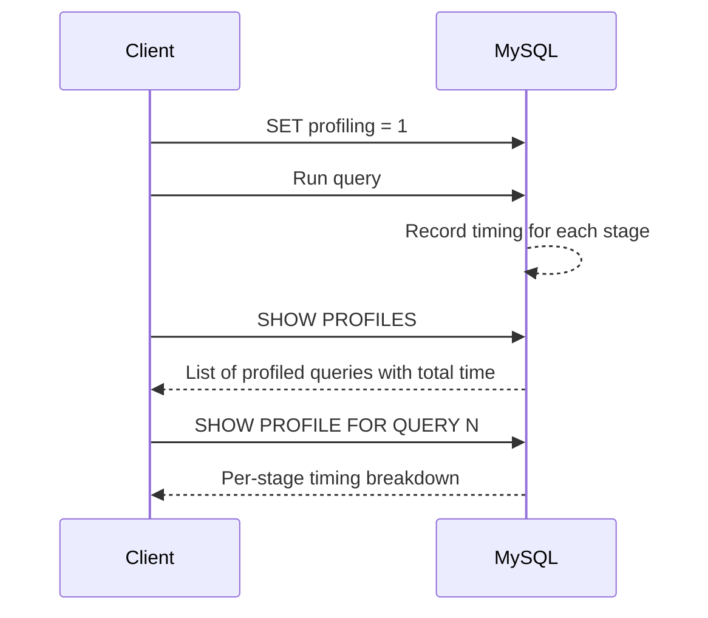

# How to Use MySQL Query Profiling with SET profiling=1

Author: [nawazdhandala](https://www.github.com/nawazdhandala)

Tags: MySQL, SQL, Query Profiling, Performance, Database

Description: Learn how to use MySQL query profiling with SET profiling=1 and SHOW PROFILE to measure time spent in each phase of query execution.

---

## How MySQL Query Profiling Works

MySQL's built-in profiling captures the time spent in each execution stage (parsing, optimizing, executing, sending results, etc.) for queries run in the current session. It is enabled with `SET profiling = 1` and queried with `SHOW PROFILES` and `SHOW PROFILE`.

Note: `SHOW PROFILE` is deprecated as of MySQL 5.6.7 in favor of the Performance Schema. However, it remains functional and is useful for quick ad-hoc profiling. The Performance Schema approach is covered at the end.



## Syntax

```sql
-- Enable profiling for the current session
SET profiling = 1;

-- Run your query
SELECT ...;

-- List all profiled queries with their total duration
SHOW PROFILES;

-- Show stage-by-stage breakdown for query N
SHOW PROFILE FOR QUERY N;

-- Show CPU and I/O details
SHOW PROFILE CPU, BLOCK IO FOR QUERY N;

-- Disable profiling
SET profiling = 0;
```

## Examples

### Setup: Create Sample Tables

```sql
CREATE TABLE products (
    id INT PRIMARY KEY AUTO_INCREMENT,
    name VARCHAR(100) NOT NULL,
    category VARCHAR(50),
    price DECIMAL(10, 2),
    description TEXT
);

CREATE TABLE sales (
    id INT PRIMARY KEY AUTO_INCREMENT,
    product_id INT NOT NULL,
    quantity INT,
    total DECIMAL(10, 2),
    sale_date DATE
);

-- Generate sample data
INSERT INTO products (name, category, price, description)
SELECT
    CONCAT('Product ', n),
    ELT(1 + (n MOD 3), 'Electronics', 'Furniture', 'Clothing'),
    ROUND(10 + RAND() * 500, 2),
    REPEAT('Sample description text. ', 10)
FROM (
    SELECT a.n + b.n * 10 + 1 AS n
    FROM (SELECT 0 n UNION SELECT 1 UNION SELECT 2 UNION SELECT 3 UNION SELECT 4
          UNION SELECT 5 UNION SELECT 6 UNION SELECT 7 UNION SELECT 8 UNION SELECT 9) a
    CROSS JOIN (SELECT 0 n UNION SELECT 1 UNION SELECT 2 UNION SELECT 3 UNION SELECT 4
               UNION SELECT 5 UNION SELECT 6 UNION SELECT 7 UNION SELECT 8 UNION SELECT 9) b
) nums;

INSERT INTO sales (product_id, quantity, total, sale_date)
SELECT
    1 + (n MOD 100),
    1 + (n MOD 5),
    ROUND(RAND() * 1000, 2),
    DATE_SUB(CURDATE(), INTERVAL (n MOD 365) DAY)
FROM (
    SELECT a.n + b.n * 10 + c.n * 100 + 1 AS n
    FROM (SELECT 0 n UNION SELECT 1 UNION SELECT 2 UNION SELECT 3 UNION SELECT 4
          UNION SELECT 5 UNION SELECT 6 UNION SELECT 7 UNION SELECT 8 UNION SELECT 9) a
    CROSS JOIN (SELECT 0 n UNION SELECT 1 UNION SELECT 2 UNION SELECT 3 UNION SELECT 4
               UNION SELECT 5 UNION SELECT 6 UNION SELECT 7 UNION SELECT 8 UNION SELECT 9) b
    CROSS JOIN (SELECT 0 n UNION SELECT 1 UNION SELECT 2 UNION SELECT 3) c
) nums
WHERE n <= 500;
```

### Enable Profiling and Run Queries

```sql
SET profiling = 1;

-- Query 1: Full table scan
SELECT name, price FROM products WHERE category = 'Electronics';

-- Query 2: Join with aggregation
SELECT p.category, SUM(s.total) AS total_revenue
FROM products p
INNER JOIN sales s ON p.id = s.product_id
GROUP BY p.category;

-- Query 3: With sorting
SELECT * FROM products ORDER BY price DESC LIMIT 10;
```

### View All Profiled Queries

```sql
SHOW PROFILES;
```

```text
+----------+------------+------------------------------------------------------------------+
| Query_ID | Duration   | Query                                                            |
+----------+------------+------------------------------------------------------------------+
| 1        | 0.00231900 | SELECT name, price FROM products WHERE category = 'Electronics'  |
| 2        | 0.00489200 | SELECT p.category, SUM(s.total) AS total_revenue...              |
| 3        | 0.00175400 | SELECT * FROM products ORDER BY price DESC LIMIT 10              |
+----------+------------+------------------------------------------------------------------+
```

### View Stage Breakdown for a Specific Query

```sql
SHOW PROFILE FOR QUERY 2;
```

```text
+----------------------+----------+
| Status               | Duration |
+----------------------+----------+
| starting             | 0.000065 |
| checking permissions | 0.000008 |
| Opening tables       | 0.000025 |
| init                 | 0.000012 |
| System lock          | 0.000008 |
| optimizing           | 0.000035 |
| statistics           | 0.000045 |
| preparing            | 0.000020 |
| executing            | 0.000005 |
| Sending data         | 0.004500 |
| end                  | 0.000008 |
| query end            | 0.000010 |
| closing tables       | 0.000008 |
| freeing items        | 0.000015 |
| cleaning up          | 0.000010 |
+----------------------+----------+
```

The `Sending data` stage is often the largest - it covers scanning, filtering, and sending result rows.

### View CPU and Block I/O Profile

```sql
SHOW PROFILE CPU, BLOCK IO FOR QUERY 2;
```

```text
+----------------------+----------+----------+------------+--------------+---------------+
| Status               | Duration | CPU_user | CPU_system | Block_ops_in | Block_ops_out |
+----------------------+----------+----------+------------+--------------+---------------+
| starting             | 0.000065 | 0.000050 | 0.000000   | 0            | 0             |
| Sending data         | 0.004500 | 0.004200 | 0.000100   | 24           | 0             |
| ...                  | ...      | ...      | ...        | ...          | ...           |
+----------------------+----------+----------+------------+--------------+---------------+
```

High `Block_ops_in` during "Sending data" indicates disk I/O from reading table rows - a sign that indexes or the buffer pool need tuning.

### Using Performance Schema Instead (Modern Approach)

For MySQL 5.7+ in production, use Performance Schema for non-deprecated profiling:

```sql
-- Check if Performance Schema is enabled
SHOW VARIABLES LIKE 'performance_schema';

-- Enable statement instrumentation
UPDATE performance_schema.setup_instruments
SET ENABLED = 'YES', TIMED = 'YES'
WHERE NAME LIKE '%statement%';

UPDATE performance_schema.setup_consumers
SET ENABLED = 'YES'
WHERE NAME LIKE '%events_statements%';

-- Run your query, then inspect:
SELECT EVENT_ID, SQL_TEXT, TIMER_WAIT/1000000000 AS duration_ms,
       ROWS_EXAMINED, NO_INDEX_USED
FROM performance_schema.events_statements_history_long
ORDER BY TIMER_WAIT DESC
LIMIT 10;
```

## Best Practices

- Use `SET profiling = 1` for quick session-level profiling during development.
- Keep `profiling_history_size` (default 15) in mind - only the last N queries are retained.
- Prefer Performance Schema for production monitoring as `SHOW PROFILE` is deprecated.
- Pay close attention to `Sending data` duration - if it dominates, optimize with better indexes or reduce returned rows.
- Reset profiles with `SET profiling = 0; SET profiling = 1;` to clear old results.

## Summary

MySQL query profiling with `SET profiling = 1` captures per-stage execution timing for queries in the current session. `SHOW PROFILES` lists all profiled queries with their total duration, and `SHOW PROFILE FOR QUERY N` breaks down time by stage. The most important stage is usually `Sending data`, which covers actual data retrieval. For production systems, the Performance Schema provides a non-deprecated, more detailed alternative for query profiling.
