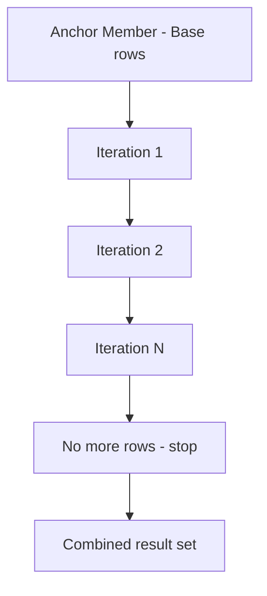

# How to Use Recursive CTEs in MySQL 8.0

Author: [nawazdhandala](https://www.github.com/nawazdhandala)

Tags: MySQL, SQL, CTE, Recursive CTE, MySQL 8.0, Hierarchy, Database

Description: Learn how to use recursive CTEs in MySQL 8.0 to traverse hierarchical data like org charts, category trees, and bill of materials.

---

## How Recursive CTEs Work

A recursive CTE is a CTE that references itself. It consists of two parts connected by UNION ALL: an anchor member (the base case) and a recursive member (which references the CTE itself). MySQL executes the anchor once, then repeatedly runs the recursive member using the previous iteration's output, until no more rows are produced.



Recursive CTEs require MySQL 8.0+.

## Syntax

```sql
WITH RECURSIVE cte_name AS (
    -- Anchor member (base case)
    SELECT columns FROM table WHERE condition

    UNION ALL

    -- Recursive member (references cte_name)
    SELECT columns FROM table
    INNER JOIN cte_name ON table.parent_id = cte_name.id
)
SELECT * FROM cte_name;
```

## Examples

### Setup: Organizational Hierarchy

```sql
CREATE TABLE employees (
    id INT PRIMARY KEY AUTO_INCREMENT,
    name VARCHAR(100) NOT NULL,
    manager_id INT,
    title VARCHAR(100)
);

INSERT INTO employees (name, manager_id, title) VALUES
    ('Sarah',  NULL, 'CEO'),
    ('Alice',  1,    'VP Engineering'),
    ('Bob',    1,    'VP Marketing'),
    ('Carol',  2,    'Senior Engineer'),
    ('Dave',   2,    'Senior Engineer'),
    ('Eve',    3,    'Marketing Manager'),
    ('Frank',  4,    'Junior Engineer'),
    ('Grace',  4,    'Junior Engineer');
```

### Traverse the Entire Hierarchy

Start at the CEO and recursively find all reports.

```sql
WITH RECURSIVE org_chart AS (
    -- Anchor: start from the top
    SELECT id, name, manager_id, title, 0 AS depth,
           CAST(name AS CHAR(500)) AS path
    FROM employees
    WHERE manager_id IS NULL

    UNION ALL

    -- Recursive: find direct reports of current level
    SELECT e.id, e.name, e.manager_id, e.title,
           oc.depth + 1,
           CONCAT(oc.path, ' -> ', e.name)
    FROM employees e
    INNER JOIN org_chart oc ON e.manager_id = oc.id
)
SELECT depth,
       CONCAT(REPEAT('  ', depth), name) AS indented_name,
       title,
       path
FROM org_chart
ORDER BY path;
```

```text
+-------+--------------------+-------------------+---------------------------------------------+
| depth | indented_name      | title             | path                                        |
+-------+--------------------+-------------------+---------------------------------------------+
| 0     | Sarah              | CEO               | Sarah                                       |
| 1     |   Alice            | VP Engineering    | Sarah -> Alice                              |
| 1     |   Bob              | VP Marketing      | Sarah -> Bob                                |
| 2     |     Carol          | Senior Engineer   | Sarah -> Alice -> Carol                     |
| 2     |     Dave           | Senior Engineer   | Sarah -> Alice -> Dave                      |
| 2     |     Eve            | Marketing Manager | Sarah -> Bob -> Eve                         |
| 3     |       Frank        | Junior Engineer   | Sarah -> Alice -> Carol -> Frank            |
| 3     |       Grace        | Junior Engineer   | Sarah -> Alice -> Carol -> Grace            |
+-------+--------------------+-------------------+---------------------------------------------+
```

### Find All Reports Under a Specific Manager

Start the anchor at a specific node to traverse only that subtree.

```sql
WITH RECURSIVE subtree AS (
    -- Anchor: start from Alice (id = 2)
    SELECT id, name, title, 0 AS depth
    FROM employees
    WHERE id = 2

    UNION ALL

    SELECT e.id, e.name, e.title, s.depth + 1
    FROM employees e
    INNER JOIN subtree s ON e.manager_id = s.id
)
SELECT depth, CONCAT(REPEAT('  ', depth), name) AS name, title
FROM subtree
ORDER BY depth, name;
```

```text
+-------+------------------+-----------------+
| depth | name             | title           |
+-------+------------------+-----------------+
| 0     | Alice            | VP Engineering  |
| 1     |   Carol          | Senior Engineer |
| 1     |   Dave           | Senior Engineer |
| 2     |     Frank        | Junior Engineer |
| 2     |     Grace        | Junior Engineer |
+-------+------------------+-----------------+
```

### Generate a Number Series

Recursive CTEs can generate sequences without a stored procedure.

```sql
WITH RECURSIVE numbers AS (
    SELECT 1 AS n
    UNION ALL
    SELECT n + 1 FROM numbers WHERE n < 10
)
SELECT n FROM numbers;
```

```text
+----+
| n  |
+----+
| 1  |
| 2  |
| 3  |
| ...
| 10 |
+----+
```

### Generate a Calendar (Date Series)

```sql
WITH RECURSIVE calendar AS (
    SELECT CAST('2026-01-01' AS DATE) AS cal_date
    UNION ALL
    SELECT DATE_ADD(cal_date, INTERVAL 1 DAY)
    FROM calendar
    WHERE cal_date < '2026-01-31'
)
SELECT cal_date, DAYNAME(cal_date) AS day_name
FROM calendar;
```

### Controlling Recursion Depth

MySQL limits recursion depth with the `cte_max_recursion_depth` system variable (default 1000). Override it per session if needed.

```sql
SET SESSION cte_max_recursion_depth = 5000;

WITH RECURSIVE deep_tree AS (
    SELECT 1 AS level
    UNION ALL
    SELECT level + 1 FROM deep_tree WHERE level < 2000
)
SELECT COUNT(*) FROM deep_tree;
```

## Best Practices

- Always include a termination condition in the recursive member's WHERE clause to prevent infinite loops.
- Track depth in the recursive query and add `WHERE depth < max_depth` as a safety guard.
- Use `CAST` or `CHAR(N)` to initialize path strings with sufficient length for concatenation.
- For very deep trees, increase `cte_max_recursion_depth` at the session level rather than globally.
- Consider adding a `cycle_path` column when data may contain cycles to detect and break them.

## Summary

Recursive CTEs in MySQL 8.0 enable elegant traversal of hierarchical data such as org charts, category trees, and file systems. The pattern uses an anchor member for the starting rows and a recursive member that builds upon the previous iteration. Recursive CTEs are also useful for generating sequences and date ranges. Always include a termination condition and be aware of the `cte_max_recursion_depth` limit when working with deep hierarchies.
