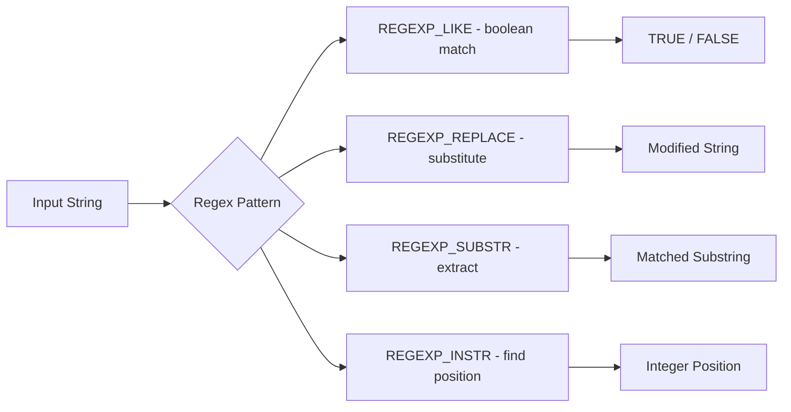

# How to Use MySQL Regular Expression Functions (REGEXP_REPLACE, REGEXP_LIKE)

Author: [nawazdhandala](https://www.github.com/nawazdhandala)

Tags: MySQL, SQL, Regular Expression, String Function, Database

Description: Learn how to use MySQL regular expression functions REGEXP_REPLACE and REGEXP_LIKE to search, validate, and transform string data using patterns.

---

## How MySQL Regular Expression Functions Work

MySQL 8.0 introduced the `REGEXP_REPLACE`, `REGEXP_LIKE`, `REGEXP_INSTR`, and `REGEXP_SUBSTR` functions, which use the International Components for Unicode (ICU) regular expression engine. These functions provide full POSIX-compatible regex support including look-ahead, look-behind, and Unicode character classes.

The older `REGEXP` and `RLIKE` operators also work for simple pattern matching but do not support capture groups or replacement.



## Setup: Sample Table

```sql
CREATE TABLE contacts (
    id       INT AUTO_INCREMENT PRIMARY KEY,
    name     VARCHAR(100),
    email    VARCHAR(150),
    phone    VARCHAR(30),
    notes    TEXT
);

INSERT INTO contacts (name, email, phone, notes) VALUES
('Alice Johnson',  'alice@example.com',        '+1-212-555-0100', 'VIP customer. Order #12345.'),
('Bob Smith',      'bob.smith@company.org',    '(312) 555-0199',  'Prefers email contact.'),
('Charlie Brown',  'CHARLIE@Example.COM',      '212.555.0177',    'Called on 2026-01-15.'),
('Diana Prince',  'not-a-valid-email',         '555-CALL-NOW',    'Callback needed.'),
('Eve Adams',      'eve@subdomain.example.net','1.800.555.0123',  'Contact re: invoice INV-9876.');
```

## REGEXP_LIKE

`REGEXP_LIKE` returns 1 (true) when the string matches the pattern, 0 otherwise. The optional `match_type` argument controls flags such as case sensitivity.

**Syntax:**

```sql
REGEXP_LIKE(expr, pattern [, match_type])
```

Match type flags:

```text
c - case-sensitive (default)
i - case-insensitive
m - multi-line mode (^ and $ match line boundaries)
n - . also matches newline
```

**Example - validate email format:**

```sql
SELECT
    name,
    email,
    REGEXP_LIKE(email, '^[A-Za-z0-9._%+-]+@[A-Za-z0-9.-]+\\.[A-Za-z]{2,}$') AS valid_email
FROM contacts;
```

```text
+---------------+------------------------------+-------------+
| name          | email                        | valid_email |
+---------------+------------------------------+-------------+
| Alice Johnson | alice@example.com            | 1           |
| Bob Smith     | bob.smith@company.org        | 1           |
| Charlie Brown | CHARLIE@Example.COM          | 1           |
| Diana Prince  | not-a-valid-email            | 0           |
| Eve Adams     | eve@subdomain.example.net    | 1           |
+---------------+------------------------------+-------------+
```

**Example - filter rows with case-insensitive match:**

```sql
SELECT name, email FROM contacts
WHERE REGEXP_LIKE(email, '@example\\.com$', 'i');
```

**Using the REGEXP operator (shorthand):**

```sql
SELECT name FROM contacts
WHERE email REGEXP '^[A-Za-z0-9._%+-]+@[A-Za-z0-9.-]+\\.[A-Za-z]{2,}$';
```

## REGEXP_REPLACE

`REGEXP_REPLACE` replaces occurrences of a pattern within a string. By default it replaces all occurrences; you can control the starting position and occurrence index.

**Syntax:**

```sql
REGEXP_REPLACE(expr, pattern, repl [, pos [, occurrence [, match_type]]])
```

**Example - normalize phone numbers (remove non-digits):**

```sql
SELECT
    name,
    phone,
    REGEXP_REPLACE(phone, '[^0-9]', '') AS digits_only
FROM contacts;
```

```text
+---------------+-----------------+-------------+
| name          | phone           | digits_only |
+---------------+-----------------+-------------+
| Alice Johnson | +1-212-555-0100 | 12125550100 |
| Bob Smith     | (312) 555-0199  | 3125550199  |
| Charlie Brown | 212.555.0177    | 2125550177  |
| Diana Prince  | 555-CALL-NOW    | 555         |
| Eve Adams     | 1.800.555.0123  | 18005550123 |
+---------------+-----------------+-------------+
```

**Example - redact order numbers in notes:**

```sql
SELECT
    name,
    REGEXP_REPLACE(notes, '#[0-9]+', '#XXXXX') AS redacted_notes
FROM contacts;
```

**Example - collapse multiple spaces:**

```sql
SELECT REGEXP_REPLACE('Hello   World   MySQL', ' {2,}', ' ');
-- Result: Hello World MySQL
```

## REGEXP_SUBSTR

`REGEXP_SUBSTR` extracts the first (or nth) substring that matches the pattern.

**Syntax:**

```sql
REGEXP_SUBSTR(expr, pattern [, pos [, occurrence [, match_type]]])
```

**Example - extract invoice numbers from notes:**

```sql
SELECT
    name,
    REGEXP_SUBSTR(notes, 'INV-[0-9]+') AS invoice_number
FROM contacts;
```

```text
+---------------+----------------+
| name          | invoice_number |
+---------------+----------------+
| Alice Johnson | NULL           |
| Bob Smith     | NULL           |
| Charlie Brown | NULL           |
| Diana Prince  | NULL           |
| Eve Adams     | INV-9876       |
+---------------+----------------+
```

## REGEXP_INSTR

`REGEXP_INSTR` returns the starting position of the pattern match (1-based), or 0 if not found.

```sql
SELECT
    name,
    notes,
    REGEXP_INSTR(notes, '[0-9]{4}-[0-9]{2}-[0-9]{2}') AS date_position
FROM contacts;
```

## Best Practices

- Use double backslashes (`\\`) in MySQL string literals to represent a single regex backslash.
- Keep regex patterns simple for high-frequency WHERE clause filters - complex patterns prevent index use.
- Use generated columns with `REGEXP_LIKE` conditions to pre-compute frequently filtered boolean results.
- Prefer `REGEXP_LIKE` for filter conditions and `REGEXP_REPLACE` for UPDATE statements to clean dirty data at rest.
- Test patterns in isolation with `SELECT REGEXP_LIKE('test string', 'pattern')` before applying to production tables.

## Summary

MySQL 8.0 regular expression functions bring full ICU-powered pattern matching to SQL. `REGEXP_LIKE` filters rows by pattern, supporting case-insensitive and multi-line modes. `REGEXP_REPLACE` substitutes matched substrings making it ideal for data cleaning. `REGEXP_SUBSTR` extracts matching portions of strings, and `REGEXP_INSTR` pinpoints match positions. Together these functions replace a significant amount of application-side string processing when working with messy or variable-format text data.
