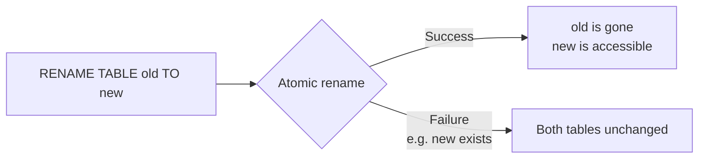

# How to Rename a Table in MySQL with RENAME TABLE

Author: [nawazdhandala](https://www.github.com/nawazdhandala)

Tags: MySQL, SQL, DDL, RENAME TABLE, Schema, Migration

Description: Rename one or more MySQL tables atomically with RENAME TABLE, move tables between databases, and understand how foreign keys and views are affected.

---

## How It Works

`RENAME TABLE` is an atomic operation - either all renames succeed or none do. It is implemented as a metadata-only operation in InnoDB and is therefore nearly instantaneous regardless of table size.



## Syntax

```sql
RENAME TABLE old_table_name TO new_table_name
    [, old_table2 TO new_table2, ...];
```

## Basic Example

```sql
-- Before rename
SHOW TABLES LIKE 'usr%';
```

```text
+---------------------+
| Tables_in_myapp (usr%) |
+---------------------+
| usr                  |
+---------------------+
```

```sql
RENAME TABLE usr TO users;

SHOW TABLES LIKE 'user%';
```

```text
+------------------------+
| Tables_in_myapp (user%)|
+------------------------+
| users                  |
+------------------------+
```

Data and all indexes are preserved.

## Renaming Multiple Tables in One Statement

Because `RENAME TABLE` is atomic across all listed renames, you can swap two tables safely.

```sql
-- Atomic swap: make new_users the live table
RENAME TABLE
    users     TO users_old,
    users_new TO users;
```

This is a common pattern for zero-downtime schema changes where you pre-populate a new table and swap it in atomically.

## Moving a Table Between Databases

`RENAME TABLE` can move a table to a different database on the same MySQL instance by qualifying the table name.

```sql
RENAME TABLE old_db.my_table TO new_db.my_table;
```

After the rename, the table exists only in `new_db`. This is equivalent to moving the underlying InnoDB tablespace file.

## Using ALTER TABLE RENAME

`ALTER TABLE` also supports renaming a table.

```sql
ALTER TABLE old_table_name RENAME TO new_table_name;
```

This is less flexible than `RENAME TABLE` (only one table at a time) but can be combined with other `ALTER TABLE` operations in a single statement.

```sql
ALTER TABLE old_table
    RENAME TO new_table,
    ADD COLUMN created_at DATETIME NOT NULL DEFAULT CURRENT_TIMESTAMP;
```

## Effect on Foreign Keys

When you rename a table, foreign key constraints that reference it are automatically updated to reference the new name.

```sql
CREATE TABLE departments (
    id   INT UNSIGNED PRIMARY KEY,
    name VARCHAR(100) NOT NULL
);

CREATE TABLE employees (
    id         INT UNSIGNED AUTO_INCREMENT PRIMARY KEY,
    dept_id    INT UNSIGNED NOT NULL,
    name       VARCHAR(100) NOT NULL,
    CONSTRAINT fk_emp_dept FOREIGN KEY (dept_id) REFERENCES departments (id)
);

RENAME TABLE departments TO depts;

-- The FK now correctly references 'depts'
SHOW CREATE TABLE employees\G
```

```text
CONSTRAINT `fk_emp_dept` FOREIGN KEY (`dept_id`) REFERENCES `depts` (`id`)
```

## Effect on Views

Views that reference the old table name are NOT automatically updated. After renaming a table, you must recreate any views that reference it.

```sql
CREATE VIEW active_users AS
    SELECT id, username FROM users WHERE is_active = 1;

RENAME TABLE users TO app_users;

-- View now points to a non-existent table
SELECT * FROM active_users;
```

```text
ERROR 1356 (HY000): View 'myapp.active_users' references invalid table(s) or column(s)
or function(s) or definer/invoker of view lack rights to use them
```

Fix by recreating the view:

```sql
CREATE OR REPLACE VIEW active_users AS
    SELECT id, username FROM app_users WHERE is_active = 1;
```

## Checking for Views Before Renaming

```sql
SELECT TABLE_NAME AS view_name, VIEW_DEFINITION
FROM information_schema.VIEWS
WHERE TABLE_SCHEMA = DATABASE()
  AND VIEW_DEFINITION LIKE '%users%';
```

## Checking for Stored Procedures and Triggers

```sql
-- Stored procedures and functions
SELECT ROUTINE_NAME, ROUTINE_TYPE
FROM information_schema.ROUTINES
WHERE ROUTINE_SCHEMA = DATABASE()
  AND ROUTINE_DEFINITION LIKE '%users%';

-- Triggers
SELECT TRIGGER_NAME, EVENT_OBJECT_TABLE
FROM information_schema.TRIGGERS
WHERE TRIGGER_SCHEMA = DATABASE()
  AND (EVENT_OBJECT_TABLE = 'users'
    OR ACTION_STATEMENT LIKE '%users%');
```

## Best Practices

- Use `RENAME TABLE` rather than `ALTER TABLE RENAME` when renaming multiple tables atomically.
- Audit views, stored procedures, and triggers for references to the old table name before renaming.
- Update application ORM models and queries in the same deployment as the rename.
- Use the multi-rename form for zero-downtime swap patterns: populate a shadow table, then atomically swap it with the live table.
- When moving a table between databases, ensure the target database exists and the user has CREATE privileges in it.

## Summary

`RENAME TABLE` renames one or more tables atomically in a metadata-only operation that is instantaneous for InnoDB tables. It can also move tables between databases on the same instance. Foreign key constraints automatically update to reference the new name, but views referencing the old name break and must be recreated manually. Always audit views, triggers, and stored procedures before renaming a table.
