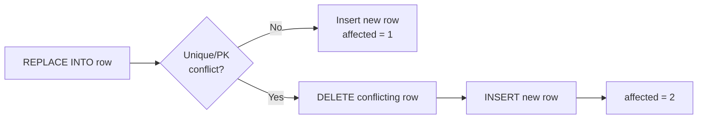

# How to Use REPLACE INTO in MySQL

Author: [nawazdhandala](https://www.github.com/nawazdhandala)

Tags: MySQL, SQL, DML, REPLACE, INSERT, Upsert

Description: Use MySQL REPLACE INTO to delete an existing row and insert a new one when a primary or unique key conflict occurs, and understand when to prefer it over ON DUPLICATE KEY UPDATE.

---

## How It Works

`REPLACE INTO` is a variant of `INSERT`. If the new row would cause a duplicate primary key or unique key violation, MySQL deletes the conflicting existing row and inserts the new row. If there is no conflict, it works exactly like `INSERT`.



Because the old row is deleted before the new row is inserted, `REPLACE INTO` always assigns a new `AUTO_INCREMENT` id to the row. `ON DELETE CASCADE` foreign keys are triggered by the delete.

## Syntax

```sql
REPLACE INTO table_name (col1, col2, ...)
VALUES (val1, val2, ...);

-- Or SET form
REPLACE INTO table_name
SET col1 = val1,
    col2 = val2;
```

## Basic Example

```sql
CREATE TABLE settings (
    setting_key   VARCHAR(100)  NOT NULL PRIMARY KEY,
    setting_value VARCHAR(1000) NOT NULL,
    updated_at    DATETIME      NOT NULL DEFAULT CURRENT_TIMESTAMP ON UPDATE CURRENT_TIMESTAMP
);

-- Insert initial settings
INSERT INTO settings (setting_key, setting_value) VALUES
    ('site_name',  'My App'),
    ('max_upload', '10');

SELECT * FROM settings;
```

```text
+--------------+---------------+---------------------+
| setting_key  | setting_value | updated_at          |
+--------------+---------------+---------------------+
| max_upload   | 10            | 2024-06-01 10:00:00 |
| site_name    | My App        | 2024-06-01 10:00:00 |
+--------------+---------------+---------------------+
```

```sql
-- Replace an existing setting
REPLACE INTO settings (setting_key, setting_value)
VALUES ('site_name', 'My Awesome App');

SELECT * FROM settings;
```

```text
+--------------+----------------+---------------------+
| setting_key  | setting_value  | updated_at          |
+--------------+----------------+---------------------+
| max_upload   | 10             | 2024-06-01 10:00:00 |
| site_name    | My Awesome App | 2024-06-01 10:01:00 |
+--------------+----------------+---------------------+
```

The row was deleted and re-inserted with the new value.

## Affected Rows Behaviour

`REPLACE INTO` reports `2 rows affected` when it replaces an existing row (1 delete + 1 insert) and `1 row affected` for a fresh insert.

```sql
REPLACE INTO settings (setting_key, setting_value) VALUES ('site_name', 'New Name');
SELECT ROW_COUNT();
```

```text
+-------------+
| ROW_COUNT() |
+-------------+
|           2 |
+-------------+
```

## AUTO_INCREMENT and REPLACE INTO

Because `REPLACE INTO` deletes the old row and inserts a new one, the new row gets a new `AUTO_INCREMENT` id.

```sql
CREATE TABLE counters (
    id    INT UNSIGNED AUTO_INCREMENT PRIMARY KEY,
    name  VARCHAR(50) NOT NULL UNIQUE,
    value INT UNSIGNED NOT NULL DEFAULT 0
);

INSERT INTO counters (name, value) VALUES ('hits', 100);

SELECT id, name, value FROM counters;
```

```text
+----+------+-------+
| id | name | value |
+----+------+-------+
|  1 | hits |   100 |
+----+------+-------+
```

```sql
REPLACE INTO counters (name, value) VALUES ('hits', 200);

SELECT id, name, value FROM counters;
```

```text
+----+------+-------+
| id | name | value |
+----+------+-------+
|  2 | hits |   200 |
+----+------+-------+
```

The original `id = 1` is gone. A new row with `id = 2` was created. This is a key difference from `ON DUPLICATE KEY UPDATE`, which would keep `id = 1`.

## REPLACE INTO with SET Syntax

```sql
REPLACE INTO settings
SET setting_key   = 'max_upload',
    setting_value = '25';
```

## REPLACE INTO and Foreign Keys

If another table has a foreign key referencing the row being replaced, and the FK has `ON DELETE CASCADE` or `ON DELETE SET NULL`, those actions fire when `REPLACE INTO` deletes the old row.

```sql
CREATE TABLE user_profiles (
    user_id   INT UNSIGNED PRIMARY KEY,
    bio       TEXT,
    CONSTRAINT fk_profile_user FOREIGN KEY (user_id) REFERENCES users (id) ON DELETE CASCADE
);

-- Replacing a user row will cascade-delete the profile first, then insert the new user row
REPLACE INTO users (id, username, email) VALUES (1, 'alice_new', 'alice_new@example.com');
-- user_profiles row for user_id=1 is deleted by the cascade!
```

This is often unexpected. Prefer `ON DUPLICATE KEY UPDATE` when child rows must be preserved.

## REPLACE INTO vs ON DUPLICATE KEY UPDATE

| Aspect | REPLACE INTO | ON DUPLICATE KEY UPDATE |
|---|---|---|
| Mechanism | DELETE old + INSERT new | UPDATE old row in-place |
| AUTO_INCREMENT | New ID assigned | Original ID kept |
| ON DELETE triggers / cascades | Fired | Not fired |
| Partial column update | No (must supply all columns) | Yes (only listed columns) |
| Best for | Full row replacement | Upsert with preserved ID |

## Multi-Row REPLACE INTO

```sql
REPLACE INTO settings (setting_key, setting_value) VALUES
    ('site_name',  'Awesome App'),
    ('max_upload', '50'),
    ('debug_mode', 'false');
```

## Best Practices

- Prefer `ON DUPLICATE KEY UPDATE` in most upsert scenarios to avoid losing the original AUTO_INCREMENT id and unintended cascade deletes.
- Use `REPLACE INTO` when you intentionally want a complete row replacement and the id loss is acceptable (e.g., a key-value settings table with a natural primary key).
- Always supply all required column values in `REPLACE INTO` because the old row is completely deleted - any column you omit gets its default value, not the old value.
- Be careful with tables that have child rows linked via `ON DELETE CASCADE` foreign keys.

## Summary

`REPLACE INTO` provides upsert semantics by deleting the conflicting row and inserting the new one. It always produces a row with a new AUTO_INCREMENT id and fires `ON DELETE` cascade rules on child tables. Because of these side effects, `ON DUPLICATE KEY UPDATE` is the safer choice for most upsert scenarios. Use `REPLACE INTO` when you want true full-row replacement on tables with natural primary keys and no child row dependencies.
