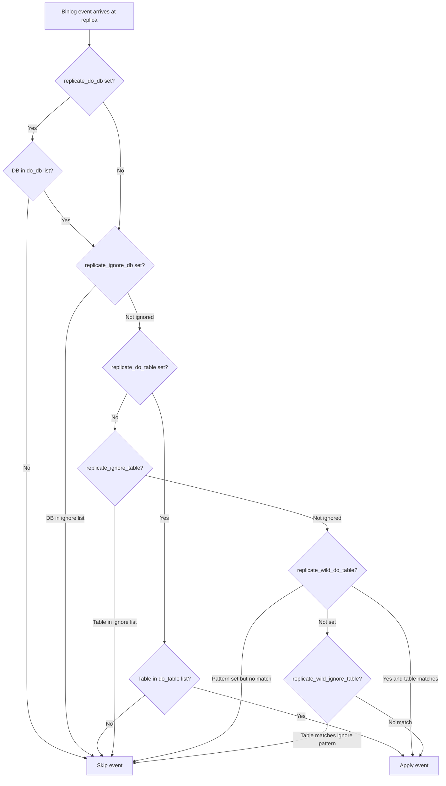

# How to Configure MySQL Replication Filters

Author: [nawazdhandala](https://www.github.com/nawazdhandala)

Tags: MySQL, Replication, Filter, Administration, Configuration

Description: Learn how to configure MySQL replication filters to selectively replicate specific databases or tables using my.cnf options and runtime CHANGE REPLICATION FILTER.

---

## Introduction

Replication filters let you control which events from the source binary log the replica applies. They are useful for:

- Replicating only a subset of databases to a dedicated replica
- Excluding audit or logging tables from replication
- Directing events to specific replicas in a sharded topology
- Reducing replica I/O and storage by ignoring unused schemas

Filters can be applied at two levels:
1. **Source-side (binlog filters):** the source does not write matching events to the binary log at all.
2. **Replica-side (replication filters):** the source writes all events; the replica selectively ignores them.

Replica-side filters are more common and more flexible.

## Filter types reference

| Filter variable | Scope | Action |
|---|---|---|
| `replicate_do_db` | Database | Apply only listed databases |
| `replicate_ignore_db` | Database | Skip listed databases |
| `replicate_do_table` | Table | Apply only listed tables (db.table) |
| `replicate_ignore_table` | Table | Skip listed tables (db.table) |
| `replicate_wild_do_table` | Table (glob) | Apply tables matching pattern |
| `replicate_wild_ignore_table` | Table (glob) | Skip tables matching pattern |

## Method 1 - Set filters in my.cnf (static)

```ini
# /etc/mysql/mysql.conf.d/mysqld.cnf (replica)

[mysqld]
# Only replicate these databases
replicate-do-db = myapp_production
replicate-do-db = billing

# Ignore the logging database
replicate-ignore-db = app_logs

# Ignore specific tables (format: db.table)
replicate-ignore-table = myapp_production.sessions
replicate-ignore-table = myapp_production.cache_entries

# Wildcard: ignore all tables matching a pattern
replicate-wild-ignore-table = myapp_production.tmp_%
replicate-wild-ignore-table = %_logs.%
```

Restart MySQL for static changes to take effect:

```bash
sudo systemctl restart mysql
```

## Method 2 - Set filters at runtime (MySQL 5.7+)

`CHANGE REPLICATION FILTER` lets you modify filters without restarting the replica or editing configuration files:

```sql
-- Stop the SQL thread before changing filters
STOP REPLICA SQL_THREAD;

-- Apply only specific databases
CHANGE REPLICATION FILTER
  REPLICATE_DO_DB = (myapp_production, billing);

-- Ignore specific tables
CHANGE REPLICATION FILTER
  REPLICATE_IGNORE_TABLE = (myapp_production.sessions, myapp_production.cache_entries);

-- Wildcard ignore (use backtick-quoted strings)
CHANGE REPLICATION FILTER
  REPLICATE_WILD_IGNORE_TABLE = ('myapp_production.tmp_%', '%_logs.%');

-- Combine multiple filter types in one statement
CHANGE REPLICATION FILTER
  REPLICATE_DO_DB     = (myapp_production),
  REPLICATE_IGNORE_TABLE = (myapp_production.sessions);

-- Restart the SQL thread
START REPLICA SQL_THREAD;
```

## Verify current filters

```sql
-- Check active filters
SHOW REPLICA STATUS\G
-- Look for: Replicate_Do_DB, Replicate_Ignore_DB, etc.

-- More detail from Performance Schema
SELECT
  FILTER_NAME,
  FILTER_RULE
FROM performance_schema.replication_applier_filters;
```

## Per-channel filters (multi-source replication)

```sql
-- Apply filter only to a specific channel
CHANGE REPLICATION FILTER
  REPLICATE_DO_DB = (shard1_db)
FOR CHANNEL 'ch_shard1';

CHANGE REPLICATION FILTER
  REPLICATE_DO_DB = (shard2_db)
FOR CHANNEL 'ch_shard2';

-- Verify per-channel filters
SELECT
  CHANNEL_NAME,
  FILTER_NAME,
  FILTER_RULE
FROM performance_schema.replication_applier_filters
ORDER BY CHANNEL_NAME;
```

## Source-side binlog filters

Apply these on the **source** to prevent specific events from ever entering the binary log:

```ini
# /etc/mysql/mysql.conf.d/mysqld.cnf (source)

[mysqld]
# Do not write these databases to the binlog
binlog-ignore-db = temp_processing
binlog-ignore-db = local_cache

# Write only these databases to the binlog
# binlog-do-db = myapp_production
```

Source-side filtering reduces binlog size and network traffic but means that affected databases are not recoverable from binlog-based point-in-time recovery. Use with care.

## Important caveats

### Database-level filters and cross-database queries

`replicate_do_db` and `replicate_ignore_db` check the **default database** at the time the statement executes, not the database named in the query. This means:

```sql
-- Session is on database 'myapp_production' (replicated)
USE myapp_production;

-- This UPDATE affects billing.invoices but will BE replicated
-- because the default db is myapp_production
UPDATE billing.invoices SET status = 'paid' WHERE id = 1;
```

Use `replicate_do_table` or `replicate_wild_do_table` for table-level precision with cross-database queries.

### Row-based replication and database filters

With row-based replication (`binlog_format = ROW`), database-level filters work on the schema where the table lives, regardless of the default database. This is more reliable than statement-based replication with database filters.

## Filter evaluation order



## Removing all filters

```sql
-- Remove all runtime-set filters (reset to no filtering)
STOP REPLICA SQL_THREAD;

CHANGE REPLICATION FILTER
  REPLICATE_DO_DB           = (),
  REPLICATE_IGNORE_DB       = (),
  REPLICATE_DO_TABLE        = (),
  REPLICATE_IGNORE_TABLE    = (),
  REPLICATE_WILD_DO_TABLE   = (),
  REPLICATE_WILD_IGNORE_TABLE = ();

START REPLICA SQL_THREAD;
```

## Summary

MySQL replication filters are configured either statically in `my.cnf` (requires restart) or dynamically with `CHANGE REPLICATION FILTER` (no restart needed). The key filter types are `REPLICATE_DO_DB` / `REPLICATE_IGNORE_DB` for database-level control and `REPLICATE_DO_TABLE` / `REPLICATE_IGNORE_TABLE` / `REPLICATE_WILD_IGNORE_TABLE` for table-level precision. Use table-level filters with row-based replication for reliable cross-database query handling. In multi-source setups, apply per-channel filters with the `FOR CHANNEL` clause to scope each source to its dedicated schema.
