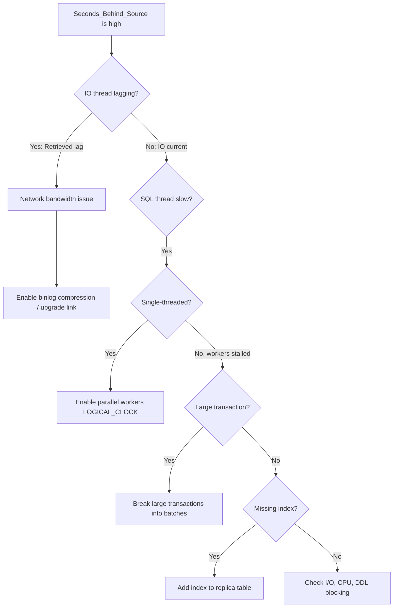

# How to Troubleshoot MySQL Replication Lag

Author: [nawazdhandala](https://www.github.com/nawazdhandala)

Tags: MySQL, Replication, Performance, Lag, Troubleshooting

Description: Learn how to diagnose and fix MySQL replication lag by identifying slow SQL threads, large transactions, missing indexes on replicas, and network bottlenecks.

---

## Introduction

Replication lag is the time difference between when a transaction commits on the source and when it finishes applying on the replica. A lagging replica risks serving stale reads and, in a failover, losing recently committed data.

`Seconds_Behind_Source` in `SHOW REPLICA STATUS` is the primary indicator, but it is a rough estimate. This guide covers how to measure lag accurately, identify the root cause, and apply the appropriate fix.

## Quick diagnosis checklist

```sql
-- Step 1: Check current lag and thread states
SHOW REPLICA STATUS\G
-- Key fields: Replica_IO_Running, Replica_SQL_Running, Seconds_Behind_Source

-- Step 2: Check what the SQL thread is currently doing
SHOW PROCESSLIST;
-- Look for lines with "Waiting for..." or a long-running query in State column

-- Step 3: Check Performance Schema for worker details
SELECT
  WORKER_ID,
  LAST_APPLIED_TRANSACTION,
  APPLYING_TRANSACTION,
  LAST_ERROR_MESSAGE,
  TIMESTAMPDIFF(SECOND,
    APPLYING_TRANSACTION_ORIGINAL_COMMIT_TIMESTAMP,
    NOW()) AS current_tx_age_sec
FROM performance_schema.replication_applier_status_by_worker
ORDER BY current_tx_age_sec DESC;
```

## Cause 1 - Single-threaded applier

By default the replica applies events with a single SQL thread. High-write sources quickly overwhelm a single-threaded applier.

### Fix: enable parallel replication

```ini
# /etc/mysql/mysql.conf.d/mysqld.cnf (replica)

[mysqld]
replica_parallel_type         = LOGICAL_CLOCK
replica_parallel_workers      = 8       # start with CPU count
replica_preserve_commit_order = ON      # ensures read consistency
```

```sql
-- Apply at runtime (requires restarting SQL thread)
STOP REPLICA SQL_THREAD;
SET GLOBAL replica_parallel_type    = 'LOGICAL_CLOCK';
SET GLOBAL replica_parallel_workers = 8;
START REPLICA SQL_THREAD;

-- Verify workers are active
SELECT WORKER_ID, SERVICE_STATE
FROM performance_schema.replication_applier_status_by_worker;
```

## Cause 2 - Large transactions

A single multi-million-row UPDATE or LOAD DATA can block the SQL thread for minutes.

### Identify the current transaction size

```sql
-- Find the transaction currently being applied
SELECT
  APPLYING_TRANSACTION,
  APPLYING_TRANSACTION_ORIGINAL_COMMIT_TIMESTAMP,
  TIMESTAMPDIFF(SECOND,
    APPLYING_TRANSACTION_ORIGINAL_COMMIT_TIMESTAMP,
    NOW()) AS age_sec
FROM performance_schema.replication_applier_status_by_coordinator;
```

### Prevent large transactions at the application level

```sql
-- Instead of one giant DELETE:
DELETE FROM audit_logs WHERE created_at < DATE_SUB(NOW(), INTERVAL 90 DAY);

-- Break it into chunks:
DELIMITER $$
CREATE PROCEDURE batch_delete_old_logs()
BEGIN
  DECLARE done INT DEFAULT 0;
  WHILE done = 0 DO
    DELETE FROM audit_logs
    WHERE created_at < DATE_SUB(NOW(), INTERVAL 90 DAY)
    LIMIT 1000;
    IF ROW_COUNT() < 1000 THEN
      SET done = 1;
    END IF;
    DO SLEEP(0.1); -- brief pause between batches
  END WHILE;
END$$
DELIMITER ;
```

## Cause 3 - Missing indexes on the replica

Row-based replication must locate rows on the replica using a primary or unique key. If the replica is missing an index the source has, a full table scan occurs for every replicated row event.

```sql
-- Check if a table on the replica is being scanned (run on replica)
SHOW STATUS LIKE 'Handler_read_rnd_next'; -- high value = full scans

-- Compare index definitions
SHOW CREATE TABLE orders\G          -- run on source
SHOW CREATE TABLE orders\G          -- run on replica
-- They should be identical

-- Check slave_rows_search_algorithms setting
SHOW VARIABLES LIKE 'replica_rows_search_algorithms';
-- Recommended: INDEX_SCAN,HASH_SCAN
```

```ini
# /etc/mysql/mysql.conf.d/mysqld.cnf (replica)
[mysqld]
replica_rows_search_algorithms = INDEX_SCAN,HASH_SCAN
```

## Cause 4 - Network bandwidth saturation

```bash
# Check network throughput on the replica
sar -n DEV 1 5
# or
nload eth0

# Check binlog bytes being sent from the source
mysql -u root -p -e "SHOW STATUS LIKE 'Binlog_bytes_written';"

# Enable binlog compression (MySQL 8.0.20+)
```

```sql
-- Enable binary log transaction compression on the source (MySQL 8.0.20+)
SET GLOBAL binlog_transaction_compression = ON;
SHOW VARIABLES LIKE 'binlog_transaction_compression%';
```

## Cause 5 - Replica I/O or CPU bottleneck

```bash
# Check disk I/O wait on the replica
iostat -x 1 5
# High %iowait on the disk holding relay logs or data directory indicates I/O bottleneck

# Check CPU
top
# The mysqld process should not be constantly at 100% CPU on a replica
```

### Optimize relay log flushing

```ini
# /etc/mysql/mysql.conf.d/mysqld.cnf (replica)
[mysqld]
sync_relay_log         = 0      # reduce relay log fsync frequency
relay_log_recovery     = ON     # recover relay log on crash
```

## Cause 6 - DDL statements serializing replication

DDL statements (ALTER TABLE, CREATE INDEX) run serially and cannot be parallelized. A long-running `ALTER TABLE` on the source creates a corresponding delay on the replica.

### Use online DDL or pt-online-schema-change

```bash
# Use pt-online-schema-change to avoid long DDL locks
pt-online-schema-change \
  --alter "ADD COLUMN description TEXT" \
  --execute \
  D=myapp,t=products

# Or use MySQL 8.0 instant DDL where available
```

```sql
-- Check if instant DDL is possible (MySQL 8.0+)
ALTER TABLE products
  ADD COLUMN description TEXT,
  ALGORITHM=INSTANT;
```

## Measuring lag with Performance Schema (precise)

```sql
SELECT
  CHANNEL_NAME,
  LAST_APPLIED_TRANSACTION                                 AS last_gtid,
  LAST_APPLIED_TRANSACTION_ORIGINAL_COMMIT_TIMESTAMP       AS committed_on_source,
  LAST_APPLIED_TRANSACTION_END_APPLY_TIMESTAMP             AS applied_on_replica,
  TIMESTAMPDIFF(MICROSECOND,
    LAST_APPLIED_TRANSACTION_ORIGINAL_COMMIT_TIMESTAMP,
    LAST_APPLIED_TRANSACTION_END_APPLY_TIMESTAMP) / 1000000.0
    AS apply_lag_sec
FROM performance_schema.replication_applier_status_by_worker
ORDER BY apply_lag_sec DESC;
```

## Replication lag root-cause decision tree



## Summary

MySQL replication lag has several common causes: a single-threaded SQL applier (fix: enable `LOGICAL_CLOCK` parallel workers), large transactions (fix: batch writes), missing indexes on the replica (fix: sync schema, enable `HASH_SCAN`), network saturation (fix: binlog compression), and DDL serialization (fix: online DDL tools). Use `SHOW REPLICA STATUS`, Performance Schema `replication_applier_status_by_worker`, and `iostat` / `sar` together to pinpoint the bottleneck before applying a remedy.
