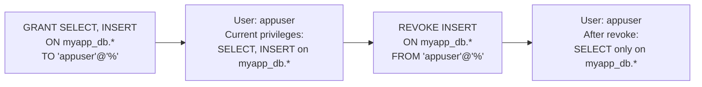

# How to Revoke Privileges in MySQL with REVOKE

Author: [nawazdhandala](https://www.github.com/nawazdhandala)

Tags: MySQL, Security, REVOKE, User Privileges, Database Administration

Description: Learn how to use MySQL REVOKE to remove specific privileges from users at global, database, table, and column levels, and how to perform privilege audits.

---

## How REVOKE Works

`REVOKE` is the counterpart to `GRANT`. It removes previously granted privileges from a user account. The syntax mirrors `GRANT` - you specify the same privileges, objects, and user that were in the original `GRANT` statement.



Important: `REVOKE` only removes privileges that were explicitly granted. It does not affect privileges from other sources (e.g., role assignments or grants at a different level).

## Basic REVOKE Syntax

```sql
-- Revoke a specific privilege
REVOKE INSERT ON myapp_db.* FROM 'appuser'@'%';

-- Revoke multiple privileges at once
REVOKE INSERT, UPDATE, DELETE ON myapp_db.* FROM 'appuser'@'%';

-- Revoke all privileges on a database
REVOKE ALL PRIVILEGES ON myapp_db.* FROM 'appuser'@'%';

-- Revoke all privileges on all databases
REVOKE ALL PRIVILEGES ON *.* FROM 'appuser'@'%';
```

## Revoking Table-Level Privileges

```sql
-- Revoke read access to a specific table
REVOKE SELECT ON myapp_db.sensitive_data FROM 'reporting_user'@'%';

-- Revoke DML privileges on specific tables
REVOKE INSERT, UPDATE, DELETE ON myapp_db.orders FROM 'order_svc'@'%';
```

## Revoking Column-Level Privileges

```sql
-- Revoke access to specific columns
REVOKE SELECT (credit_card_number, cvv)
    ON myapp_db.payment_info
    FROM 'limited_user'@'localhost';
```

## Revoking the GRANT OPTION

Remove a user's ability to grant their privileges to others:

```sql
REVOKE GRANT OPTION ON myapp_db.* FROM 'team_lead'@'localhost';
```

To revoke both the privilege and the grant option in one statement:

```sql
REVOKE INSERT, UPDATE ON myapp_db.* FROM 'team_lead'@'localhost';
-- Then separately:
REVOKE GRANT OPTION ON myapp_db.* FROM 'team_lead'@'localhost';
```

## Revoking Global Privileges

```sql
-- Revoke administrative privileges
REVOKE SUPER ON *.* FROM 'dba_user'@'localhost';

-- Revoke replication privileges
REVOKE REPLICATION SLAVE ON *.* FROM 'replicator'@'%';
```

## Verifying Privileges Before and After Revoke

Always verify the current grants before revoking to ensure you revoke the right privileges:

```sql
-- Check current grants
SHOW GRANTS FOR 'appuser'@'%';
```

Example output before revoke:

```text
GRANT SELECT, INSERT, UPDATE, DELETE ON `myapp_db`.* TO `appuser`@`%`
```

After revoking INSERT and UPDATE:

```sql
REVOKE INSERT, UPDATE ON myapp_db.* FROM 'appuser'@'%';

-- Verify
SHOW GRANTS FOR 'appuser'@'%';
```

Expected output after:

```text
GRANT SELECT, DELETE ON `myapp_db`.* TO `appuser`@`%`
```

## Revoking All Privileges and Dropping a User

To completely remove a user, revoke all privileges and drop the account:

```sql
-- Revoke all privileges
REVOKE ALL PRIVILEGES, GRANT OPTION FROM 'olduser'@'%';

-- Drop the user
DROP USER 'olduser'@'%';
```

Or simply drop the user, which automatically removes all their grants:

```sql
DROP USER 'olduser'@'%';
```

## Privilege Audit: Finding Over-Privileged Users

Query `information_schema` to audit all user grants:

```sql
-- Find all users with global privileges
SELECT user, host, Select_priv, Insert_priv, Update_priv,
       Delete_priv, Super_priv, Grant_priv, Repl_slave_priv
FROM   mysql.user
WHERE  user NOT IN ('mysql.sys', 'mysql.session', 'mysql.infoschema')
ORDER  BY user, host;

-- Find users with SUPER privilege (risky in MySQL 8.0)
SELECT user, host
FROM   mysql.user
WHERE  Super_priv = 'Y';

-- Find users with ALL PRIVILEGES at database level
SELECT grantee, table_schema, privilege_type
FROM   information_schema.SCHEMA_PRIVILEGES
WHERE  privilege_type = 'ALL PRIVILEGES'
ORDER  BY grantee;
```

## Revoking Across Multiple Users

When multiple users have the same over-broad privileges, revoke them efficiently:

```sql
-- Check who has SELECT on a sensitive table
SELECT grantee, privilege_type
FROM   information_schema.TABLE_PRIVILEGES
WHERE  table_schema = 'myapp_db'
AND    table_name   = 'payment_info';

-- Revoke from each identified user
REVOKE SELECT ON myapp_db.payment_info FROM 'user1'@'%';
REVOKE SELECT ON myapp_db.payment_info FROM 'user2'@'%';
```

## Common Revoke Scenarios

### Downgrading an Application User from Read-Write to Read-Only

```sql
REVOKE INSERT, UPDATE, DELETE ON myapp_db.* FROM 'appuser'@'%';
SHOW GRANTS FOR 'appuser'@'%';
```

### Removing a Decommissioned Replication User

```sql
REVOKE REPLICATION SLAVE ON *.* FROM 'old_replica'@'192.168.1.20';
DROP USER 'old_replica'@'192.168.1.20';
```

### Removing Backup Privileges After a Migration

```sql
REVOKE SELECT, SHOW VIEW, RELOAD, REPLICATION CLIENT,
       EVENT, LOCK TABLES, TRIGGER ON *.* FROM 'migration_backup'@'localhost';
DROP USER 'migration_backup'@'localhost';
```

## Best Practices

- Audit all user privileges quarterly using `SHOW GRANTS FOR` and `information_schema.SCHEMA_PRIVILEGES`.
- Follow the principle of least privilege: revoke any privilege that is not actively needed.
- When removing a user, use `DROP USER` instead of only revoking privileges - `DROP USER` is atomic.
- Document privilege changes in a change log with the reason for the change.
- Use MySQL roles (MySQL 8.0+) to group privileges - changing a role revokes it from all users at once.
- Never rely on revoking from `'%'` if the user also has a specific host entry - each host entry must be revoked separately.

## Summary

`REVOKE` removes previously granted MySQL privileges at any level: global, database, table, or column. Always verify privileges with `SHOW GRANTS` before and after revoking. For removing users entirely, `DROP USER` is the cleanest approach as it atomically removes the account and all associated grants. Regular privilege audits using `information_schema` help ensure users do not accumulate more access than they need.
