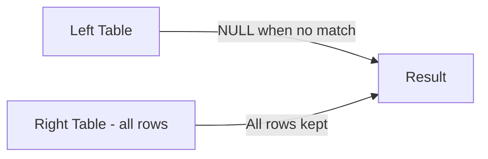

# How to Use RIGHT JOIN in MySQL

Author: [nawazdhandala](https://www.github.com/nawazdhandala)

Tags: MySQL, SQL, JOIN, Database, Query

Description: Learn how RIGHT JOIN in MySQL returns all rows from the right table and matching rows from the left table, filling NULLs where no match exists.

---

## How RIGHT JOIN Works

A RIGHT JOIN (also written as RIGHT OUTER JOIN) returns all rows from the right table, plus matched rows from the left table. When no match exists in the left table, MySQL fills every left-table column in that row with NULL. RIGHT JOIN is the mirror image of LEFT JOIN - any RIGHT JOIN can be rewritten as a LEFT JOIN by swapping the table order.



## Syntax

```sql
SELECT column_list
FROM left_table
RIGHT JOIN right_table ON left_table.column = right_table.column;
```

## Examples

### Setup: Create Sample Tables

```sql
CREATE TABLE employees (
    id INT PRIMARY KEY AUTO_INCREMENT,
    name VARCHAR(100) NOT NULL,
    department_id INT
);

CREATE TABLE departments (
    id INT PRIMARY KEY AUTO_INCREMENT,
    name VARCHAR(100) NOT NULL,
    budget DECIMAL(12, 2)
);

INSERT INTO departments (name, budget) VALUES
    ('Engineering', 500000.00),
    ('Marketing',   200000.00),
    ('Finance',     150000.00),
    ('Legal',       100000.00);

INSERT INTO employees (name, department_id) VALUES
    ('Alice', 1),
    ('Bob',   2),
    ('Carol', 1),
    ('Dave',  3);
```

### Basic RIGHT JOIN

Retrieve all departments and any employees in them. The Legal department has no employees so it shows NULL for employee columns.

```sql
SELECT e.name AS employee, d.name AS department, d.budget
FROM employees e
RIGHT JOIN departments d ON e.department_id = d.id
ORDER BY d.name;
```

```text
+----------+-------------+-----------+
| employee | department  | budget    |
+----------+-------------+-----------+
| Alice    | Engineering | 500000.00 |
| Carol    | Engineering | 500000.00 |
| Dave     | Finance     | 150000.00 |
| NULL     | Legal       | 100000.00 |
| Bob      | Marketing   | 200000.00 |
+----------+-------------+-----------+
```

### Finding Empty Departments (Anti-Join)

Filter for NULL on the left-table column to find departments with no employees assigned.

```sql
SELECT d.name AS department, d.budget
FROM employees e
RIGHT JOIN departments d ON e.department_id = d.id
WHERE e.id IS NULL;
```

```text
+------------+-----------+
| department | budget    |
+------------+-----------+
| Legal      | 100000.00 |
+------------+-----------+
```

### Rewriting as LEFT JOIN

RIGHT JOIN can always be rewritten as a LEFT JOIN by reversing the table order. The two queries below produce the same result.

```sql
-- Using RIGHT JOIN
SELECT e.name, d.name AS department
FROM employees e
RIGHT JOIN departments d ON e.department_id = d.id;

-- Equivalent using LEFT JOIN (tables swapped)
SELECT e.name, d.name AS department
FROM departments d
LEFT JOIN employees e ON e.department_id = d.id;
```

### RIGHT JOIN with COUNT

Count employees per department, showing zero for departments with no staff.

```sql
SELECT d.name AS department,
       COUNT(e.id) AS employee_count,
       d.budget
FROM employees e
RIGHT JOIN departments d ON e.department_id = d.id
GROUP BY d.id, d.name, d.budget
ORDER BY employee_count DESC;
```

```text
+-------------+----------------+-----------+
| department  | employee_count | budget    |
+-------------+----------------+-----------+
| Engineering | 2              | 500000.00 |
| Finance     | 1              | 150000.00 |
| Marketing   | 1              | 200000.00 |
| Legal       | 0              | 100000.00 |
+-------------+----------------+-----------+
```

## Best Practices

- Most developers prefer LEFT JOIN over RIGHT JOIN because it reads more naturally (start with the primary table). Consider rewriting RIGHT JOINs as LEFT JOINs for consistency.
- Avoid mixing LEFT and RIGHT JOINs in the same query - it becomes difficult to reason about which rows are preserved.
- Use `COUNT(left_table.id)` instead of `COUNT(*)` when grouping on a RIGHT JOIN so that unmatched rows count as 0 rather than 1.
- Index the join column on the left table to optimize lookup performance.
- When using the anti-join pattern, filter on a NOT NULL column from the left table to correctly detect missing matches.

## Summary

RIGHT JOIN preserves all rows from the right table, padding left-table columns with NULL when no match is found. It is the mirror of LEFT JOIN and any RIGHT JOIN can be expressed as a LEFT JOIN by swapping table positions. In practice, teams often standardize on LEFT JOIN for readability and convert RIGHT JOINs accordingly. The anti-join pattern with `WHERE left_table.id IS NULL` is a clean way to find records in the right table that have no corresponding left-table rows.
