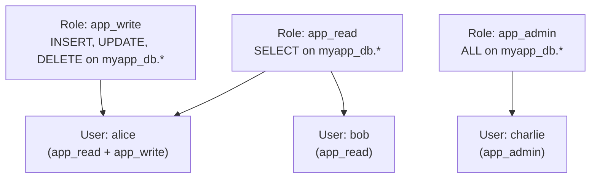

# How to Set Up MySQL Role-Based Access Control

Author: [nawazdhandala](https://www.github.com/nawazdhandala)

Tags: MySQL, Security, Role-Based Access Control, RBAC, User Management

Description: Learn how to use MySQL 8.0 roles to group privileges into named roles, assign them to users, and simplify privilege management across teams and applications.

---

## How MySQL Roles Work

MySQL 8.0 introduced native role support. A role is a named collection of privileges that can be granted to and revoked from users as a unit. Instead of managing individual privileges for each user, you grant a role, and all privileges in that role are applied at once.



Benefits of roles:
- Centralized privilege management - change a role, all members get updated
- Reduced errors - no need to manually replicate grants for each new user
- Easier auditing - see what a role permits, then see who has the role

## Creating Roles

```sql
-- Create roles (roles are like user accounts with no host or password)
CREATE ROLE 'app_readonly';
CREATE ROLE 'app_readwrite';
CREATE ROLE 'app_admin';
CREATE ROLE 'db_backup';
CREATE ROLE 'db_replication';
```

## Granting Privileges to Roles

```sql
-- Read-only role
GRANT SELECT ON myapp_db.* TO 'app_readonly';

-- Read-write role
GRANT SELECT, INSERT, UPDATE, DELETE ON myapp_db.* TO 'app_readwrite';

-- Admin role (full access)
GRANT ALL PRIVILEGES ON myapp_db.* TO 'app_admin';

-- Backup role
GRANT SELECT, SHOW VIEW, RELOAD, REPLICATION CLIENT,
      EVENT, LOCK TABLES, TRIGGER ON *.* TO 'db_backup';

-- Replication role
GRANT REPLICATION SLAVE ON *.* TO 'db_replication';
```

## Assigning Roles to Users

Create users and assign roles:

```sql
-- Create users
CREATE USER 'alice'@'%' IDENTIFIED BY 'AlicePass123!';
CREATE USER 'bob'@'%' IDENTIFIED BY 'BobPass123!';
CREATE USER 'charlie'@'%' IDENTIFIED BY 'CharliePass123!';
CREATE USER 'backup_agent'@'localhost' IDENTIFIED BY 'BackupPass123!';
CREATE USER 'replica'@'192.168.1.%' IDENTIFIED BY 'ReplicaPass123!';

-- Assign roles to users
GRANT 'app_readwrite' TO 'alice'@'%';
GRANT 'app_readonly' TO 'bob'@'%';
GRANT 'app_admin' TO 'charlie'@'%';
GRANT 'db_backup' TO 'backup_agent'@'localhost';
GRANT 'db_replication' TO 'replica'@'192.168.1.%';

-- Alice gets both read and write roles
GRANT 'app_readonly', 'app_readwrite' TO 'alice'@'%';
```

## Activating Roles

By default in MySQL 8.0, granted roles are NOT active when a user connects. Users must activate them, or you configure them to activate automatically.

### Activate Roles in a Session

```sql
-- Activate specific roles for the current session
SET ROLE 'app_readwrite';

-- Activate all granted roles
SET ROLE ALL;

-- Deactivate all roles
SET ROLE NONE;

-- Check which roles are active
SELECT CURRENT_ROLE();
```

### Set Default Active Roles for a User

```sql
-- Role is automatically active when alice connects
ALTER USER 'alice'@'%' DEFAULT ROLE 'app_readwrite';

-- Multiple default roles
ALTER USER 'charlie'@'%' DEFAULT ROLE 'app_admin', 'db_backup';

-- All granted roles are active by default
ALTER USER 'bob'@'%' DEFAULT ROLE ALL;
```

### Activate Roles for All Users at Startup

```ini
# /etc/mysql/mysql.conf.d/mysqld.cnf
[mysqld]
activate_all_roles_on_login = ON
```

Or set dynamically:

```sql
SET GLOBAL activate_all_roles_on_login = ON;
```

## Viewing Role Assignments

```sql
-- See all roles and who they are granted to
SELECT FROM_USER AS role, TO_USER AS assigned_to, TO_HOST AS host
FROM   mysql.role_edges
ORDER  BY role, assigned_to;

-- See granted roles for a specific user
SHOW GRANTS FOR 'alice'@'%';
SHOW GRANTS FOR 'alice'@'%' USING 'app_readwrite';
```

## Nesting Roles

Roles can be granted to other roles, creating a hierarchy:

```sql
-- Create a senior developer role that inherits app_readwrite plus extra
CREATE ROLE 'senior_dev';
GRANT 'app_readwrite' TO 'senior_dev';
GRANT ALTER, CREATE, DROP, INDEX ON myapp_db.* TO 'senior_dev';

-- Assign to a user
CREATE USER 'diana'@'%' IDENTIFIED BY 'DianaPass123!';
GRANT 'senior_dev' TO 'diana'@'%';
ALTER USER 'diana'@'%' DEFAULT ROLE 'senior_dev';
```

## Revoking Roles

```sql
-- Revoke a role from a user
REVOKE 'app_readwrite' FROM 'alice'@'%';

-- Revoke a privilege from a role (affects all users with that role)
REVOKE DELETE ON myapp_db.* FROM 'app_readwrite';

-- Drop a role (also removes it from all users who have it)
DROP ROLE 'app_readonly';
```

## Mandatory Roles

Configure roles that are always active for all users:

```sql
SET GLOBAL mandatory_roles = 'app_readonly';
```

Or in configuration:

```ini
[mysqld]
mandatory_roles = 'app_readonly'
```

## Role vs Direct Grant

Compare viewing effective permissions for a user with a role vs direct grants:

```sql
-- Show effective permissions including those from roles
SHOW GRANTS FOR 'alice'@'%' USING 'app_readwrite';
```

## Best Practices

- Create roles for each distinct access pattern: `readonly`, `readwrite`, `admin`, `backup`, `replication`.
- Set `activate_all_roles_on_login = ON` in most production environments to avoid users needing to manually activate roles.
- Use role nesting to build privilege hierarchies without duplicating grant statements.
- Revoke a role from a user when their responsibilities change, rather than tracking individual privileges.
- Audit role assignments weekly: `SELECT * FROM mysql.role_edges`.
- Drop unused roles to keep the privilege model clean.

## Summary

MySQL 8.0 roles allow grouping privileges into named collections that can be granted to users as a unit. Create roles with `CREATE ROLE`, assign privileges with `GRANT ... TO role`, and assign roles to users with `GRANT role TO user`. Set `activate_all_roles_on_login = ON` or use `ALTER USER ... DEFAULT ROLE` so users do not need to manually activate roles each session. Roles simplify privilege management at scale by centralizing the definition of what each access level can do.
