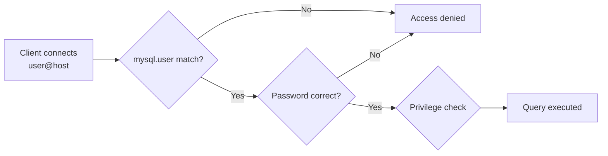

# How to Set Up MySQL Root Password and User Accounts

Author: [nawazdhandala](https://www.github.com/nawazdhandala)

Tags: MySQL, Security, User, Authentication, Database, Administration

Description: Set the MySQL root password, create application user accounts with least-privilege grants, and manage authentication plugins in MySQL 8.0.

---

## How It Works

MySQL manages access through a grant table system stored in the `mysql` system database. Every connection is authenticated by matching the connecting user, host, and password against the `mysql.user` table. MySQL 8.0 introduced `caching_sha2_password` as the default authentication plugin, replacing the older `mysql_native_password`.



## Checking the Current Root Password Status

After a fresh install, the root account may have no password or a randomly generated temporary password logged to the error log.

```bash
sudo grep 'temporary password' /var/log/mysql/error.log
```

Connect as root (using `sudo` if no password is set on Debian/Ubuntu).

```bash
sudo mysql
# or
mysql -u root -p
```

## Setting the Root Password

If the root account has no password or you need to change it, use `ALTER USER` after logging in.

```sql
ALTER USER 'root'@'localhost' IDENTIFIED BY 'NewStrongPassword!9';
FLUSH PRIVILEGES;
```

Verify the change by disconnecting and reconnecting.

```bash
mysql -u root -p
```

## Creating Application User Accounts

Always create a dedicated user for each application instead of using root.

```sql
-- Create a user that can connect only from localhost
CREATE USER 'appuser'@'localhost' IDENTIFIED BY 'AppPass!2024';

-- Create a user that can connect from any host (less secure)
CREATE USER 'appuser'@'%' IDENTIFIED BY 'AppPass!2024';

-- Create a user restricted to a specific IP range
CREATE USER 'appuser'@'192.168.1.%' IDENTIFIED BY 'AppPass!2024';
```

## Granting Privileges

Grant only the privileges the application actually needs.

```sql
-- Grant all privileges on one database (typical for an application user)
GRANT ALL PRIVILEGES ON myapp.* TO 'appuser'@'localhost';

-- Grant read-only access
GRANT SELECT ON myapp.* TO 'readonly'@'localhost';

-- Grant specific DML privileges
GRANT SELECT, INSERT, UPDATE, DELETE ON myapp.* TO 'appuser'@'localhost';

-- Grant a specific privilege on a specific table
GRANT SELECT ON myapp.products TO 'reporting'@'localhost';

FLUSH PRIVILEGES;
```

## Viewing Existing Users and Grants

List all user accounts.

```sql
SELECT user, host, plugin, authentication_string != '' AS has_password
FROM mysql.user
ORDER BY user, host;
```

```text
+------------------+-----------+-------------------------------+--------------+
| user             | host      | plugin                        | has_password |
+------------------+-----------+-------------------------------+--------------+
| appuser          | localhost | caching_sha2_password         |            1 |
| mysql.infoschema | localhost | caching_sha2_password         |            1 |
| mysql.session    | localhost | caching_sha2_password         |            1 |
| mysql.sys        | localhost | caching_sha2_password         |            1 |
| root             | localhost | caching_sha2_password         |            1 |
+------------------+-----------+-------------------------------+--------------+
```

Show the grants for a specific user.

```sql
SHOW GRANTS FOR 'appuser'@'localhost';
```

```text
+------------------------------------------------------------------+
| Grants for appuser@localhost                                     |
+------------------------------------------------------------------+
| GRANT USAGE ON *.* TO `appuser`@`localhost`                      |
| GRANT ALL PRIVILEGES ON `myapp`.* TO `appuser`@`localhost`       |
+------------------------------------------------------------------+
```

## Changing a User Password

```sql
ALTER USER 'appuser'@'localhost' IDENTIFIED BY 'NewAppPass!2025';
FLUSH PRIVILEGES;
```

## Resetting the Root Password if Locked Out

If you are locked out and cannot log in as root, follow these steps.

Stop MySQL.

```bash
sudo systemctl stop mysql
```

Start MySQL without the grant table check.

```bash
sudo mysqld_safe --skip-grant-tables &
```

Connect and reset the password.

```bash
mysql -u root
```

```sql
FLUSH PRIVILEGES;
ALTER USER 'root'@'localhost' IDENTIFIED BY 'NewRootPassword!1';
FLUSH PRIVILEGES;
```

Stop the unsafe instance and start normally.

```bash
sudo killall mysqld
sudo systemctl start mysql
```

## Authentication Plugins in MySQL 8.0

MySQL 8.0 defaults to `caching_sha2_password`. Some older clients do not support it. To use the legacy plugin for a specific user:

```sql
CREATE USER 'legacyapp'@'localhost'
    IDENTIFIED WITH mysql_native_password
    BY 'LegacyPass!1';
```

To check which plugin a user is using:

```sql
SELECT user, host, plugin FROM mysql.user WHERE user = 'legacyapp';
```

## Revoking Privileges

```sql
-- Revoke a specific privilege
REVOKE INSERT ON myapp.* FROM 'appuser'@'localhost';

-- Revoke all privileges on a database
REVOKE ALL PRIVILEGES ON myapp.* FROM 'appuser'@'localhost';

FLUSH PRIVILEGES;
```

## Dropping a User

```sql
DROP USER 'appuser'@'localhost';
```

## Best Practices

- Never use the `root` account for application connections.
- Restrict users to `localhost` or a specific IP range whenever possible.
- Apply the principle of least privilege - grant only `SELECT, INSERT, UPDATE, DELETE` rather than `ALL PRIVILEGES` for application users.
- Use strong passwords with a mix of upper/lower case, digits, and special characters.
- Rotate application passwords periodically and store them in a secrets manager.
- Disable the anonymous user and the `test` database (done by `mysql_secure_installation`).

## Summary

MySQL user account management centres on `CREATE USER`, `GRANT`, `REVOKE`, and `ALTER USER`. Every application should have its own dedicated MySQL user with the minimum necessary privileges restricted to a specific host. MySQL 8.0 defaults to the `caching_sha2_password` plugin for stronger security, with `mysql_native_password` available for legacy client compatibility. Always flush privileges after manual changes to the grant tables.
