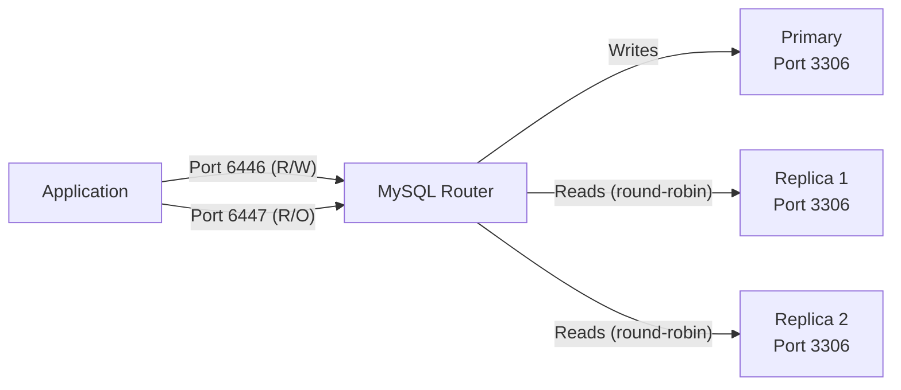

# How to Use MySQL Router for Load Balancing

Author: [nawazdhandala](https://www.github.com/nawazdhandala)

Tags: MySQL, Router, Load Balancing, High Availability, InnoDB Cluster

Description: Learn how to install, configure, and use MySQL Router to route application connections across a MySQL InnoDB Cluster for read/write splitting and load balancing.

---

## How MySQL Router Works

MySQL Router is a lightweight middleware that sits between your application and MySQL servers. It provides transparent routing of client connections to the appropriate MySQL instance based on the routing strategy. When used with InnoDB Cluster, it automatically discovers the cluster topology and updates routing rules when membership changes.



MySQL Router listens on multiple ports:
- **6446** - Classic protocol, read/write (routes to primary only)
- **6447** - Classic protocol, read-only (round-robin across replicas)
- **6448** - X Protocol, read/write
- **6449** - X Protocol, read-only

## Installation

Install MySQL Router:

```bash
# Ubuntu/Debian
sudo apt-get install -y mysql-router

# RHEL/CentOS
sudo yum install -y mysql-router
```

## Bootstrap Configuration

The easiest way to configure MySQL Router for an InnoDB Cluster is to bootstrap it. Bootstrapping automatically generates the configuration file by connecting to the cluster:

```bash
sudo mysqlrouter \
    --bootstrap root@192.168.1.10:3306 \
    --directory /etc/mysqlrouter \
    --conf-use-sockets \
    --conf-bind-address 0.0.0.0 \
    --user=mysqlrouter
```

This creates `/etc/mysqlrouter/mysqlrouter.conf` with auto-detected routes.

## Manual Configuration

For standalone MySQL servers (without InnoDB Cluster), create the configuration manually:

```ini
# /etc/mysqlrouter/mysqlrouter.conf

[DEFAULT]
logging_folder = /var/log/mysqlrouter
runtime_folder = /run/mysqlrouter
config_folder  = /etc/mysqlrouter

[logger]
level = INFO

# Read/Write route - only primary
[routing:primary]
bind_address           = 0.0.0.0
bind_port              = 6446
destinations           = 192.168.1.10:3306
routing_strategy       = first-available
protocol               = classic

# Read-Only route - load balanced across replicas
[routing:secondary]
bind_address           = 0.0.0.0
bind_port              = 6447
destinations           = 192.168.1.11:3306,192.168.1.12:3306
routing_strategy       = round-robin
protocol               = classic
```

## Routing Strategies

MySQL Router supports several routing strategies:

```ini
# first-available - use the first server; fail over to next on error
routing_strategy = first-available

# next-available - like first-available but never returns to failed servers
routing_strategy = next-available

# round-robin - distribute connections equally across all servers
routing_strategy = round-robin

# round-robin-with-fallback - round-robin primaries; fall back to secondaries
routing_strategy = round-robin-with-fallback
```

## Starting and Enabling MySQL Router

```bash
# Start using the generated configuration
sudo mysqlrouter -c /etc/mysqlrouter/mysqlrouter.conf &

# Or as a systemd service
sudo systemctl start mysqlrouter
sudo systemctl enable mysqlrouter
```

Verify it is listening on the expected ports:

```bash
sudo ss -tlnp | grep mysqlrouter
```

Expected output:

```text
LISTEN  0  128  0.0.0.0:6446  0.0.0.0:*  users:(("mysqlrouter",pid=1234,fd=10))
LISTEN  0  128  0.0.0.0:6447  0.0.0.0:*  users:(("mysqlrouter",pid=1234,fd=11))
```

## Connecting Through MySQL Router

Applications connect to MySQL Router instead of directly to MySQL servers:

```bash
# Connect for read/write operations
mysql -u appuser -p -h 127.0.0.1 -P 6446 myapp_db

# Connect for read-only operations
mysql -u appuser -p -h 127.0.0.1 -P 6447 myapp_db
```

In application code (Python example):

```text
# Read/Write connection
RW_DSN = "appuser:password@127.0.0.1:6446/myapp_db"

# Read-Only connection (for SELECT queries)
RO_DSN = "appuser:password@127.0.0.1:6447/myapp_db"
```

## Connection Timeouts and Limits

Tune connection behavior in the routing section:

```ini
[routing:primary]
bind_address           = 0.0.0.0
bind_port              = 6446
destinations           = 192.168.1.10:3306
routing_strategy       = first-available
protocol               = classic
connect_timeout        = 5
client_connect_timeout = 9
max_connections        = 512
```

## Monitoring MySQL Router

Check router status via the REST API (if enabled):

```bash
curl http://localhost:8081/api/20190715/router/status
```

Enable the REST API in configuration:

```ini
[http_server]
port = 8081
bind_address = 127.0.0.1

[rest_router]
require_realm = somerealm
```

View the log for connection activity:

```bash
sudo tail -f /var/log/mysqlrouter/mysqlrouter.log
```

## Best Practices

- Run MySQL Router on the application servers rather than the database servers to reduce network hops.
- Use bootstrapping for InnoDB Cluster deployments; it keeps routing metadata automatically updated.
- Set `max_connections` per route to prevent a single route from exhausting server connection limits.
- Use the read-only port (6447) for reporting queries to reduce load on the primary.
- Monitor `connect_timeout` values; too low causes false failures, too high causes slow failover.
- Restart MySQL Router after cluster topology changes if not using bootstrapped auto-discovery.

## Summary

MySQL Router provides lightweight, transparent connection routing between applications and MySQL servers. Bootstrapping against an InnoDB Cluster automatically configures read/write and read-only routes with topology awareness. For standalone setups, manual configuration supports first-available and round-robin strategies. Applications simply target the appropriate router port (6446 for writes, 6447 for reads) and MySQL Router handles the rest.
