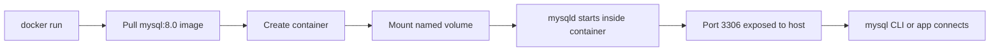

# How to Run MySQL with Docker

Author: [nawazdhandala](https://www.github.com/nawazdhandala)

Tags: MySQL, Docker, Container, Database, DevOps

Description: Run a MySQL 8.0 container with Docker, configure persistent storage, environment variables, and connect from the host machine.

---

## How It Works

Docker packages MySQL and all its dependencies into a portable image. When you run a MySQL container, Docker creates an isolated process with its own filesystem. A named volume maps the data directory (`/var/lib/mysql`) to a persistent location on the host so data survives container restarts.



## Prerequisites

- Docker Engine 20.10 or later installed
- Docker CLI available on your PATH

## Running MySQL with a Single Command

The quickest way to start a MySQL container is with `docker run`.

```bash
docker run --name mysql-dev \
  -e MYSQL_ROOT_PASSWORD=rootpassword \
  -e MYSQL_DATABASE=myapp \
  -e MYSQL_USER=appuser \
  -e MYSQL_PASSWORD=apppassword \
  -p 3306:3306 \
  -d mysql:8.0
```

Flag explanations:

```text
--name mysql-dev          Container name for easy reference
-e MYSQL_ROOT_PASSWORD    Root account password (required)
-e MYSQL_DATABASE         Database created on first start
-e MYSQL_USER             Non-root user created on first start
-e MYSQL_PASSWORD         Password for the non-root user
-p 3306:3306              Map host port 3306 to container port 3306
-d                        Run in detached (background) mode
mysql:8.0                 Official MySQL 8.0 image from Docker Hub
```

Check that the container is running.

```bash
docker ps
```

```text
CONTAINER ID   IMAGE       COMMAND                  CREATED         STATUS         PORTS                    NAMES
a1b2c3d4e5f6   mysql:8.0   "docker-entrypoint.s..."   10 seconds ago   Up 9 seconds   0.0.0.0:3306->3306/tcp   mysql-dev
```

## Adding a Persistent Volume

Without a volume, all data is lost when the container is removed. Add a named volume to persist data.

```bash
docker run --name mysql-dev \
  -e MYSQL_ROOT_PASSWORD=rootpassword \
  -e MYSQL_DATABASE=myapp \
  -e MYSQL_USER=appuser \
  -e MYSQL_PASSWORD=apppassword \
  -p 3306:3306 \
  -v mysql-data:/var/lib/mysql \
  -d mysql:8.0
```

Verify the volume was created.

```bash
docker volume ls
```

```text
DRIVER    VOLUME NAME
local     mysql-data
```

## Using Docker Compose

For most projects, a `docker-compose.yml` file is easier to manage than a long `docker run` command.

```yaml
version: "3.9"

services:
  db:
    image: mysql:8.0
    container_name: mysql-dev
    restart: unless-stopped
    environment:
      MYSQL_ROOT_PASSWORD: rootpassword
      MYSQL_DATABASE: myapp
      MYSQL_USER: appuser
      MYSQL_PASSWORD: apppassword
    ports:
      - "3306:3306"
    volumes:
      - mysql-data:/var/lib/mysql
      - ./init:/docker-entrypoint-initdb.d
    command: --default-authentication-plugin=mysql_native_password

volumes:
  mysql-data:
```

Start the stack.

```bash
docker compose up -d
```

## Initialization Scripts

Any `.sql` or `.sh` files placed in the `./init` directory (mounted at `/docker-entrypoint-initdb.d`) are executed on the very first start when the data directory is empty.

Create `./init/01_schema.sql`:

```sql
CREATE TABLE IF NOT EXISTS users (
    id         INT UNSIGNED AUTO_INCREMENT PRIMARY KEY,
    username   VARCHAR(50)  NOT NULL UNIQUE,
    email      VARCHAR(255) NOT NULL UNIQUE,
    created_at DATETIME     NOT NULL DEFAULT CURRENT_TIMESTAMP
);
```

Create `./init/02_seed.sql`:

```sql
INSERT INTO users (username, email) VALUES
    ('alice', 'alice@example.com'),
    ('bob',   'bob@example.com');
```

## Connecting from the Host Machine

Use the mysql CLI to connect to the running container on `localhost:3306`.

```bash
mysql -h 127.0.0.1 -P 3306 -u appuser -p myapp
```

Alternatively, open a shell inside the container.

```bash
docker exec -it mysql-dev mysql -u appuser -p myapp
```

## Custom MySQL Configuration

Mount a custom `my.cnf` file to override default settings.

```text
[mysqld]
innodb_buffer_pool_size = 256M
max_connections         = 200
slow_query_log          = 1
slow_query_log_file     = /var/lib/mysql/slow.log
long_query_time         = 1
```

Add the volume mount to your `docker run` command or Compose file.

```bash
-v $(pwd)/my.cnf:/etc/mysql/conf.d/custom.cnf
```

## Viewing Logs

```bash
docker logs mysql-dev
docker logs -f mysql-dev   # follow in real time
```

## Best Practices

- Never commit real passwords to version control; use a `.env` file with Docker Compose and add it to `.gitignore`.
- Always pin a specific image tag (e.g., `mysql:8.0.36`) in production to prevent unintended upgrades.
- Use named volumes, not bind-mounted host directories, for the data directory to avoid permission issues on Linux.
- Set `restart: unless-stopped` in Compose so the database comes back up after a reboot.
- Keep initialization SQL scripts idempotent (`CREATE TABLE IF NOT EXISTS`) so they do not fail if the container is re-created against an existing volume.

## Summary

Running MySQL with Docker requires just a `docker run` command with a few environment variables for credentials and a named volume for persistence. For multi-service projects, Docker Compose provides a declarative way to define the database alongside application containers. Initialization scripts in `/docker-entrypoint-initdb.d` automate schema creation and seeding on first boot, making it easy to reproduce development environments consistently.
