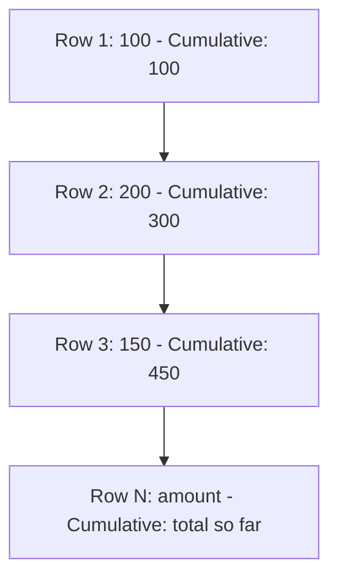

# How to Use Running Totals with SUM() OVER() in MySQL

Author: [nawazdhandala](https://www.github.com/nawazdhandala)

Tags: MySQL, SQL, Window Function, Running Total, Sum, MySQL 8.0, Database

Description: Learn how to compute running totals in MySQL 8.0 using the SUM() window function with the OVER clause and cumulative frame specifications.

---

## How Running Totals Work

A running total (cumulative sum) accumulates a value from the first row up to and including the current row. In MySQL 8.0, this is done with `SUM(column) OVER (ORDER BY ...)`. The window frame defaults to `ROWS BETWEEN UNBOUNDED PRECEDING AND CURRENT ROW`, which is exactly what running totals need.



## Syntax

```sql
SUM(column) OVER (
    [PARTITION BY group_column]
    ORDER BY order_column
    [ROWS BETWEEN UNBOUNDED PRECEDING AND CURRENT ROW]
)
```

The frame clause `ROWS BETWEEN UNBOUNDED PRECEDING AND CURRENT ROW` is the default when ORDER BY is specified and is safe to omit, but stating it explicitly clarifies intent.

## Examples

### Setup: Create Sample Data

```sql
CREATE TABLE daily_sales (
    id INT PRIMARY KEY AUTO_INCREMENT,
    sale_date DATE NOT NULL,
    product_category VARCHAR(50) NOT NULL,
    amount DECIMAL(10, 2) NOT NULL
);

INSERT INTO daily_sales (sale_date, product_category, amount) VALUES
    ('2026-01-01', 'Electronics', 1200.00),
    ('2026-01-02', 'Electronics',  800.00),
    ('2026-01-03', 'Electronics', 1500.00),
    ('2026-01-04', 'Electronics',  950.00),
    ('2026-01-05', 'Electronics', 1100.00),
    ('2026-01-01', 'Furniture',    500.00),
    ('2026-01-02', 'Furniture',    750.00),
    ('2026-01-03', 'Furniture',    300.00),
    ('2026-01-04', 'Furniture',    900.00),
    ('2026-01-05', 'Furniture',    450.00);
```

### Basic Running Total

Compute the cumulative total sales across all categories ordered by date.

```sql
SELECT
    sale_date,
    product_category,
    amount,
    SUM(amount) OVER (ORDER BY sale_date, id) AS running_total
FROM daily_sales
ORDER BY sale_date, id;
```

```text
+------------+------------------+--------+---------------+
| sale_date  | product_category | amount | running_total |
+------------+------------------+--------+---------------+
| 2026-01-01 | Electronics      | 1200   | 1200.00       |
| 2026-01-01 | Furniture        |  500   | 1700.00       |
| 2026-01-02 | Electronics      |  800   | 2500.00       |
| 2026-01-02 | Furniture        |  750   | 3250.00       |
| 2026-01-03 | Electronics      | 1500   | 4750.00       |
| 2026-01-03 | Furniture        |  300   | 5050.00       |
| 2026-01-04 | Electronics      |  950   | 6000.00       |
| 2026-01-04 | Furniture        |  900   | 6900.00       |
| 2026-01-05 | Electronics      | 1100   | 8000.00       |
| 2026-01-05 | Furniture        |  450   | 8450.00       |
+------------+------------------+--------+---------------+
```

### Running Total Per Category with PARTITION BY

Reset the running total for each product category independently.

```sql
SELECT
    sale_date,
    product_category,
    amount,
    SUM(amount) OVER (
        PARTITION BY product_category
        ORDER BY sale_date
    ) AS category_running_total
FROM daily_sales
ORDER BY product_category, sale_date;
```

```text
+------------+------------------+--------+------------------------+
| sale_date  | product_category | amount | category_running_total |
+------------+------------------+--------+------------------------+
| 2026-01-01 | Electronics      | 1200   | 1200.00                |
| 2026-01-02 | Electronics      |  800   | 2000.00                |
| 2026-01-03 | Electronics      | 1500   | 3500.00                |
| 2026-01-04 | Electronics      |  950   | 4450.00                |
| 2026-01-05 | Electronics      | 1100   | 5550.00                |
| 2026-01-01 | Furniture        |  500   |  500.00                |
| 2026-01-02 | Furniture        |  750   | 1250.00                |
| 2026-01-03 | Furniture        |  300   | 1550.00                |
| 2026-01-04 | Furniture        |  900   | 2450.00                |
| 2026-01-05 | Furniture        |  450   | 2900.00                |
+------------+------------------+--------+------------------------+
```

### Running Percentage of Total

Add a column showing the cumulative percentage of total sales.

```sql
SELECT
    sale_date,
    product_category,
    amount,
    SUM(amount) OVER (ORDER BY sale_date, id) AS running_total,
    ROUND(
        SUM(amount) OVER (ORDER BY sale_date, id) /
        SUM(amount) OVER () * 100,
        1
    ) AS cumulative_pct
FROM daily_sales
ORDER BY sale_date, id;
```

`SUM(amount) OVER ()` with no ORDER BY computes the grand total across all rows.

```text
+------------+------------------+--------+---------------+----------------+
| sale_date  | product_category | amount | running_total | cumulative_pct |
+------------+------------------+--------+---------------+----------------+
| 2026-01-01 | Electronics      | 1200   | 1200.00       | 14.2           |
| 2026-01-01 | Furniture        |  500   | 1700.00       | 20.1           |
| 2026-01-02 | Electronics      |  800   | 2500.00       | 29.6           |
| ...        | ...              | ...    | ...           | ...            |
| 2026-01-05 | Furniture        |  450   | 8450.00       | 100.0          |
+------------+------------------+--------+---------------+----------------+
```

### Running Count and Running Average

SUM is not the only aggregate that works with OVER. Pair with COUNT and AVG.

```sql
SELECT
    sale_date,
    amount,
    SUM(amount)   OVER (ORDER BY sale_date, id) AS running_sum,
    COUNT(*)      OVER (ORDER BY sale_date, id) AS running_count,
    ROUND(AVG(amount) OVER (ORDER BY sale_date, id), 2) AS running_avg
FROM daily_sales
ORDER BY sale_date, id;
```

## Best Practices

- Include a unique secondary sort column (such as `id`) in ORDER BY when dates can be non-unique to ensure deterministic ordering.
- Use PARTITION BY to compute independent running totals per group (per customer, per category, etc.).
- `SUM(col) OVER ()` (no ORDER BY, no PARTITION BY) returns the grand total for every row - useful for percentage calculations.
- For performance on very large tables, ensure the ORDER BY column is indexed.
- Running totals cannot be used directly in WHERE - wrap in a CTE or subquery to filter on the running total value.

## Summary

Running totals in MySQL 8.0 are computed with `SUM(column) OVER (ORDER BY ...)`. The OVER clause with ORDER BY tells MySQL to accumulate the sum from the first row through the current row. PARTITION BY resets the cumulative sum per group. Combined with grand total via `SUM() OVER ()`, running totals enable cumulative percentage calculations. These patterns eliminate the need for correlated subqueries or self-joins that were required in older MySQL versions.
