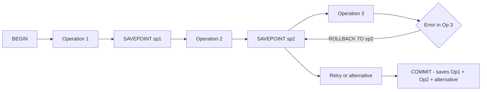

# How to Use Savepoints in MySQL Transactions

Author: [nawazdhandala](https://www.github.com/nawazdhandala)

Tags: MySQL, SQL, Transaction, Savepoint, Rollback, Database

Description: Learn how to use MySQL savepoints to create intermediate checkpoints within a transaction, enabling partial rollbacks without discarding all changes.

---

## How Savepoints Work

A savepoint is a named checkpoint within an open transaction. When you roll back to a savepoint, only the changes made after that savepoint are undone. Changes before the savepoint remain in effect. This enables partial rollbacks - the ability to undo part of a transaction while preserving earlier work.



## Syntax

```sql
-- Create a savepoint
SAVEPOINT savepoint_name;

-- Roll back to a savepoint (undoes changes since that savepoint)
ROLLBACK TO SAVEPOINT savepoint_name;
-- or (shorter form)
ROLLBACK TO savepoint_name;

-- Release a savepoint (removes it from the transaction's savepoint list)
RELEASE SAVEPOINT savepoint_name;
```

Rules:
- Savepoints only exist within an open transaction.
- ROLLBACK TO SAVEPOINT does not end the transaction - you still need COMMIT or full ROLLBACK.
- If you create a new savepoint with the same name, the old one is replaced.

## Examples

### Setup: Create Sample Tables

```sql
CREATE TABLE orders (
    id INT PRIMARY KEY AUTO_INCREMENT,
    customer_id INT NOT NULL,
    status VARCHAR(20) DEFAULT 'pending',
    total DECIMAL(10, 2)
);

CREATE TABLE order_items (
    id INT PRIMARY KEY AUTO_INCREMENT,
    order_id INT NOT NULL,
    product_name VARCHAR(100),
    quantity INT,
    price DECIMAL(10, 2)
);

CREATE TABLE inventory (
    id INT PRIMARY KEY AUTO_INCREMENT,
    product_name VARCHAR(100) UNIQUE,
    stock_qty INT,
    CONSTRAINT chk_stock CHECK (stock_qty >= 0)
);

INSERT INTO inventory (product_name, stock_qty) VALUES
    ('Laptop', 10),
    ('Mouse',  50),
    ('Keyboard', 0);  -- Out of stock
```

### Basic Savepoint: Partial Rollback

Create an order with multiple items. If one item fails (out of stock), roll back only that item but keep the successful ones.

```sql
START TRANSACTION;

-- Insert the order header
INSERT INTO orders (customer_id, total) VALUES (42, 0);
SET @order_id = LAST_INSERT_ID();

SAVEPOINT order_created;

-- Add item 1: Laptop (in stock)
INSERT INTO order_items (order_id, product_name, quantity, price)
VALUES (@order_id, 'Laptop', 1, 999.99);

UPDATE inventory SET stock_qty = stock_qty - 1 WHERE product_name = 'Laptop';

SAVEPOINT item1_added;

-- Add item 2: Keyboard (out of stock - will violate CHECK constraint)
INSERT INTO order_items (order_id, product_name, quantity, price)
VALUES (@order_id, 'Keyboard', 1, 59.99);

-- This will fail due to CHECK constraint (stock_qty = 0 - 1 = -1)
UPDATE inventory SET stock_qty = stock_qty - 1 WHERE product_name = 'Keyboard';
-- ERROR: Check constraint 'chk_stock' is violated.

-- Roll back only the keyboard addition
ROLLBACK TO SAVEPOINT item1_added;

-- Continue with the order without the keyboard
UPDATE orders
SET total = (SELECT SUM(price * quantity) FROM order_items WHERE order_id = @order_id)
WHERE id = @order_id;

COMMIT;

-- Verify
SELECT o.id, o.customer_id, o.total, oi.product_name, oi.quantity
FROM orders o
LEFT JOIN order_items oi ON o.id = oi.order_id
WHERE o.customer_id = 42;
```

```text
+----+-------------+--------+--------------+----------+
| id | customer_id | total  | product_name | quantity |
+----+-------------+--------+--------------+----------+
| 1  | 42          | 999.99 | Laptop       | 1        |
+----+-------------+--------+--------------+----------+
```

The order was saved without the Keyboard item. Inventory for Laptop was correctly decremented.

### Savepoints in Multi-Step Processing

Use savepoints in a loop to process items individually, rolling back only failed items.

```sql
START TRANSACTION;

-- Process item list
SAVEPOINT before_item_1;
INSERT INTO order_items (order_id, product_name, quantity, price) VALUES (1, 'Mouse', 2, 29.99);
UPDATE inventory SET stock_qty = stock_qty - 2 WHERE product_name = 'Mouse';
SAVEPOINT after_item_1;  -- Checkpoint: item 1 done

SAVEPOINT before_item_2;
-- Attempt to add out-of-stock item
-- If this fails in application code, rollback to before_item_2
ROLLBACK TO SAVEPOINT before_item_2;  -- Item 2 undone

SAVEPOINT before_item_3;
INSERT INTO order_items (order_id, product_name, quantity, price) VALUES (1, 'Laptop', 1, 999.99);
UPDATE inventory SET stock_qty = stock_qty - 1 WHERE product_name = 'Laptop';
SAVEPOINT after_item_3;

COMMIT;  -- Commits item 1 and item 3, not item 2
```

### Release Savepoint (Cleanup)

Once a savepoint is no longer needed, release it to free the associated memory.

```sql
START TRANSACTION;

SAVEPOINT step_one;
INSERT INTO orders (customer_id, total) VALUES (5, 100.00);

SAVEPOINT step_two;
INSERT INTO order_items (order_id, product_name, quantity, price) VALUES (LAST_INSERT_ID(), 'Mouse', 2, 29.99);

-- step_one no longer useful as a rollback target
RELEASE SAVEPOINT step_one;

COMMIT;
```

### Nested Savepoints Pattern

Savepoints can be used to simulate nested transactions in stored procedures.

```sql
DELIMITER $$

CREATE PROCEDURE process_order_batch()
BEGIN
    DECLARE i INT DEFAULT 1;
    DECLARE v_savepoint VARCHAR(50);

    START TRANSACTION;

    WHILE i <= 5 DO
        SET v_savepoint = CONCAT('batch_item_', i);
        SAVEPOINT batch_item_1;  -- Named savepoints (use dynamic SQL for variable names)

        -- Process order item i
        INSERT INTO orders (customer_id, total) VALUES (i, i * 100.00);

        -- If error, rollback this item only and continue
        -- (In practice, use DECLARE HANDLER for error catching)

        SET i = i + 1;
    END WHILE;

    COMMIT;
END$$

DELIMITER ;
```

## Best Practices

- Use savepoints when processing a batch of items where individual failures should not abort the entire batch.
- Always COMMIT or fully ROLLBACK the transaction after using savepoints - savepoints do not end transactions.
- Release savepoints you no longer need with RELEASE SAVEPOINT to free memory in very long transactions.
- Keep savepoint names descriptive (e.g., `after_header_insert`, `before_inventory_update`).
- Savepoints are especially useful in stored procedures that process lists of records where partial success is acceptable.

## Summary

MySQL savepoints create named checkpoints within an open transaction, allowing partial rollbacks without discarding the entire transaction. `SAVEPOINT name` marks a checkpoint, `ROLLBACK TO SAVEPOINT name` undoes changes since that point, and `RELEASE SAVEPOINT name` removes the checkpoint. The transaction remains open after a partial rollback and must still be explicitly committed or fully rolled back. Savepoints are most useful in batch processing scenarios where some items may fail but the successfully processed items should still be committed.
