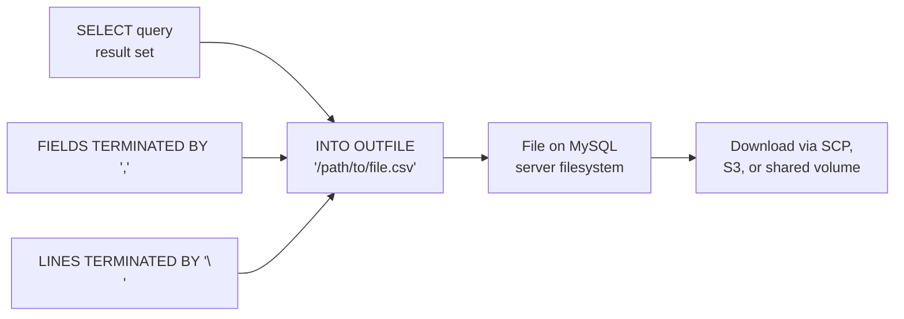

# How to Use SELECT INTO OUTFILE to Export Data in MySQL

Author: [nawazdhandala](https://www.github.com/nawazdhandala)

Tags: MySQL, SQL, Export, CSV, SELECT, Database

Description: Learn how to use SELECT INTO OUTFILE in MySQL to export query results to a CSV or delimited text file on the server filesystem, with format options and permissions.

---

## What Is SELECT INTO OUTFILE

`SELECT ... INTO OUTFILE` is a MySQL statement that writes the result set of a `SELECT` query directly to a file on the MySQL server's filesystem. It is the complement of `LOAD DATA INFILE` and is used for bulk data export.

The output file is written on the server, not the client machine. The MySQL server process must have write permission to the target directory, and the file must not already exist.



## Syntax

```sql
SELECT column_list
FROM table
[WHERE ...]
[ORDER BY ...]
INTO OUTFILE '/absolute/path/to/file.txt'
[CHARACTER SET charset]
[FIELDS
    [TERMINATED BY 'string']
    [OPTIONALLY ENCLOSED BY 'char']
    [ESCAPED BY 'char']
]
[LINES
    [STARTING BY 'string']
    [TERMINATED BY 'string']
];
```

## Prerequisites

```sql
-- Check the secure_file_priv setting (restricts allowed export directories)
SHOW VARIABLES LIKE 'secure_file_priv';

-- Check user has FILE privilege
SHOW GRANTS FOR CURRENT_USER;

-- Grant FILE privilege to a user if needed (requires SUPER)
GRANT FILE ON *.* TO 'export_user'@'localhost';
```

The `secure_file_priv` system variable restricts which directories MySQL can write to. If it is set to a path like `/var/lib/mysql-files/`, you must write to that directory. If it is empty, any directory is allowed (not recommended for production).

## Examples

### Setup: Products Table

```sql
CREATE TABLE products (
    id          INT           PRIMARY KEY AUTO_INCREMENT,
    name        VARCHAR(100)  NOT NULL,
    category    VARCHAR(50),
    price       DECIMAL(10,2),
    stock       INT           DEFAULT 0,
    created_at  DATE
);

INSERT INTO products (name, category, price, stock, created_at) VALUES
    ('Laptop Pro',   'Electronics', 1299.99,  45, '2024-01-15'),
    ('Wireless Mouse', 'Electronics', 29.99,  200, '2024-02-10'),
    ('Office Chair', 'Furniture',   399.00,   30, '2024-03-05'),
    ('Standing Desk', 'Furniture',  549.99,   15, '2024-04-20'),
    ('Notebook Set', 'Stationery',   12.50,  500, '2024-05-01');
```

### Basic Export to CSV

```sql
SELECT id, name, category, price, stock
INTO OUTFILE '/var/lib/mysql-files/products_export.csv'
FIELDS TERMINATED BY ','
OPTIONALLY ENCLOSED BY '"'
LINES TERMINATED BY '\n'
FROM products;
```

The output file `/var/lib/mysql-files/products_export.csv` contains:

```text
1,"Laptop Pro","Electronics",1299.99,45
2,"Wireless Mouse","Electronics",29.99,200
3,"Office Chair","Furniture",399.00,30
4,"Standing Desk","Furniture",549.99,15
5,"Notebook Set","Stationery",12.50,500
```

### Add a Header Row

MySQL does not add column headers automatically. Use `UNION ALL` with a header row:

```sql
SELECT 'id', 'name', 'category', 'price', 'stock'
UNION ALL
SELECT id, name, category, price, stock
FROM products
INTO OUTFILE '/var/lib/mysql-files/products_with_header.csv'
FIELDS TERMINATED BY ','
OPTIONALLY ENCLOSED BY '"'
LINES TERMINATED BY '\n';
```

```text
"id","name","category","price","stock"
1,"Laptop Pro","Electronics",1299.99,45
2,"Wireless Mouse","Electronics",29.99,200
...
```

### Export with Tab Delimiter

```sql
SELECT id, name, category, price
INTO OUTFILE '/var/lib/mysql-files/products_tab.tsv'
FIELDS TERMINATED BY '\t'
LINES TERMINATED BY '\n'
FROM products;
```

### Export a Filtered and Sorted Result Set

```sql
SELECT
    p.id,
    p.name,
    p.category,
    p.price,
    p.stock,
    p.created_at
FROM products p
WHERE p.category IN ('Electronics', 'Furniture')
  AND p.stock > 20
ORDER BY p.category, p.price DESC
INTO OUTFILE '/var/lib/mysql-files/filtered_products.csv'
FIELDS TERMINATED BY ','
OPTIONALLY ENCLOSED BY '"'
LINES TERMINATED BY '\n';
```

### Export with Custom Escape Character

```sql
-- Use backslash escaping (MySQL default) for special characters
SELECT name, category, price
INTO OUTFILE '/var/lib/mysql-files/products_escaped.csv'
FIELDS TERMINATED BY ','
OPTIONALLY ENCLOSED BY '"'
ESCAPED BY '\\'
LINES TERMINATED BY '\r\n'   -- Windows line endings
FROM products;
```

### Export a JOIN Result

```sql
SELECT
    o.id          AS order_id,
    c.name        AS customer,
    p.name        AS product,
    oi.quantity,
    oi.unit_price,
    o.created_at
FROM orders o
JOIN customers c  ON c.id = o.customer_id
JOIN order_items oi ON oi.order_id = o.id
JOIN products p   ON p.id = oi.product_id
WHERE o.created_at >= '2025-01-01'
INTO OUTFILE '/var/lib/mysql-files/orders_2025.csv'
FIELDS TERMINATED BY ','
OPTIONALLY ENCLOSED BY '"'
LINES TERMINATED BY '\n';
```

### SELECT INTO OUTFILE for Data Pipeline

For automated exports in shell scripts:

```bash
mysql -u exporter -p'password' -e "
SELECT id, name, price
INTO OUTFILE '/var/lib/mysql-files/daily_export_$(date +%Y%m%d).csv'
FIELDS TERMINATED BY ','
OPTIONALLY ENCLOSED BY '\"'
LINES TERMINATED BY '\n'
FROM products;" mydb
```

### Alternative: SELECT ... INTO DUMPFILE

For exporting binary data (images, blobs), use `INTO DUMPFILE` which writes raw bytes without any field or line delimiters:

```sql
SELECT file_content
INTO DUMPFILE '/var/lib/mysql-files/image_export.bin'
FROM files
WHERE id = 1;
```

## Common Issues and Solutions

```sql
-- Error: File already exists - MySQL will not overwrite
-- Solution: Remove the file before re-running, or use a timestamped filename

-- Error: Access denied or secure_file_priv restriction
SHOW VARIABLES LIKE 'secure_file_priv';
-- Write to the directory shown in secure_file_priv value

-- Error: Can't create/write to file (permission denied)
-- Solution: Ensure the MySQL server OS user (mysql) has write access to the directory
-- sudo chown mysql:mysql /var/lib/mysql-files/
```

## SELECT INTO OUTFILE vs mysqldump

| Method                 | Output Format      | Requires Server Access | Use Case                      |
|------------------------|--------------------|------------------------|-------------------------------|
| SELECT INTO OUTFILE    | CSV / delimited    | Yes (server filesystem)| Data export for ETL, sharing  |
| mysqldump              | SQL INSERT         | No (client tool)       | Full database/table backup    |
| SELECT ... (client)    | Client-side file   | No                     | Small exports from client     |

## Best Practices

- Check `secure_file_priv` before writing the query to ensure your target path is allowed.
- Always add column headers using `UNION ALL` with a literal header row for CSV files.
- Use `OPTIONALLY ENCLOSED BY '"'` to handle values containing commas or special characters.
- Include a timestamp in the filename to avoid conflicts: `/path/export_20250101.csv`.
- Do not use `SELECT INTO OUTFILE` for large exports in high-traffic production systems; schedule it during low-traffic windows.

## Summary

`SELECT ... INTO OUTFILE '/path/file.csv'` exports a query result set to a file on the MySQL server's filesystem. Configure field and line delimiters with `FIELDS TERMINATED BY` and `LINES TERMINATED BY`. Add column headers by prepending a literal row with `UNION ALL`. Check `secure_file_priv` to determine the allowed export directory. The exported file is owned by the MySQL server process and must be moved or accessed from the server.
