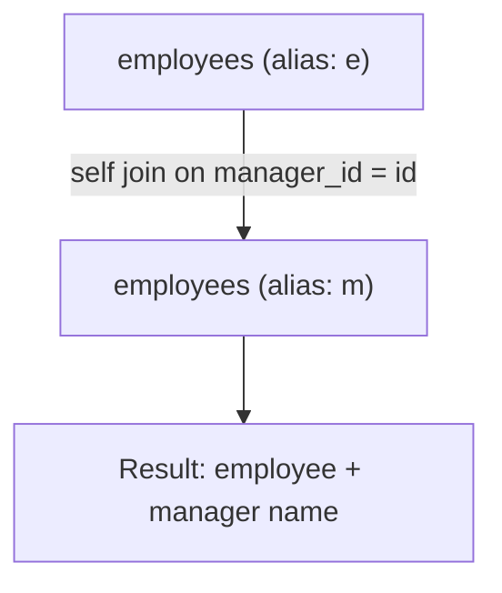

# How to Use SELF JOIN in MySQL

Author: [nawazdhandala](https://www.github.com/nawazdhandala)

Tags: MySQL, SQL, JOIN, Database, Query

Description: Learn how to use SELF JOIN in MySQL to join a table to itself, enabling hierarchical queries and row comparisons within the same table.

---

## How SELF JOIN Works

A SELF JOIN joins a table to itself. MySQL does not have a special SELF JOIN keyword - you simply reference the same table twice with different aliases. This technique is useful for querying hierarchical data (like org charts), comparing rows within the same table, or finding records that share a common attribute.



## Syntax

```sql
SELECT a.column, b.column
FROM table_name a
JOIN table_name b ON a.related_column = b.id;
```

Use different aliases (`a` and `b`, or `e` and `m`) to distinguish the two "copies" of the same table.

## Examples

### Setup: Employee Hierarchy Table

```sql
CREATE TABLE employees (
    id INT PRIMARY KEY AUTO_INCREMENT,
    name VARCHAR(100) NOT NULL,
    manager_id INT,
    department VARCHAR(100),
    salary DECIMAL(10, 2)
);

INSERT INTO employees (name, manager_id, department, salary) VALUES
    ('Sarah',  NULL, 'Executive',   150000.00),
    ('Alice',  1,    'Engineering', 105000.00),
    ('Bob',    1,    'Marketing',    80000.00),
    ('Carol',  2,    'Engineering',  90000.00),
    ('Dave',   2,    'Engineering',  85000.00),
    ('Eve',    3,    'Marketing',    70000.00),
    ('Frank',  3,    'Marketing',    68000.00);
```

### Reporting Hierarchy: Employee and Their Manager

Use a SELF JOIN to list each employee alongside their manager's name.

```sql
SELECT e.name AS employee,
       m.name AS manager,
       e.department,
       e.salary
FROM employees e
LEFT JOIN employees m ON e.manager_id = m.id
ORDER BY m.name, e.name;
```

```text
+----------+---------+-------------+-----------+
| employee | manager | department  | salary    |
+----------+---------+-------------+-----------+
| Sarah    | NULL    | Executive   | 150000.00 |
| Alice    | Sarah   | Engineering | 105000.00 |
| Bob      | Sarah   | Marketing   |  80000.00 |
| Carol    | Alice   | Engineering |  90000.00 |
| Dave     | Alice   | Engineering |  85000.00 |
| Eve      | Bob     | Marketing   |  70000.00 |
| Frank    | Bob     | Marketing   |  68000.00 |
+----------+---------+-------------+-----------+
```

Using LEFT JOIN ensures the top-level employee (Sarah, who has no manager) still appears.

### Find Employees Who Earn More Than Their Manager

Compare salaries within the same table.

```sql
SELECT e.name AS employee,
       e.salary AS employee_salary,
       m.name AS manager,
       m.salary AS manager_salary
FROM employees e
INNER JOIN employees m ON e.manager_id = m.id
WHERE e.salary > m.salary;
```

```text
+----------+-----------------+---------+----------------+
| employee | employee_salary | manager | manager_salary |
+----------+-----------------+---------+----------------+
| Alice    | 105000.00       | Sarah   | 150000.00      |
+----------+-----------------+---------+----------------+
```

No results - all managers earn more. Adjust salaries to test:

```sql
UPDATE employees SET salary = 95000.00 WHERE name = 'Sarah';
```

### Find Pairs of Employees in the Same Department

Use a SELF JOIN to find all pairs without duplicating (e.g., Alice-Carol and Carol-Alice). The `a.id < b.id` condition avoids duplicates.

```sql
SELECT a.name AS employee_1,
       b.name AS employee_2,
       a.department
FROM employees a
INNER JOIN employees b ON a.department = b.department
                       AND a.id < b.id
ORDER BY a.department, a.name;
```

```text
+------------+------------+-------------+
| employee_1 | employee_2 | department  |
+------------+------------+-------------+
| Alice      | Carol      | Engineering |
| Alice      | Dave       | Engineering |
| Carol      | Dave       | Engineering |
| Bob        | Eve        | Marketing   |
| Bob        | Frank      | Marketing   |
| Eve        | Frank      | Marketing   |
+------------+------------+-------------+
```

### Find Direct Reports Count per Manager

```sql
SELECT m.name AS manager,
       COUNT(e.id) AS direct_reports
FROM employees m
LEFT JOIN employees e ON e.manager_id = m.id
GROUP BY m.id, m.name
ORDER BY direct_reports DESC;
```

```text
+----------+----------------+
| manager  | direct_reports |
+----------+----------------+
| Sarah    | 2              |
| Alice    | 2              |
| Bob      | 2              |
| Carol    | 0              |
| Dave     | 0              |
| Eve      | 0              |
| Frank    | 0              |
+----------+----------------+
```

## Best Practices

- Always use distinct, meaningful aliases to clearly differentiate the two "copies" of the table.
- Use `a.id < b.id` (or `<`) to avoid duplicate pairs when finding matching row combinations.
- For deep hierarchies, consider Recursive CTEs (available in MySQL 8.0) instead of chaining multiple self joins.
- Index the self-join columns (such as `manager_id`) to avoid full table scans.
- Use LEFT JOIN when the hierarchy root (the row with no parent) should still appear in results.

## Summary

SELF JOIN is a technique where a table is joined to itself using two different aliases. It is most commonly used for hierarchical data like organizational charts, for comparing rows within the same table, and for finding pairs or duplicates. MySQL handles self joins with the same JOIN syntax as regular joins - the key is using distinct aliases to distinguish the two references to the same table. For complex multi-level hierarchies, prefer Recursive CTEs in MySQL 8.0 over chained self joins.
