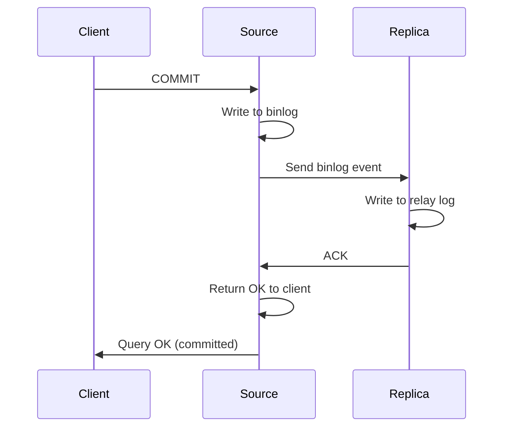
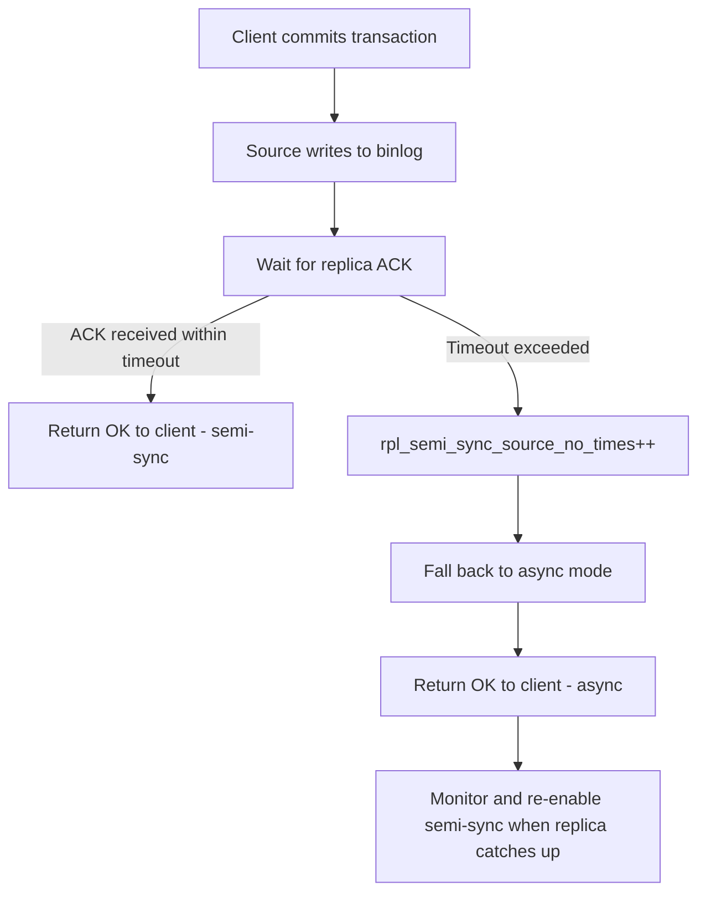

# How to Set Up MySQL Semi-Synchronous Replication

Author: [nawazdhandala](https://www.github.com/nawazdhandala)

Tags: MySQL, Replication, Semi-Synchronous, High Availability, Durability

Description: Learn how to configure MySQL semi-synchronous replication to guarantee that at least one replica acknowledges each transaction before the source commits.

---

## Introduction

MySQL supports three replication durability modes:

| Mode | Source waits for | Risk on failover |
|---|---|---|
| Asynchronous (default) | Nothing | Data loss possible |
| Semi-synchronous | At least one replica to acknowledge receipt | Zero data loss (acknowledged transactions) |
| Synchronous (Group Replication / NDB) | All members to apply | No data loss, higher latency |

Semi-synchronous replication is a middle ground: the source does not commit until at least one replica has written the event to its relay log and sent an acknowledgement. If no acknowledgement arrives within `rpl_semi_sync_source_timeout` milliseconds, the source falls back to asynchronous mode automatically.

## Architecture overview



## Prerequisites

- MySQL 8.0+ (uses `rpl_semi_sync_source` and `rpl_semi_sync_replica` plugin names)
- MySQL 5.7: plugin names are `rpl_semi_sync_master` and `rpl_semi_sync_slave`
- Existing asynchronous replication already configured, or start from a fresh setup

## Step 1 - Install the plugins on the source

```sql
-- On the source server
INSTALL PLUGIN rpl_semi_sync_source SONAME 'semisync_source.so';

SHOW PLUGINS WHERE Name LIKE '%semi%';
/*
+-----------------------+--------+--------------------+--------------------+---------+
| Name                  | Status | Type               | Library            | License |
+-----------------------+--------+--------------------+--------------------+---------+
| rpl_semi_sync_source  | ACTIVE | REPLICATION        | semisync_source.so | GPL     |
+-----------------------+--------+--------------------+--------------------+---------+
*/
```

## Step 2 - Install the plugin on the replica

```sql
-- On the replica server
INSTALL PLUGIN rpl_semi_sync_replica SONAME 'semisync_replica.so';

SHOW PLUGINS WHERE Name LIKE '%semi%';
```

## Step 3 - Enable semi-sync on the source

```sql
-- On the source
SET GLOBAL rpl_semi_sync_source_enabled = ON;
SET GLOBAL rpl_semi_sync_source_timeout = 10000; -- 10 seconds, then fall back to async

SHOW STATUS LIKE 'Rpl_semi_sync_source_status';
/*
+-----------------------------+-------+
| Variable_name               | Value |
+-----------------------------+-------+
| Rpl_semi_sync_source_status | ON    |
+-----------------------------+-------+
*/
```

## Step 4 - Enable semi-sync on the replica

```sql
-- On the replica
SET GLOBAL rpl_semi_sync_replica_enabled = ON;

-- Restart the replica IO thread to activate semi-sync
STOP REPLICA IO_THREAD;
START REPLICA IO_THREAD;

SHOW STATUS LIKE 'Rpl_semi_sync_replica_status';
/*
+------------------------------+-------+
| Variable_name                | Value |
+------------------------------+-------+
| Rpl_semi_sync_replica_status | ON    |
+------------------------------+-------+
*/
```

## Step 5 - Make settings persistent in my.cnf

```ini
# /etc/mysql/mysql.conf.d/mysqld.cnf

[mysqld]
# Source
plugin-load-add             = semisync_source.so
rpl_semi_sync_source_enabled = ON
rpl_semi_sync_source_timeout = 10000

# Replica (put only on replica servers)
# plugin-load-add              = semisync_replica.so
# rpl_semi_sync_replica_enabled = ON
```

## Verifying semi-sync is active

```sql
-- On the source: check how many replicas are configured for semi-sync
SHOW STATUS LIKE 'Rpl_semi_sync_source_clients';

-- Check whether semi-sync is currently active or fell back to async
SHOW STATUS LIKE 'Rpl_semi_sync_source_status';

-- Full status snapshot
SHOW STATUS LIKE 'Rpl_semi_sync%';
/*
+-----------------------------------------+-------+
| Variable_name                           | Value |
+-----------------------------------------+-------+
| Rpl_semi_sync_source_clients            | 1     |
| Rpl_semi_sync_source_net_avg_wait_time  | 485   |
| Rpl_semi_sync_source_net_wait_time      | 4850  |
| Rpl_semi_sync_source_net_waits          | 10    |
| Rpl_semi_sync_source_no_times           | 0     |
| Rpl_semi_sync_source_no_tx              | 0     |
| Rpl_semi_sync_source_status             | ON    |
| Rpl_semi_sync_source_timefunc_failures  | 0     |
| Rpl_semi_sync_source_tx_avg_wait_time   | 510   |
| Rpl_semi_sync_source_tx_wait_time       | 5100  |
| Rpl_semi_sync_source_tx_waits           | 10    |
| Rpl_semi_sync_source_wait_pos_backtraverse | 0  |
| Rpl_semi_sync_source_wait_sessions      | 0     |
| Rpl_semi_sync_source_yes_tx             | 10    |
+-----------------------------------------+-------+
*/
```

## Timeout and fallback behavior



## Key variables reference

| Variable | Default | Description |
|---|---|---|
| `rpl_semi_sync_source_enabled` | OFF | Enable semi-sync on source |
| `rpl_semi_sync_source_timeout` | 10000 ms | Wait timeout before async fallback |
| `rpl_semi_sync_source_wait_no_replica` | ON | Wait even when no replicas connected |
| `rpl_semi_sync_replica_enabled` | OFF | Enable semi-sync on replica |
| `rpl_semi_sync_source_wait_point` | AFTER_SYNC | When to wait for ACK |

## AFTER_SYNC vs AFTER_COMMIT wait point

MySQL 5.7.2+ supports two wait points controlled by `rpl_semi_sync_source_wait_point`:

| Wait point | Source waits | Behaviour on crash |
|---|---|---|
| `AFTER_SYNC` (default) | After writing to binlog, before engine commit | Highest durability; no phantom reads after failover |
| `AFTER_COMMIT` | After engine commit | Lower latency; acknowledged rows visible before ACK in crash scenario |

```sql
SHOW VARIABLES LIKE 'rpl_semi_sync_source_wait_point';

SET GLOBAL rpl_semi_sync_source_wait_point = 'AFTER_SYNC';
```

## Summary

MySQL semi-synchronous replication installs as a plugin pair (`semisync_source.so` on the source, `semisync_replica.so` on the replica) and is enabled with `SET GLOBAL rpl_semi_sync_source_enabled = ON` and `SET GLOBAL rpl_semi_sync_replica_enabled = ON`. The source waits up to `rpl_semi_sync_source_timeout` milliseconds for at least one replica to acknowledge receipt of each transaction before returning success to the client. If the timeout expires, replication falls back to asynchronous mode automatically, ensuring the source never stalls indefinitely. The `AFTER_SYNC` wait point provides the strongest durability guarantee.
